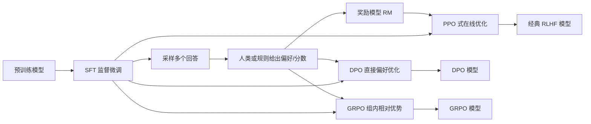
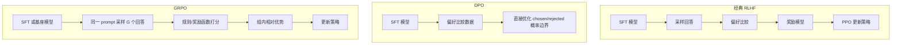

---
layout: post
title: "强化学习笔记"
date: 2026-04-23
categories:
  - blog
---
# 强化学习初学者速通文档

## 执行摘要

如果你把这份文档只读一遍，最应该建立的认知有四条。第一，**RLHF 不是一个单一算法，而是一条训练管线**：先做 SFT，让模型学会“基本回答”；再收集偏好比较数据训练奖励模型；最后用 PPO 之类的策略优化算法，让模型在不偏离参考模型太远的前提下提高“人类更喜欢”的回答概率。OpenAI 的 InstructGPT 就是这条路线的经典代表，而且论文报告称，**1.3B 的 InstructGPT 在人工偏好评测中优于 175B 的原始 GPT-3**。

第二，**PPO 是“稳着改策略”**。它本质上是策略梯度方法的工程化强化版：先根据旧策略采样，再用一个“剪切后的替代目标”更新新策略，防止一次更新迈得太大。PPO 很通用，也很成熟，但在 LLM 对齐里通常还要配合参考模型、奖励模型、价值模型、KL 约束和大量训练细节，所以它常被认为“强但重”。

第三，**DPO 是“把 RLHF 里的一部分 RL 数学化简掉”**。在 Bradley–Terry 偏好模型和 KL 约束设定下，DPO 论文把“奖励模型 + RL”改写成了一个直接作用于策略的分类损失，因此**不需要显式奖励模型，也不需要在线采样回路**；论文与官方实现都强调其训练更简单、更稳定。对初学者来说，DPO 往往是最容易真正跑起来、也最容易从 loss 曲线和 chosen/rejected 对数概率中建立直觉的方法。

第四，**GRPO 是“去掉 critic 的 PPO 亲戚”**。它在 DeepSeekMath 中被正式提出，并在 DeepSeek-R1 系列训练中被采用。核心做法是：对同一个 prompt 生成一组回答，用组内相对奖励构造 advantage，而不是单独训练一个价值模型；因此它尤其适合**有可验证奖励**的任务，如数学、代码、规则格式约束。但你也要知道，GRPO 目前**并不是一个像 PPO 那样完全定型、单一版本的算法**：原始 DeepSeekMath 公式、DeepSeek-R1 实践和 Hugging Face TRL 当前实现之间，已经出现了对 KL 是否启用、奖励是否按组标准差归一化、损失是否做长度修正等细节分化。初学者看到不同文章写法不一致，不一定是谁错了，更可能是“同一家族的不同工程变体”。

## 阅读前的最小背景与统一符号

为了把 RLHF、PPO、DPO、GRPO 放在同一个坐标系里，我们先统一最常见的符号。对大语言模型而言，状态通常不再写成经典 RL 的 $s_t$，而更常写成“**prompt + 已生成前缀**”；策略 $\pi_\theta$ 表示模型在当前上下文下生成下一个 token 的条件概率；$\pi_{\text{ref}}$ 是参考策略，通常来自 SFT 模型；$r$ 是奖励，可能来自奖励模型，也可能来自规则验证器；$V$ 是价值函数，只在 PPO/Actor-Critic 一类方法里需要；$A$ 是 advantage，表示“这个动作比当前平均水平好多少”。这些写法在 PPO、DPO、GRPO 的原始论文与 OpenAI Spinning Up 的策略优化教程中是一致的，只是 LLM 场景把“动作”换成了 token 序列。

| 符号 | 含义 |
|---|---|
| $x$ | 输入 prompt |
| $y$ | 一条完整回答 |
| $y^+, y^-$ | 同一 prompt 下的优选回答 / 弱选回答 |
| $\pi_\theta(y\mid x)$ | 当前策略模型 |
| $\pi_{\text{ref}}(y\mid x)$ | 参考模型，通常是 SFT 模型 |
| $r_\phi(x,y)$ | 奖励模型给出的分数 |
| $V_\psi$ | 价值模型 |
| $A$ | advantage，表示相对优劣 |
| $\beta$ | 控制与参考模型偏离程度的系数 |
| $\epsilon$ | PPO/GRPO 中剪切范围 |
| $G$ | GRPO 中每个 prompt 采样的候选回答数 |

把四个概念放进一张图里，初学者最需要记住的是：**RLHF 是总流程，PPO 是流程中的一个优化器；DPO 是把这个流程中的一部分目标直接改写；GRPO 则是另一种在线策略优化路线，重点是用“组内相对优势”替代 critic。**



上图对应的是行业里最常见的理解方式：经典 RLHF 走“**SFT → 偏好比较 → RM → PPO**”，DPO 走“**SFT → 偏好比较 → 直接优化策略**”，GRPO 更偏“**SFT/基座模型 → 在线采样多个回答 → 组内相对奖励 → 更新策略**”。其中 InstructGPT 和 TL;DR 总结工作展示了经典 RLHF 管线，DPO 论文给出了直接偏好优化的闭式改写，DeepSeekMath 与 DeepSeek-R1 则展示了 GRPO 在推理任务上的用法。

## RLHF

### 通俗直观解释

RLHF 可以理解成“**先让模型学会说话，再让人类教它什么叫说得更好**”。只做预训练时，模型学到的是“互联网上像人类一样继续写下去”；但这不等于“遵从指令、诚实、无害、对用户有帮助”。因此 OpenAI 在 InstructGPT 里采用了三步法：先做人类演示的 SFT，再做人类比较偏好的奖励模型，最后用 PPO 优化策略。OpenAI 在论文和博客中都把这条路线当作把“语言建模目标”改成“更符合用户意图目标”的关键办法。

这条路线为什么有效？因为在很多真实任务里，**“哪个回答更好”比“正确答案唯一是什么”更容易标注**。比如总结、对话、写作风格、安全拒答，标注者往往更擅长在两个回答里选一个更好的，而不一定能直接写出最优答案。OpenAI 在 TL;DR 总结工作中收集了大规模摘要比较数据，训练奖励模型，再用 RL 去最大化该奖励，结果是模型在人工偏好评价中明显优于纯监督学习基线，而且跨域迁移到 CNN/DM 新闻总结时也能保持较强效果。

### 关键数学推导

RLHF 的核心通常分成两层数学对象：一个是**偏好模型**，一个是**带 KL 约束的策略优化目标**。最常见的偏好建模方式是 Bradley–Terry 形式：给定同一 prompt $x$ 下两个回答 $y^+$ 和 $y^-$，人类更喜欢 $y^+$ 的概率由两者奖励差决定：

$$
P(y^+ \succ y^- \mid x)=\sigma\big(r_\phi(x,y^+) - r_\phi(x,y^-)\big)
$$

于是奖励模型的训练就是一个二分类最大似然问题：

$$
\mathcal L_{\text{RM}}(\phi)=
-\mathbb E_{(x,y^+,y^-)\sim \mathcal D}
\left[
\log \sigma\big(r_\phi(x,y^+) - r_\phi(x,y^-)\big)
\right]
$$

这一步的假设是：人类偏好可以被一个潜在标量奖励函数近似，而且偏好数据主要以成对比较形式出现。这个写法在 DPO 论文回顾 RLHF 管线时写得非常清楚，也与 TL;DR 总结和 InstructGPT 采用的“比较数据 → 奖励模型”路线一致。

有了奖励模型后，经典 RLHF 的策略优化目标通常写成：

$$
\max_{\pi_\theta}\;
\mathbb E_{x \sim \mathcal D,\; y \sim \pi_\theta(\cdot\mid x)}
\big[r_\phi(x,y)\big]
\;-\;
\beta\, D_{\mathrm{KL}}\!\left(\pi_\theta(\cdot\mid x)\,\|\,\pi_{\text{ref}}(\cdot\mid x)\right)
$$

第一项是“追求更高奖励”，第二项是“别离参考模型太远”。初学者最容易漏掉的是第二项的重要性：**如果没有 KL 约束，模型很容易为了讨好奖励模型而走到奖励模型并不可靠的区域，出现 reward hacking、模式崩塌或者语言质量劣化。** DPO 论文把这个目标明确写为 prior RLHF 的标准形式；InstructGPT 和后续 TRL/PPO 实现则把它具体化成带参考模型的 PPO 训练。

从工程视角看，RLHF 与普通监督学习最大的不同是：**训练目标取决于当前模型的采样结果**。这意味着训练是“闭环”的，而不是固定数据上的静态拟合。也正因为如此，PPO 和 GRPO 这类在线方法会比 DPO 更重，但也更灵活。

### 伪代码

下面这段伪代码概括的是经典 RLHF 管线，而不是任何一家公司的逐字实现。流程结构与 InstructGPT、TL;DR summarization 和 TRL/OpenRLHF 常见实现一致。

```python
# Classical RLHF pipeline

# Step 1: SFT
policy = init_from_pretrained_lm()
policy = supervised_finetune(policy, demonstration_dataset)

# Step 2: Reward Model
preference_pairs = collect_pairs(policy, prompt_dataset)   # (x, y_plus, y_minus)
reward_model = init_reward_model(policy)
for batch in preference_pairs:
    loss_rm = -log_sigmoid(reward_model(x, y_plus) - reward_model(x, y_minus)).mean()
    update(reward_model, loss_rm)

# Step 3: RL optimization
ref_policy = copy(policy)   # frozen reference
value_model = init_value_model()   # PPO-style setups usually need it
for iteration in range(num_iters):
    trajectories = sample_responses(policy, prompt_dataset)
    rewards = reward_model.score(trajectories) - beta * kl(policy, ref_policy)
    advantages = estimate_advantages(rewards, value_model)
    update_policy_with_ppo(policy, value_model, trajectories, advantages)
```

### 简短 Python 示例片段

下面的片段只用于说明 **TRL 当前 PPOTrainer 需要哪些核心对象**。它仍然不是可直接运行的完整脚本，但字段名已经尽量对齐当前文档，避免把 `PPOTrainer` 误解成只要 `policy/ref/reward` 三件套就能启动。

```python
# 仅作结构示意：真实训练还需要数据预处理、生成配置、分布式训练等
from transformers import (
    AutoModelForCausalLM,
    AutoModelForSequenceClassification,
    AutoTokenizer,
)
from trl import PPOTrainer, PPOConfig

policy = AutoModelForCausalLM.from_pretrained("your-sft-model")
ref_policy = AutoModelForCausalLM.from_pretrained("your-sft-model")
reward_model = AutoModelForSequenceClassification.from_pretrained("your-rm")
value_model = AutoModelForSequenceClassification.from_pretrained("your-value-model")
tokenizer = AutoTokenizer.from_pretrained("your-sft-model")
train_dataset = load_your_prompt_dataset()

args = PPOConfig(
    learning_rate=3e-6,
    cliprange=0.2,
    kl_coef=0.05,
    num_ppo_epochs=4,
)

trainer = PPOTrainer(
    args=args,
    processing_class=tokenizer,
    model=policy,
    ref_model=ref_policy,
    reward_model=reward_model,
    value_model=value_model,
    train_dataset=train_dataset,
)

# 训练时的闭环仍然是：prompt -> generate -> reward -> advantage/value -> PPO update
```

### 实践要点与超参数建议

对初学者最有价值的经验不是“某个神奇超参”，而是**先把三阶段的职责分清**。SFT 负责把分布收窄到“像样回答”的区域；奖励模型负责把“更好/更差”映射成标量；PPO 负责在 KL 约束下移动策略。如果你的 SFT 很差，后续 RM 和 PPO 往往也不会好，因为比较数据和采样数据都会变脏。OpenAI 的 InstructGPT 和 TRL 的 PPO 文档都把 SFT 作为 RLHF 的前置基础。

在工程细节上，Hugging Face 对 OpenAI 早期 RLHF 代码的复现实验总结出一批非常“接地气”的经验：**关闭 dropout、奖励/值函数归一化、学习率退火、奖励白化、adaptive KL、必要时做 rejection sampling**，这些都显著影响稳定性；而且他们在复现实验中还特别指出，PPO 训练里 PyTorch/TF 的 Adam 数值行为差异都可能导致更新激进。对初学者来说，这意味着：**不要低估实现细节，RLHF 不是“把 PPO 套上去”就完事。**

如果你想做一个“能跑通”的入门版本，我的建议是：先不用追求 InstructGPT 规模，优先选择公开框架与小模型。奖励模型可以从序列分类头开始；如果数据很少，优先防止 RM 过拟合；PPO 阶段先严格盯住 `objective/rlhf_reward`、`objective/kl`、`val/ratio` 等指标，因为这些指标能直接告诉你训练是不是“往前走但没走飞”。TRL 文档特别提示，`val/ratio` 应围绕 1 左右波动，过大或过小都说明相邻策略之间变化过猛。

### 典型实现与在线文档

就“官方材料”而言，InstructGPT 的**完整训练代码公开程度是未指定**；但 OpenAI 已公开论文、博客、模型卡/评测仓库，以及更早的 `lm-human-preferences` 和 `summarize-from-feedback` 代码资源作为近似参考。对学习者而言，这些足以建立 RLHF 管线认知。

比较值得直接阅读的材料有：OpenAI 的 **InstructGPT 论文与博客**、OpenAI 的 **Learning to Summarize from Human Feedback** 论文与仓库、OpenAI 的 **lm-human-preferences** 代码库、Hugging Face 的 **TRL Reward Modeling / PPOTrainer** 文档、以及 **OpenRLHF** 这类偏工程化的高性能开源框架。中文方面，优先看 **Hugging Face 中文博客/文档**、**OpenRLHF 中文文档** 和 **Spinning Up 中文版**，因为它们更接近原始英文材料，而不是二次转述。

### 常见问题与调试建议

RLHF 最常见的问题，不是 loss 不下降，而是**你根本不知道下降的是什么**。奖励模型分数升高，不等于人类偏好一定同步升高；KL 很低，不等于模型真的学到了更好的行为；value loss 稳定，也不等于 policy 真在变好。这也是 OpenAI 后续研究 CriticGPT 的原因之一：随着模型越来越强，**人类评审越来越难稳定地发现错误**，而 RLHF 的标签质量会因此成为瓶颈。

如果你跑 PPO 式 RLHF，先排查四件事。第一，看回答是否很快塌缩成模板化短句；第二，看 KL 是否飞升；第三，看 `val/ratio` 是否经常远离 1；第四，看 RM 是否在训练集上好、在验证集上差。如果出现这些问题，优先从**减小学习率、增大 KL 约束、缩短回复长度、检查 EOS/截断规则、复查 chosen/rejected 数据质量**入手，而不是立刻改模型结构。

### 小结与适用场景

如果你想理解“现代大模型对齐最经典的一条路”，RLHF 必学；如果你想做一个**工业上可解释、可扩展、可插入任意奖励函数**的系统，RLHF 仍然很重要；但如果你只是想快速从偏好数据起步，RLHF 往往不是最容易的第一站，因为它的工程复杂度明显高于 DPO。这个判断并不是说 RLHF 过时，而是说它更像“全家桶”，适合在你已经会 SFT、懂 PPO、知道 RM 风险之后再系统掌握。

## PPO

### 通俗直观解释

PPO 最容易理解的方式是：**每次都朝“更高奖励”的方向走，但只允许走一小步安全步长**。如果不加限制，策略梯度会鼓励模型把某些高回报动作的概率一路抬高，结果常常是“一步迈太大”，训练发散。TRPO 用 KL 约束来硬性限制步长，PPO 则用更简单的剪切目标来近似这种“别走太远”的思想，所以它在工程上更易实现。OpenAI 的 PPO 原始论文和 Spinning Up 教程都把它定位为在简单性、样本效率和稳定性之间取得平衡的方法。

放到 LLM 对齐里，PPO 的角色就变成：模型先根据当前策略回答一批 prompt，再根据奖励模型给分；如果某些回答分高，就提高这条回答路径上 token 的概率；但提高的幅度要被剪切项和 KL 项约束住，不然模型会迅速偏离语言质量良好的区域。DeepSeekMath 在介绍 GRPO 时，也先把 PPO 作为“当前 LLM RL 微调中广泛使用的 actor-critic 算法”来对照。

### 关键数学推导

从策略梯度出发，我们希望最大化策略的期望回报 $J(\theta)$。在旧策略 $\pi_{\theta_{\text{old}}}$ 采样的数据上，可以把新旧策略的差异写成一个比值：

$$
r_t(\theta)=\frac{\pi_\theta(a_t\mid s_t)}{\pi_{\theta_{\text{old}}}(a_t\mid s_t)}
$$

于是得到经典的替代目标：

$$
L^{\text{CPI}}(\theta)=\hat{\mathbb E}_t\big[r_t(\theta)\hat A_t\big]
$$

这里 $\hat A_t$ 是 advantage，它表示在状态 $s_t$ 下选动作 $a_t$ 比平均动作好多少。这个目标的问题是：如果直接最大化，策略可能在少数状态上被推得太远。PPO 的关键改写就是加入剪切：

$$
L^{\text{CLIP}}(\theta)=
\hat{\mathbb E}_t
\Big[
\min\big(
r_t(\theta)\hat A_t,\;
\operatorname{clip}(r_t(\theta),1-\epsilon,1+\epsilon)\hat A_t
\big)
\Big]
$$

这就是 PPO 最核心的公式。论文给出的直觉是：如果 $\hat A_t>0$，那就不希望 $r_t$ 大幅高于 $1+\epsilon$；如果 $\hat A_t<0$，那就不希望 $r_t$ 大幅低于 $1-\epsilon$。这样做的结果不是“完全不让策略变”，而是“超过安全区后，继续变大对目标不再有额外好处”。

在 LLM RLHF 中，PPO 还经常配一个价值函数 $V_\psi$ 来降低方差，并配一个参考模型 KL 惩罚避免策略漂移。DeepSeekMath 对 PPO 的回顾特别指出，PPO 在 LLM 场景里通常需要训练 value function，并在 token 级奖励中加入来自参考模型的 KL 惩罚；这恰好也是后来 GRPO 要“去 critic”的原因。

### 伪代码

下面的伪代码是 PPO 的最小骨架，结构上与 Schulman 的原始算法和 TRL 的 PPOTrainer 都一致。

```python
initialize policy πθ
initialize value function Vψ

for each iteration:
    rollouts = collect_trajectories(πθ_old)
    rewards = compute_rewards(rollouts)
    advantages = estimate_advantages(rewards, Vψ)

    for epoch in range(K):
        ratio = πθ(a|s) / πθ_old(a|s)
        clipped_ratio = clip(ratio, 1 - eps, 1 + eps)
        policy_loss = -mean(min(ratio * advantages,
                                clipped_ratio * advantages))
        value_loss = mse(Vψ(s), returns)
        loss = policy_loss + c_v * value_loss - c_e * entropy(πθ)
        update(θ, ψ)
```

### 简短 Python 示例片段

下面的片段强调的是 **PPO 的对象依赖关系**：当前策略、参考策略、奖励模型、价值模型、prompt 数据集和 tokenizer/processor 缺一不可。它是结构示意，不是最小可运行脚本。

```python
from transformers import AutoTokenizer
from trl import PPOConfig, PPOTrainer

tokenizer = AutoTokenizer.from_pretrained("your-sft-model")
args = PPOConfig(
    learning_rate=3e-6,
    num_ppo_epochs=4,
    cliprange=0.2,
    vf_coef=0.1,
    kl_coef=0.05,
    gamma=1.0,
    lam=0.95,
)

trainer = PPOTrainer(
    args=args,
    processing_class=tokenizer,
    model=policy_model,
    ref_model=ref_model,
    reward_model=reward_model,
    value_model=value_model,
    train_dataset=prompt_dataset,
)

# prompts -> generate -> reward -> value/advantage -> PPO update
```

### 实践要点与超参数建议

对初学者最友好的 PPO 起点，往往不是原论文的通用设置，而是现成的 LLM 实现默认值。以 TRL 为例，PPOConfig 的关键默认值包括：`cliprange=0.2`、`vf_coef=0.1`、`cliprange_value=0.2`、`gamma=1.0`、`lam=0.95`、`kl_coef=0.05`、`num_ppo_epochs=4`。这组默认值反映了 LLM RLHF 的典型做法：**把整段回答的质量看得比传统逐步折扣更重要，因此常把 $\gamma$ 设成 1；同时用 KL 和 value loss 控制训练稳定性。**

如果你要调 PPO，优先盯三件事。第一，`val/ratio` 是否明显脱离 1；第二，`objective/kl` 是否持续上冲；第三，`policy/clipfrac_avg` 是否过高。TRL 官方文档直接给了调试建议：`val/ratio` 应在 1 附近波动，若到 2、1000 或掉到 0.1 这类量级，说明连续两次策略更新差异太大，应先回头检查学习率、奖励尺度、KL 系数和 batch 构造。

再往前走一步，Hugging Face 对 OpenAI 早期 RLHF 的复现材料还给出一批很实用的 PPO 细节：训练中通常**关闭 dropout**；为 reward 与 policy 做**学习率退火**；在某些任务中做**reward whitening**；并通过 **adaptive KL** 动态调节 KL 系数。这些做法不一定对所有任务都最优，但对“为什么我的 PPO 跑不稳”这个初学者问题非常关键。

### 典型实现与在线文档

学习 PPO 最推荐的顺序是：先看 **PPO 原始论文**，理解剪切目标；再看 **OpenAI Spinning Up**，把公式和实现联系起来；如果你的目标是 LLM 对齐，再看 **TRL PPOTrainer** 和 **OpenAI/复现项目的 RLHF with PPO 实现细节**。这样你不会把“机器人控制 PPO”和“语言模型 PPO”混为一谈。

中文学习材料里，**Spinning Up 中文版**适合建立基础策略优化直觉，**Hugging Face 中文博客的 RLHF with PPO 实现细节**更适合理解 LLM 对齐中的工程坑。

### 常见问题与调试建议

PPO 在 LLM 场景最典型的失败模式是“**奖励涨了，但文本坏了**”。这常见于 KL 太弱、奖励模型可被钻空子、或者 EOS/截断规则处理不当。OpenAI 复现工作中特别提到 rejection sampling、截断、EOS 处理和固定低分惩罚，这些都不是数学主角，但它们会直接改变模型被奖励的输出分布。

第二类问题是“**critic 学坏导致 advantage 失真**”。如果 value loss 长期震荡、优势估计噪声很大，policy 就会跟着乱动。DeepSeekMath 在提出 GRPO 时正是明确指出：在 LLM 里，value model 常与 policy 模型同量级，内存和算力负担都很大，而且当奖励只在结尾给出时，训练一个逐 token 准确的 value function 还会变得更难。

### 小结与适用场景

PPO 适合你需要**在线探索**、奖励函数复杂、且希望保留“显式 RL 闭环”能力的时候。它是最经典、最通用、也最重的一条路。如果你的目标是“先把偏好学习跑起来”，DPO 通常更轻；如果你的目标是“在可验证推理任务里做在线强化学习，但不想背 critic 成本”，GRPO 往往更合适。

## DPO

### 通俗直观解释

DPO 的核心直觉非常适合初学者：**既然我们手里已经有“同一 prompt 下哪个回答更好”的配对数据，那为什么还要先学一个奖励模型，再跑一轮 RL，最后才能让策略更偏向好回答？** DPO 的答案是：在特定假设下，可以直接把这个优化目标写成分类损失，于是训练就变成“提高优选回答的相对似然，降低弱选回答的相对似然”。

这也是为什么 DPO 论文会说它“stable, performant, and computationally lightweight”，并强调**不需要在微调时从语言模型中在线采样，也不需要显式奖励模型**。对于初学者，这意味着：比起 PPO，你可以更快地建立“偏好数据如何改变模型分布”的感觉，因为训练就像一个偏好版的二分类。

### 关键数学推导

DPO 推导的起点并不是“完全抛弃 RLHF”，而是**从 RLHF 的 KL 约束目标出发**。假设我们要解的仍是下面这个问题：

$$
\max_{\pi}\;
\mathbb E_{x\sim \mathcal D,\; y\sim \pi(\cdot|x)}[r(x,y)]
-\beta D_{\mathrm{KL}}(\pi(\cdot|x)\|\pi_{\text{ref}}(\cdot|x))
$$

DPO 论文说明，这个目标的最优策略可以写成：

$$
\pi^*(y\mid x)=\frac{1}{Z(x)}\pi_{\text{ref}}(y\mid x)\exp\!\left(\frac{1}{\beta}r(x,y)\right)
$$

其中 $Z(x)$ 是归一化常数。把它取对数并整理，可得：

$$
r(x,y)=
\beta \log \frac{\pi^*(y\mid x)}{\pi_{\text{ref}}(y\mid x)}
+\beta \log Z(x)
$$

接下来引入 Bradley–Terry 偏好模型：

$$
P(y^+ \succ y^- \mid x)=\sigma\big(r(x,y^+) - r(x,y^-)\big)
$$

把上面的 reward 重参数化代进去，$Z(x)$ 会在成对比较中抵消，于是得到只与策略和参考策略有关的偏好概率。最终得到 DPO 损失：

$$
\mathcal L_{\text{DPO}}(\theta)=
-\mathbb E_{(x,y^+,y^-)}
\log \sigma\!\left(
\beta \log \frac{\pi_\theta(y^+\mid x)}{\pi_{\text{ref}}(y^+\mid x)}
-
\beta \log \frac{\pi_\theta(y^-\mid x)}{\pi_{\text{ref}}(y^-\mid x)}
\right)
$$

这就是 DPO 的核心：**把“学奖励再做 RL”改成了“直接学一个更符合偏好的策略”**。需要强调的是，这个结论依赖于明确的建模假设，尤其是 KL 约束形式和 Bradley–Terry 偏好建模；因此它不是“所有 RLHF 都被 DPO 完全取代”的数学结论，而是“在这类设定下，目标可被直接改写”的结论。

从实现角度看，DPO 还有一个非常实用的“隐式奖励”视角。TRL 文档把 chosen/rejected 的隐式奖励记成相对参考模型的对数概率比；如果你监控 `rewards/chosen`、`rewards/rejected` 和 `rewards/margins`，其实就在看模型相对参考模型把“好回答”和“差回答”分开得有多明显。

### 伪代码

下面的伪代码几乎就是 DPO 的本质。

```python
initialize policy πθ from SFT model
freeze reference policy πref

for batch in preference_dataset:   # (x, y_plus, y_minus)
    logp_plus = log πθ(y_plus | x)
    logp_minus = log πθ(y_minus | x)

    ref_logp_plus = log πref(y_plus | x)
    ref_logp_minus = log πref(y_minus | x)

    margin = beta * ((logp_plus - ref_logp_plus) -
                     (logp_minus - ref_logp_minus))

    loss = -mean(log_sigmoid(margin))
    update(θ, loss)
```

### 简短 Python 示例片段

下面这段代码非常接近 TRL 官方文档中的最小示例。它足够短，适合你亲自替换模型与数据集跑一个 demo。

```python
from datasets import load_dataset
from trl import DPOTrainer

trainer = DPOTrainer(
    model="Qwen/Qwen3-0.6B",
    train_dataset=load_dataset("trl-lib/ultrafeedback_binarized", split="train"),
)

trainer.train()
```

### 实践要点与超参数建议

DPO 的第一原则不是调 $\beta$，而是**确保 preference pair 真的可信**。如果 chosen / rejected 顺序经常反了，或者两条回答质量几乎没有可比差异，DPO 会学到很奇怪的边界。因为它没有单独的奖励模型做缓冲，所以数据质量问题会更直接地反映到策略里。DPO 论文与 TRL 文档都强调它处理的是“同一 prompt 的优选/弱选完成对”。

$\beta$ 是 DPO 里最值得优先理解的超参数。TRL 文档给出的默认值是 **0.1**，并把它解释为控制与参考模型偏离程度的关键参数；而后续 $\beta$-DPO 工作又专门指出，**$\beta$ 对性能是敏感的**。对于初学者，最稳妥的建议是：**先用 0.1 跑通，再围绕它做少量扫描，不要一上来就扫特别大范围。**

在工程上，TRL 当前默认 **`disable_dropout=True`**，并提供 `precompute_ref_log_probs=True` 来节省显存；此外，`padding_free` 可以配合 FlashAttention 进一步减少 padding 开销。这些都很适合大模型或长序列场景。

如果你的偏好标签有噪声，可以关注 Robust DPO / EXO 一类扩展。TRL 文档中已经把 `label_smoothing` 暴露出来，并给出了一些典型值说明，例如 Robust DPO 中常把它解释成标签翻转概率，推荐值可取 0.1 的量级；但如果你只是入门，建议先不要同时引入太多 DPO 变体。

### 典型实现与在线文档

学习 DPO 的“黄金组合”通常是：先读 **原始论文**，再看 **Stanford 的参考实现仓库**，然后直接上 **TRL DPOTrainer**。这样做的好处是你既知道数学上为什么成立，又知道工程上怎么落地。

中文方面，优先读 **Hugging Face 中文博客《从 RLHF 到 DPO》**、**Hugging Face 中文版 DPOTrainer 文档**、以及 **使用 DPO 微调 Llama 2** 这类带脚本的实战教程。它们跟英文原始材料一致性较高。

### 常见问题与调试建议

DPO 第一类常见问题是“**loss 在降，但模型回答更死板**”。这通常意味着模型在过度贴近某类 chosen 模板，或者 $\beta$ / 数据分布让模型相对参考模型的偏移过于单一。此时优先看 `rewards/margins`、`rewards/accuracies`、`logps/chosen`、`logps/rejected` 是否同步改善，而不是只看总 loss。

第二类问题是“**拿未做过 SFT 的底座直接做 DPO**”。理论上不是绝对不行，但实践上很容易因为 pair 数据分布太窄而出问题。DPO 论文本身就是在 RLHF 的 SFT 起点上做改写；TRL 文档的示例也默认你已经有可用的 base/SFT 模型。对初学者来说，**DPO 最好接在一个已经能正常完成任务的 SFT 模型之后**。

### 小结与适用场景

当你手里有**静态偏好数据**，又希望用尽可能简单的训练方式完成偏好对齐时，DPO 几乎总是值得优先尝试。它比 PPO 更轻，训练与调试门槛更低，也更适合“先学会偏好优化，再回头学在线 RL”。但它的前提很明确：你要有质量不错的 chosen/rejected 数据，而且最好已经有一个 decent 的 SFT 起点。

## GRPO

### 通俗直观解释

GRPO 可以把它想成“**不再问一个回答绝对值多少，而是问它在同组候选里相对表现如何**”。对同一个 prompt，你用旧策略一次采样出 $G$ 个回答；然后用奖励模型、规则验证器或准确率函数给它们打分；接着看每个回答相对这组回答的平均水平高多少、低多少；最后用这个“组内相对优势”更新策略。DeepSeekMath 论文把它定义为 PPO 的一个变体，最大卖点是：**不再需要单独训练 critic/value model**。

为什么这个思路在推理任务上特别流行？因为数学、代码、格式约束这些任务里，很多奖励都可以**由规则直接验证**，例如最终答案是否正确、输出是否满足模板、测试用例是否通过。DeepSeek-R1 进一步说明，他们在 reasoning 任务上更倾向于使用这类**规则型奖励信号**，而刻意避免大规模依赖神经奖励模型，因为后者在强 RL 下更容易被 reward hacking。

### 关键数学推导

GRPO 这部分最容易让人混淆的地方在于：**原始 DeepSeekMath 写法、后续 PPO-style 推广写法、以及 TRL 当前实现的工程修正式，并不是同一个公式。** 把它们拆开看会清楚很多。

先看原始 DeepSeekMath 的核心直觉。它把 PPO 中“用 value function 做 baseline”的部分，替换成“**用同组样本的平均奖励做 baseline**”。设同一个问题 $q$ 采样出 $G$ 个回答 $o_1,\dots,o_G$，对应奖励为 $r_1,\dots,r_G$。最常见的组内优势写法是：

$$
A_i=\frac{r_i-\operatorname{mean}(r_{1:G})}{\operatorname{std}(r_{1:G})}
$$

如果是 outcome supervision，那么一条回答中所有 token 共用这个终局归一化奖励；如果是 process supervision，则可以给每个推理步骤打分，再把未来步骤的归一化奖励累加到每个 token 上。DeepSeekMath 对 outcome supervision 和 process supervision 都给了明确说明。到这一步为止，重点是“**优势来自组内相对奖励，而不是 value model**”。

接下来，为了和 PPO 对照，很多讲解或实现会再引入 PPO-style 的概率比率。令

$$
\rho_{i,t}(\theta)
=
\frac{\pi_\theta(o_{i,t}\mid q,o_{i,<t})}
{\pi_{\theta_{\text{old}}}(o_{i,t}\mid q,o_{i,<t})}
$$

则一种常见的 **PPO-style surrogate 写法** 可以写成：

$$
\mathcal L_{\text{GRPO}}(\theta)
=
-\mathbb E\Big[
\min\big(
\rho_{i,t}A_i,\;
\operatorname{clip}(\rho_{i,t},1-\epsilon,1+\epsilon)A_i
\big)
-\beta D_{\mathrm{KL}}(\pi_\theta\|\pi_{\text{ref}})
\Big]
$$

其中 $\beta$ 控制与参考策略的距离，$\epsilon$ 控制剪切范围。你会发现，它和 PPO 的结构非常像；区别在于 advantage 的来源：PPO 用 value/GAE，GRPO 用组内相对奖励。正因如此，你可以把 GRPO 记成“**PPO 的 critic-free、group-relative 版本**”。

最后要把“原始算法”和“工程变体”明确区分开。TRL 当前文档明确指出，组内标准差缩放可能引入 question-level difficulty bias；原始按回答长度做归一化的写法也被后续工作指出可能引入 length bias；因此当前工程实现会提供 `scale_rewards="group" / "batch" / "none"`、`loss_type="grpo" / "dapo" / "dr_grpo"`、`mask_truncated_completions` 等选项来缓解这些偏差。也就是说，网上你看到的 GRPO 公式之所以不完全一致，往往不是谁写错了，而是**讨论的对象已经从“原始 DeepSeekMath 公式”切换成“后续工程修正版”**。

### 伪代码

下面的伪代码表达的是“对每个 prompt 生成多个回答，再用组内相对优势更新”的核心思想。它与 DeepSeekMath 的算法框架和 TRL 的 GRPOTrainer 设计是一致的。

```python
initialize policy πθ
initialize reference policy πref   # optional in some modern variants

for each iteration:
    batch_prompts = sample_prompts()

    groups = []
    for q in batch_prompts:
        completions = sample_G_responses(πθ_old, q, G)
        rewards = reward_fn(q, completions)   # rule-based or RM-based
        advantages = normalize_within_group(rewards)
        groups.append((q, completions, rewards, advantages))

    for epoch in range(num_iterations):
        for q, completions, rewards, advantages in groups:
            ratio = πθ(token | prefix) / πθ_old(token | prefix)
            loss = -mean(min(ratio * advantages,
                             clip(ratio, 1-eps, 1+eps) * advantages)
                         - beta * kl(πθ, πref))
            update(θ, loss)
```

### 简短 Python 示例片段

下面这段代码来自 TRL 的最小 GRPO 用法思路：定义数据集，定义奖励函数，把它交给 `GRPOTrainer`。这对初学者非常友好，因为它把“奖励函数”显式暴露出来了。

```python
from datasets import load_dataset
from trl import GRPOTrainer
from trl.rewards import accuracy_reward

dataset = load_dataset("trl-lib/DeepMath-103K", split="train")

trainer = GRPOTrainer(
    model="Qwen/Qwen2-0.5B-Instruct",
    reward_funcs=accuracy_reward,
    train_dataset=dataset,
)

trainer.train()
```

### 实践要点与超参数建议

如果你是初学者，我最推荐把 GRPO 用在**可验证任务**上，而不是开放式写作上。原因很简单：当 reward 是“答案是否正确”“测试是否通过”“格式是否满足模板”时，组内相对比较非常自然，而且不容易被一个脆弱的神经奖励模型带偏。DeepSeek-R1 也正是在 reasoning 任务上强调使用 rule-based reward 与 format reward，并明确写出他们避免大规模使用神经奖励模型，是因为担心 reward hacking 和额外复杂度。

从 TRL 当前默认值看，GRPO 的入门配置相对克制：`learning_rate` 默认 **1e-6**，`num_generations` 默认 **8**，`max_completion_length` 默认 **256**，`epsilon` 默认 **0.2**，`num_iterations` 默认 **1**，`beta` 默认 **0.0**。文档还特别解释了：当 `beta=0.0` 时，参考模型根本不加载，这可以进一步降低显存与训练开销。与此同时，DeepSeekMath 在原始论文里给出过一个更“经典 RL”风格的配置：policy learning rate 取 **1e-6**，KL coefficient 取 **0.04**。因此，一个很实用的理解是：**原始 GRPO 更像“带 KL 的 PPO 变体”，而许多后续实现开始尝试把 KL 弱化甚至去掉。**

另一个必须注意的点是奖励归一化。TRL 文档直接提醒：按组标准差缩放虽然是原始直觉，但可能引入题目难度偏差；可选替代是 `scale_rewards=False` 或 `scale_rewards="batch"`。如果你在一个 batch 里混合了难度差异很大的题目，这个设置会明显影响训练信号。对刚开始实验的人，我建议先使用默认方式跑一次，再在一个小验证集上比较 `group`、`batch`、`none` 三种缩放策略，而不是一开始就盲信某一篇经验帖。

最后，GRPO 在长回答任务上要格外注意**长度偏差与截断问题**。TRL 当前已经把 `mask_truncated_completions=True` 明确标为一个有助于稳定性的好实践；同时也提供了针对长度偏差修正的 `dr_grpo` 等 loss 类型。你不必在第一次实验就把这些都用上，但必须知道：**原始 GRPO 不是“公式一抄就稳”的算法，长 CoT 场景下很多偏差都是真问题。**

### 典型实现与在线文档

GRPO 最核心的原始材料是 **DeepSeekMath 论文**；如果你想看它如何进入更大规模 reasoning 体系，则读 **DeepSeek-R1**。工程上，**TRL 的 GRPOTrainer** 是最适合初学者的公开实现接口，而 **Hugging Face open-r1** 则更接近“开放复现 DeepSeek-R1 路线”的研究/工程仓库。

中文资源里，优先看 **Hugging Face 中文课程中实现 GRPO 的章节** 和 **OpenRLHF 中文文档**。前者偏教学，后者偏工程系统。

### 常见问题与调试建议

GRPO 的第一类问题是“**组内奖励几乎一样，学不到东西**”。从公式直接可见，当同组样本的奖励全接近相同，归一化后的 advantage 就会接近 0，更新信号自然变弱。这通常不是算法坏了，而是你的 reward 太粗糙、组内采样多样性太低，或者任务本身对当前模型来说已经过于简单。

第二类问题是“**算力一下子爆炸**”。GRPO 每个 prompt 要采样 $G$ 个 completion，训练成本天然受 `num_generations` 影响；TRL 的 quick start 甚至直接写出，8 GPU 下一个示例训练大约需要 1 天。OpenRLHF 也强调，在 RLHF 系统里，生成阶段常是主要开销来源。对入门实验来说，你完全可以先把 `num_generations`、`max_completion_length` 和 batch size 压小，把奖励函数和日志跑通，再考虑扩展。

第三类问题是“**你学到的是格式，而不是能力**”。如果奖励函数只奖励 `<think>...</think><answer>...</answer>` 之类模板，模型很可能先学会的是“写得像被奖励的样子”，而不是更强的推理能力。因此 reward 设计最好至少同时覆盖**正确性**与**格式性**，这也是 DeepSeek-R1 中 accuracy reward 与 format reward 并用的原因。

### 小结与适用场景

如果你的任务是数学、代码、形式化推理、结构化输出，且有可靠 verifier，GRPO 非常值得学；如果你的任务是开放式闲聊、主观写作或通用帮助性，GRPO 也能用，但它的奖励设计会比 DPO 和经典 RM-PPO 更难做稳。从方法定位上看，GRPO 更接近“**面向可验证推理任务的在线 RL 变体**”。

## 方法比较与流程概览

### 比较表

| 方法 | 目标 | 是否需奖励模型 | 是否需价值模型 | 训练复杂度 | 优点 | 缺点 | 适用场景 |
|---|---|---:|---:|---|---|---|---|
| RLHF 管线  | 用人类偏好把模型行为对齐到“更有帮助/更安全/更符合偏好”的方向 | 通常需要 | 取决于具体优化器；用 PPO 时通常需要 | 高 | 框架完整、可插入多种奖励、工业实践成熟 | 数据与工程链路长，调试成本高 | 通用大模型对齐、需要在线闭环时 |
| PPO  | 稳定地在线优化策略，避免一步更新过大 | 在 LLM 对齐中通常需要奖励信号，常来自 RM 或规则 | 需要 | 高 | 通用、成熟、适合复杂奖励 | actor/ref/reward/value 四件套很重 | 经典 RLHF、复杂环境、在线优化 |
| DPO  | 直接从偏好对中优化策略 | 不需要显式 RM | 不需要 | 中低 | 简洁、稳定、无需在线采样回路 | 强依赖高质量 preference pairs；$\beta$ 敏感 | 静态偏好数据、低门槛对齐 |
| GRPO  | 用组内相对奖励做在线策略优化 | 可选：可用 RM，也可用规则/验证器 | 不需要 | 中高 | 去掉 critic，适合可验证推理任务 | 多候选采样成本高；公式和工程变体较多 | 数学、代码、结构化推理、规则奖励 |

表里的“是否需要奖励模型/价值模型”都要按语境理解。**RLHF 是管线，不是单算法**；如果 RLHF 用 PPO，则通常需要 RM 和 value model。DPO 不需要显式 RM，也不需要 value model。GRPO 在原始 DeepSeekMath 中保留了可选 KL 正则，但核心思想就是用组内相对奖励替代 critic；在 TRL 当前实现里，`beta=0.0` 甚至是默认值。

### 一张帮助记忆的流程对比图



这张图对应的记忆口诀可以很简单：**RLHF 是全流程，PPO 是重武器，DPO 是轻武器，GRPO 是推理场景里常见的 critic-free 在线武器。**这种归纳是基于原始论文与官方文档做的教学性总结，不是任何单一论文的原话。

## 参考链接

### 原始论文

- **Training language models to follow instructions with human feedback**，InstructGPT 原始论文。
- **Learning to summarize from human feedback**，OpenAI 在摘要任务上的经典 RLHF 论文。
- **Proximal Policy Optimization Algorithms**，PPO 原始论文。
- **High-Dimensional Continuous Control Using Generalized Advantage Estimation**，GAE 原始论文。
- **Direct Preference Optimization: Your Language Model is Secretly a Reward Model**，DPO 原始论文。
- **DeepSeekMath: Pushing the Limits of Mathematical Reasoning in Open Language Models**，GRPO 最核心的原始论文来源。
- **DeepSeek-R1: Incentivizing Reasoning Capability in LLMs via Reinforcement Learning**，展示 GRPO 在 R1 系列中的核心地位与规则奖励实践。
- **The N+ Implementation Details of RLHF with PPO: A Case Study on TL;DR Summarization**，公开复现 RLHF-with-PPO 的工程论文。
- **$\beta$-DPO: Direct Preference Optimization with Dynamic $\beta$**，讨论 DPO 中 $\beta$ 敏感性的后续工作。

### 官方博客与官方文档

- **OpenAI: Aligning language models to follow instructions**，InstructGPT 官方博客。
- **OpenAI: Learning to summarize with human feedback**，总结任务 RLHF 官方介绍。
- **OpenAI Spinning Up**，策略优化和 PPO 的权威入门材料。
- **Hugging Face TRL 总览**，统一了解 PPO / DPO / GRPO / Reward Modeling 的入口。
- **TRL PPOTrainer 文档**。
- **TRL DPOTrainer 文档**。
- **TRL GRPOTrainer 文档**。
- **TRL Reward Modeling 文档**。
- **The N Implementation Details of RLHF with PPO**，Hugging Face 对 OpenAI 早期 RLHF 代码的工程级复现总结。

### 官方或常用开源仓库

- **openai/following-instructions-human-feedback**，OpenAI 的 InstructGPT 公开仓库，主要提供论文、模型卡和评测样本；完整训练代码未在该仓库中提供。
- **openai/lm-human-preferences**，OpenAI 公开的早期“人类偏好微调语言模型”代码库。
- **openai/summarize-from-feedback**，OpenAI 的摘要 RLHF 代码与数据资源。
- **openai/spinningup**，OpenAI 的深度强化学习教学仓库。
- **eric-mitchell/direct-preference-optimization**，DPO 参考实现。
- **huggingface/trl**，当前最常见的 LLM 对齐训练工具库之一。
- **OpenRLHF/OpenRLHF**，高性能 RLHF 工程框架。
- **deepseek-ai/DeepSeek-Math**，DeepSeekMath 公开仓库。
- **huggingface/open-r1**，Open-R1 开放复现项目。

### 中文高质量资源

- **Hugging Face 中文：从 RLHF 到 DPO**。
- **Hugging Face 中文：DPOTrainer 文档**。
- **Hugging Face 中文：使用 DPO 微调 Llama 2**。
- **Hugging Face 中文课程：在 TRL 中实现 GRPO**。
- **Spinning Up 中文版**。
- **OpenRLHF 中文文档**。

### 额外说明

- 对于 **InstructGPT 的完整训练代码仓库**，本文检索到的是 OpenAI 的公开说明性仓库与相关 RLHF 参考代码；若你需要“完全复刻 InstructGPT 原训练流水线”的逐步脚本，公开材料中并未给出一套与论文一一对应的官方训练仓库，可视为**未指定**。


