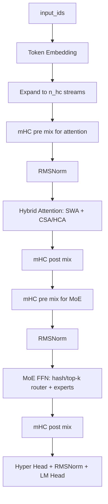

# DeepSeek V4: Towards Highly Efficient Million-Token Context Intelligence

**Link:**

- Technical Report: [DeepSeek_V4.pdf](https://huggingface.co/deepseek-ai/DeepSeek-V4-Pro/resolve/main/DeepSeek_V4.pdf)
- Hugging Face Model Card: [deepseek-ai/DeepSeek-V4-Pro](https://huggingface.co/deepseek-ai/DeepSeek-V4-Pro)
- Official Inference Code: [inference/model.py](https://huggingface.co/deepseek-ai/DeepSeek-V4-Pro/blob/main/inference/model.py)
- Transformers Code: [modeling_deepseek_v4.py](https://github.com/huggingface/transformers/blob/main/src/transformers/models/deepseek_v4/modeling_deepseek_v4.py)
- Transformers Docs: [DeepSeek-V4](https://huggingface.co/docs/transformers/main/model_doc/deepseek_v4)

[toc]

------

## **Main Contributions**

- **1M Context:** DeepSeek-V4 系列把上下文长度推到 1M tokens。重点不是单纯把 RoPE 拉长，而是围绕长上下文重新设计 attention、KV cache 和 sparse selection。
- **Hybrid Attention Architecture:** 使用 **Compressed Sparse Attention (CSA)** 和 **Heavily Compressed Attention (HCA)** 混合结构，把近邻 token 精确保留，把远程 token 压缩后选择性读取。
- **Manifold-Constrained Hyper-Connections (mHC):** 把传统 residual stream 扩成多条 hidden streams，并用受约束的 mixing 矩阵进行合并与传播。
- **MoE Routing Update:** MoE router 支持 `sqrt softplus` 分数函数和前若干层的 hash routing。
- **MTP:** 继续使用 Multi-Token Prediction 思路，为训练提供 next-n token 信号，也为后续推理辅助留下结构入口。
- **Training / Post-training:** 官方模型卡中提到 32T+ tokens 预训练、Muon optimizer，以及 SFT + GRPO + on-policy distillation 的后训练路线。

官方给出的模型规模如下：

| Model | Total Params | Activated Params | Context Length | Precision |
|---|---:|---:|---:|---|
| DeepSeek-V4-Flash | 284B | 13B | 1M | FP4 + FP8 mixed |
| DeepSeek-V4-Pro | 1.6T | 49B | 1M | FP4 + FP8 mixed |
| DeepSeek-V4-Flash-Base | 284B | 13B | 1M | FP8 mixed |
| DeepSeek-V4-Pro-Base | 1.6T | 49B | 1M | FP8 mixed |


------

## **1. 整体架构**

我先把 DeepSeek-V4 看成三条线：

1. **Attention 线：** 用 sliding window 处理最近 token，用 CSA / HCA 处理远程 token。
2. **Residual 线：** 用 mHC 替代简单 residual，让 hidden state 在多条 stream 之间混合。
3. **MoE 线：** 继续走 sparse MoE，但 router 分数和部分层路由方式有变化。

一个比较接近源码的 block 级流程如下：



在官方 inference 代码里，这个结构大概对应：

- `Transformer`: embedding、主干 blocks、lm head、MTP blocks。
- `Block`: attention + MoE，两处都包了一层 hyper-connection。
- `Attention`: sliding window cache + optional compressor + optional indexer。
- `MoE`: router、routed experts、shared expert。

需要注意：Transformers 版本为了兼容 `generate`、cache 和 HF API，类名更细；官方 inference 版本更像“论文结构的最小可读实现”。这篇笔记会同时参考两者，但讲概念时优先贴近官方 inference 写法。

------

## **2. 和 DeepSeek-V3 / V3.2 的关系**

DeepSeek-V3 的两个核心词是 **MLA** 和 **DeepSeekMoE**。V4 没有丢掉 MoE 路线，但长上下文这件事变成了中心问题。

可以先这样理解：

| 模型 | 主要 attention / cache 思路 | MoE | 长上下文处理重点 |
|---|---|---|---|
| DeepSeek-V2 | MLA 降低 KV cache | DeepSeekMoE | 经济型推理 |
| DeepSeek-V3 | MLA + MTP + MoE 训练优化 | DeepSeekMoE | 训练效率和推理能力 |
| DeepSeek-V4 | CSA + HCA hybrid attention | MoE + hash/top-k router | 1M context 下压缩和稀疏选择 |

V4 的关键不是“把所有历史 token 都完整记下来”。如果 1M tokens 全量 KV cache 直接进 attention，显存和算力都不现实。V4 的路线是：

- 最近窗口：保留完整 KV，保证局部上下文精度。
- 更远上下文：压缩成少量 compressed entries。
- 需要读远程信息时：用 indexer 从 compressed entries 里选 top-k。

所以 V4 的 attention 更像一个分层记忆系统：近处看原文，远处看摘要，必要时再从摘要索引里挑重点。

------

## **3. MTP: Multi-Token Prediction**

### 3.1 MTP 是什么

MTP = **Multi-Token Prediction**。

普通 causal LM 的训练目标是：

$$
p(x_{t+1}\mid x_{\le t})
$$

也就是每个位置只预测下一个 token。MTP 的思路是：在主 next-token loss 之外，再让模型预测更远的 token，例如：

$$
p(x_{t+2}\mid x_{\le t}),\quad p(x_{t+3}\mid x_{\le t}),\quad \ldots
$$

可以写成一个简化目标：

$$
\mathcal{L}_{\mathrm{MTP}}
= \frac{1}{D}\sum_{k=1}^{D}
\mathrm{CE}\big(p_k(x_{t+k}\mid x_{\le t}), x_{t+k}\big)
$$

其中 $D$ 是额外预测的步数。

直觉上，next-token prediction 只要求模型把眼前一步做好；MTP 会逼模型在 hidden state 里保留更多“接下来几步可能怎么走”的信息。DeepSeek-V3 技术报告里已经使用过 MTP，V4 继续保留了这个方向。

### 3.2 DeepSeek-V4 里的 MTPBlock

官方 inference 代码里有 `n_mtp_layers` 和 `MTPBlock`。从结构上看，MTPBlock 会拿两类信息：

- 当前主干模型的 hidden state。
- shifted input token 的 embedding。

先对齐源码接口。官方 inference 里的 `MTPBlock.forward` 是：

```python
def forward(self, x, start_pos, input_ids):
    e = self.embed(input_ids)
    e = self.enorm(e)
    x = self.hnorm(x)
    x = self.e_proj(e).unsqueeze(2) + self.h_proj(x)
    x = super().forward(x, start_pos, input_ids)
    logits = self.head(x, self.hc_head_fn, self.hc_head_scale, self.hc_head_base, self.norm)
    return logits
```

也就是说，源码里的 `MTPBlock` **不会自己构造 shifted tokens**。它只要求调用方传入一段 `input_ids`，然后把这段 token 的 embedding 和上一层 hidden streams 融合。真正的 shift 逻辑属于训练数据/调用逻辑：第 1 个 MTPBlock 传入 `x[t+1]`，目标是 `x[t+2]`；第 2 个 MTPBlock 再传入 `x[t+2]`，目标是 `x[t+3]`。

这里的 **shifted input token** 指的是“向后错位后的真实 token”。假设原始序列是：

```text
x0, x1, x2, x3, x4, x5
```

普通 next-token prediction 在位置 `t=2` 使用 `x0, x1, x2` 的上下文预测 `x3`。

MTP 想继续预测更远的位置。为了预测 `x4`，MTPBlock 会额外看到一个 shifted token，也就是 `x3` 的 embedding。这里不是把 `x3` 当成模型生成结果，而是在训练时把真实序列右移后喂给 MTP 模块，帮助它构造“预测下一步的下一步”的中间状态。

可以把它想成：

| 位置 | 主模型看到的上下文 | 主 LM head 目标 | 第 1 个 MTPBlock 额外输入 | 第 1 个 MTPBlock 目标 |
|---|---|---|---|---|
| `t=0` | `x0` | `x1` | `x1` | `x2` |
| `t=1` | `x0, x1` | `x2` | `x2` | `x3` |
| `t=2` | `x0, x1, x2` | `x3` | `x3` | `x4` |

所以 `shifted_input_ids` 不是一个新 token，也不是预测 token，而是训练数据中已经存在的 token，只是相对当前位置向后平移了一格。如果有多个 MTP 层，第 2 个 MTPBlock 会继续用更后面的 shifted token，去预测更远的目标。

然后 MTPBlock 会把 shifted token embedding 和主 hidden state 分别投影、相加，再过一个 block，最后接同一个 head 输出 logits。

用等价伪代码表示：

```python
tokens = [x0, x1, x2, x3, x4, x5]
T = len(tokens)

# 主模型：位置 t 的 hidden 用来预测 x[t+1]
# 有效位置：t = 0, 1, 2, 3, 4
main_hidden = backbone(tokens[:-1])
main_logits = lm_head(main_hidden)
main_loss = 0
for t in range(T - 1):
    main_loss += CE(main_logits[t], tokens[t + 1])

# 第 1 个 MTPBlock：额外输入 tokens[t+1]，目标变成 tokens[t+2]
# 有效位置：t = 0, 1, 2, 3
shifted_1 = tokens[1:]               # x1, x2, x3, x4, x5
target_1 = tokens[2:]                # x2, x3, x4, x5
mtp_hidden_1 = mtp_block_1(main_hidden[:-1], shifted_1[:-1])
mtp_logits_1 = lm_head(mtp_hidden_1)
mtp_loss_1 = 0
for t in range(T - 2):
    mtp_loss_1 += CE(mtp_logits_1[t], target_1[t])

# 如果有第 2 个 MTPBlock：继续往后错一格，目标变成 tokens[t+3]
# 有效位置：t = 0, 1, 2
shifted_2 = tokens[2:]               # x2, x3, x4, x5
target_2 = tokens[3:]                # x3, x4, x5
mtp_hidden_2 = mtp_block_2(mtp_hidden_1[:-1], shifted_2[:-1])
mtp_logits_2 = lm_head(mtp_hidden_2)
mtp_loss_2 = 0
for t in range(T - 3):
    mtp_loss_2 += CE(mtp_logits_2[t], target_2[t])
```

再把一个 `MTPBlock` 本身展开看，它内部大概是：

```python
class MTPBlock:
    def forward(prev_hidden_streams, shifted_input_ids):
        shifted_emb = embed(shifted_input_ids)
        token_part = e_proj(norm_embed(shifted_emb))
        hidden_part = h_proj(norm_hidden(prev_hidden_streams))

        mtp_hidden = token_part[:, :, None, :] + hidden_part
        mtp_hidden = transformer_block(mtp_hidden, shifted_input_ids)

        logits = shared_lm_head(hyper_head(mtp_hidden))
        return logits
```

这里有一个容易混淆的点：MTP 不是把模型一次 forward 变成“直接吐多个 token”。在公开 inference 代码里，主 `Transformer.forward` 默认仍然返回 next-token logits；`MTPBlock` 更像是额外结构，让 hidden state 多承担几个未来 token 的预测任务。

------

## **4. MoE Router、Softplus 和 Hash Route**

### 4.1 Softplus 是什么

Softplus 的定义是：

$$
\mathrm{softplus}(x)=\log(1+e^x)
$$

它可以看成 ReLU 的平滑版本：

$$
\mathrm{ReLU}(x)=\max(0,x)
$$

区别是：

- ReLU 在 $x<0$ 时直接变成 0。
- Softplus 始终大于 0，并且在 0 附近是平滑的。

这对 router 分数有用，因为 MoE router 最后要得到非负权重。如果使用 softplus，负 logits 不会被硬切成 0，而是保留一个很小的正值。

### 4.2 sqrtsoftplus

DeepSeek-V4 官方 inference 代码里，router 支持三种 score function：

- `softmax`
- `sigmoid`
- `sqrtsoftplus`

`sqrtsoftplus` 的等价形式是：

$$
s_i = \sqrt{\mathrm{softplus}(z_i)}
$$

然后对被选中的 top-k experts 做归一化：

$$
w_i = \frac{s_i}{\sum_{j\in \mathrm{TopK}}s_j}
$$

用伪代码写就是：

```python
logits = hidden @ router_weight.T
scores = sqrt(softplus(logits))
indices = topk(scores + bias, k)
weights = gather(scores, indices)
weights = weights / weights.sum(dim=-1, keepdim=True)
```

这里有个细节：bias 可以影响 top-k 选择，但真正的 routing weights 来自未加 bias 的原始 scores。这和很多 MoE router 的写法一致：selection 和 weighting 可以使用略不同的信号。

### 4.3 Hash Route 是什么

普通 top-k router 是：

```python
indices = topk(scores, k)
```

Hash route 则是：

```python
indices = tid2eid[input_ids]
```

也就是说，某些层的 expert 选择不再由当前 hidden state 动态决定，而是由 token id 查表得到。

这像是把“这个 token 去哪些专家”提前写进一个表里。对应到源码，hash layer 会有一个 `tid2eid` 参数，它的形状大致是：

$$
[\mathrm{vocab\_size},\ \mathrm{num\_experts\_per\_tok}]
$$

### 4.4 为什么要 Hash Route

这部分论文和源码能确认的是：DeepSeek-V4 确实支持前若干层使用 hash routing。至于动机，我的理解要稍微保守一点：

- 早期层的 token 表示还比较接近 token identity，用 token id 路由有一定合理性。
- hash routing 可以减少动态 top-k 路由带来的计算和通信波动。
- 固定路由可能让早期 expert 分配更稳定，降低某些 batch 下的 routing collapse 风险。
- 但它也会牺牲一部分上下文自适应能力，所以不适合所有层都这么做。

因此我会把 Hash Route 理解成：**早期层用更便宜、更稳定的 token-id 路由，后续层再交给 hidden-state-based top-k router。**

------

## **5. mHC: Manifold-Constrained Hyper-Connections**

论文第 2.2 节的写法是：先介绍 **Standard Hyper-Connections (HC)**，再说明 **mHC** 相比 HC 多了哪些稳定性约束。这里我也按论文顺序记。

### 5.1 Standard Hyper-Connections

标准 HC 的第一步是把 residual stream 的“宽度”扩成 $n_{\mathrm{hc}}$ 条。论文里说的是：

$$
\mathbb{R}^{d}\rightarrow\mathbb{R}^{n_{\mathrm{hc}}\times d}
$$

其中 $d$ 是真实喂给 Transformer layer 的 hidden size，$n_{\mathrm{hc}}$ 是 Hyper-Connection 的 stream 数量。Hugging Face 配置里对应字段叫 `hc_mult`，DeepSeek-V4 常见设置是：

```text
hc_mult = 4
```

对第 $l$ 层之前的 residual state，论文定义：

$$
\begin{aligned}
X_l
&=
\left[
x_{l,1};
\ldots;
x_{l,n_{\mathrm{hc}}}
\right]^T
&\in
\mathbb{R}^{n_{\mathrm{hc}}\times d}
\end{aligned}
$$

这里每个 $x_{l,i}\in\mathbb{R}^{d}$。所以它不是把 $d$ 切成 $d/n_{\mathrm{hc}}$，而是维护 $n_{\mathrm{hc}}$ 条完整的 $d$ 维 residual streams。

HC 引入三个线性映射：

$$
A_l\in\mathbb{R}^{1\times n_{\mathrm{hc}}}
$$

$$
B_l\in\mathbb{R}^{n_{\mathrm{hc}}\times n_{\mathrm{hc}}}
$$

$$
C_l\in\mathbb{R}^{n_{\mathrm{hc}}\times 1}
$$

更新公式是论文的式 (1)：

$$
\begin{aligned}
X_{l+1}
&=
B_lX_l+C_lF_l(A_lX_l)
\end{aligned}
$$

逐项看维度：

- $A_lX_l\in\mathbb{R}^{1\times d}$：把 $n_{\mathrm{hc}}$ 条 stream collapse 成一条，作为 layer input。
- $F_l(A_lX_l)\in\mathbb{R}^{1\times d}$：第 $l$ 个实际 layer 的输出，仍然是 $d$ 维。
- $C_lF_l(A_lX_l)\in\mathbb{R}^{n_{\mathrm{hc}}\times d}$：把 layer 输出写回 $n_{\mathrm{hc}}$ 条 stream。
- $B_lX_l\in\mathbb{R}^{n_{\mathrm{hc}}\times d}$：旧 residual streams 之间的线性混合。

所以 HC 的关键点是：**inner layer 仍然只处理 $d$ 维输入输出，额外扩展的是 residual stream 的宽度。** 这给模型增加了一条不同于 hidden size 的扩展轴，但因为 $n_{\mathrm{hc}}$ 通常很小，所以开销相对可控。

### 5.2 mHC 相比 HC 改了什么

论文说标准 HC 在多层堆叠时可能出现 numerical instability。mHC 的核心改动是：**不再让 $B_l$ 成为任意矩阵，而是把 $B_l$ 约束到 doubly stochastic matrices 的流形上。**

论文定义的流形是 Birkhoff polytope：

$$
\mathcal{M}
\coloneqq
\left\{
M\in\mathbb{R}^{n_{\mathrm{hc}}\times n_{\mathrm{hc}}}
\mid
M\mathbf{1}_{n_{\mathrm{hc}}}=\mathbf{1}_{n_{\mathrm{hc}}},
\mathbf{1}_{n_{\mathrm{hc}}}^{T}M=\mathbf{1}_{n_{\mathrm{hc}}}^{T},
M\ge 0
\right\}
$$

然后约束：

$$
B_l\in\mathcal{M}
$$

这里的含义很具体：

- $M\mathbf{1}=\mathbf{1}$：每一行和为 1。
- $\mathbf{1}^{T}M=\mathbf{1}^{T}$：每一列和为 1。
- $M\ge 0$：所有元素非负。

论文给出的理由是：这个约束会让 $\lVert B_l\rVert_2$ 被 1 bound 住，因此 residual transformation 是 non-expansive 的。换句话说，$B_l$ 混合多条 stream 时不会无限放大信号。并且 $\mathcal{M}$ 对矩阵乘法封闭，所以多层堆叠时仍然能保持稳定性。

此外，论文还约束 $A_l$ 和 $C_l$ 非负且有界，避免不同 stream 之间因为符号相反而发生 signal cancellation。

### 5.3 Dynamic Parameterization

mHC 里的 $A_l,B_l,C_l$ 不是固定参数，而是动态生成的。论文把它们分成：

- dynamic component：由当前输入 $X_l$ 生成。
- static component：输入无关的可学习 bias。

给定：

$$
X_l\in\mathbb{R}^{n_{\mathrm{hc}}\times d}
$$

先 flatten 并 RMSNorm：

$$
\begin{aligned}
\hat{X}_l
&=
\mathrm{RMSNorm}(\mathrm{vec}(X_l)) \\
&\in
\mathbb{R}^{1\times n_{\mathrm{hc}}d}
\end{aligned}
$$

然后生成 unconstrained raw parameters：

$$
\begin{aligned}
\tilde{A}_l
&=
\alpha_l^{\mathrm{pre}}
\cdot
(\hat{X}_lW_l^{\mathrm{pre}})
+
S_l^{\mathrm{pre}}
\end{aligned}
$$

$$
\begin{aligned}
\tilde{B}_l
&=
\alpha_l^{\mathrm{res}}
\cdot
\mathrm{Mat}(\hat{X}_lW_l^{\mathrm{res}})
+
S_l^{\mathrm{res}}
\end{aligned}
$$

$$
\begin{aligned}
\tilde{C}_l
&=
\alpha_l^{\mathrm{post}}
\cdot
(\hat{X}_lW_l^{\mathrm{post}})^T
+
S_l^{\mathrm{post}}
\end{aligned}
$$

对应维度是：

$$
\begin{aligned}
W_l^{\mathrm{pre}},W_l^{\mathrm{post}}
&\in
\mathbb{R}^{n_{\mathrm{hc}}d\times n_{\mathrm{hc}}}
\end{aligned}
$$

$$
\begin{aligned}
W_l^{\mathrm{res}}
&\in
\mathbb{R}^{n_{\mathrm{hc}}d\times n_{\mathrm{hc}}^2}
\end{aligned}
$$

$$
S_l^{\mathrm{pre}}\in\mathbb{R}^{1\times n_{\mathrm{hc}}},
\quad
S_l^{\mathrm{res}}\in\mathbb{R}^{n_{\mathrm{hc}}\times n_{\mathrm{hc}}},
\quad
S_l^{\mathrm{post}}\in\mathbb{R}^{n_{\mathrm{hc}}\times 1}
$$

其中 $\mathrm{Mat}(\cdot)$ 把 $1\times n_{\mathrm{hc}}^2$ 的向量 reshape 成 $n_{\mathrm{hc}}\times n_{\mathrm{hc}}$ 矩阵。$\alpha_l^{\mathrm{pre}},\alpha_l^{\mathrm{res}},\alpha_l^{\mathrm{post}}\in\mathbb{R}$ 是可学习 gating factors，论文说它们初始化为较小值。这样做的直觉是：训练初期更接近 static component，等训练稳定后再逐步放大 input-dependent dynamic component。

### 5.4 Applying Parameter Constraints

得到 raw parameters 之后，mHC 才施加约束。

对 input mapping 和 output mapping：

$$
A_l=\sigma(\tilde{A}_l)
$$

$$
C_l=2\sigma(\tilde{C}_l)
$$

这里 $A_l$ 的范围是 $(0,1)$，$C_l$ 的范围是 $(0,2)$。它们都是非负且有界的。

对 residual mapping，先保证正数：

$$
M^{(0)}=\exp(\tilde{B}_l)
$$

然后用 Sinkhorn-Knopp 反复做列归一化和行归一化：

$$
\begin{aligned}
M^{(t)}
&=
T_r\left(T_c\left(M^{(t-1)}\right)\right)
\end{aligned}
$$

其中 $T_c$ 表示 column normalization，$T_r$ 表示 row normalization。最终：

$$
B_l=M^{(t_{\max})}
$$

论文中取：

$$
t_{\max}=20
$$

这回答了之前那个疑问：20 次 Sinkhorn 发生在 $n_{\mathrm{hc}}\times n_{\mathrm{hc}}$ 的小矩阵上。DeepSeek-V4 常见 $n_{\mathrm{hc}}=4$，所以每个 token 的 $B_l$ 是 $4\times4$，不是 $d\times d$，也不是 $(n_{\mathrm{hc}}d)\times(n_{\mathrm{hc}}d)$。

### 5.5 和 Hugging Face 变量的对应

HF Transformers 里的 `DeepseekV4DecoderLayer` 有两个 hyper-connection 模块：

- `attn_hc`：包住 self-attention。
- `ffn_hc`：包住 MoE / FFN。

调用形式可以概括为：

```python
post, comb, collapsed = self.attn_hc(hidden_states)
```

对应论文符号：

| HF 变量 | 论文符号 | 维度 | 作用 |
|---|---|---|---|
| `hidden_states` | $X_l$ | $[B_{\mathrm{sz}},S,n_{\mathrm{hc}},d]$ | 多条 residual streams |
| `pre` | $A_l$ | $[B_{\mathrm{sz}},S,1,n_{\mathrm{hc}}]$ 或 broadcast 等价形态 | input mapping |
| `collapsed` | $A_lX_l$ | $[B_{\mathrm{sz}},S,d]$ | 真正喂给 attention / FFN 的输入 |
| `comb` | $B_l$ | $[B_{\mathrm{sz}},S,n_{\mathrm{hc}},n_{\mathrm{hc}}]$ | constrained residual mapping |
| `post` | $C_l$ | $[B_{\mathrm{sz}},S,n_{\mathrm{hc}},1]$ 或 broadcast 等价形态 | output mapping |

`pre` 没有返回，是因为它已经在 `collapsed = A_lX_l` 这一步用掉了。decoder layer 拿到 `collapsed` 后调用 attention / FFN，再把输出写回：

```python
post, comb, collapsed = attn_hc(hidden_states)
attn_output = self_attn(norm(collapsed))
hidden_states = post[..., None] * attn_output[..., None, :] + comb @ hidden_states
```

这就是论文公式：

$$
\begin{aligned}
X_{l+1}
&=
B_lX_l+C_lF_l(A_lX_l)
\end{aligned}
$$

这里为了代码 broadcast，`post[..., None] * attn_output[..., None, :]` 写法看起来和矩阵公式不同，但含义就是 $C_lF_l(A_lX_l)$。

------

## **6. CSA: Compressed Sparse Attention**

论文第 2.3 节先给 Figure 3，再按 **Compressed Key-Value Entries → Lightning Indexer → Shared Key-Value Multi-Query Attention → Attention Sink** 的顺序拆 CSA。这一节也按这个顺序记。


Figure 3 里有三条流：

1. **Sliding Window KV Entries:** 最近一小段 token 不压缩，直接参加 attention，用来保留局部细粒度信息。
2. **Compressed KV Entries:** 历史 KV 先由 token-level compressor 压缩，再由 top-k selector 选一部分进入 attention。
3. **Lightning Indexer:** 不直接输出 hidden state，只给 compressed KV entries 打分并选择 top-k。

一句话概括：CSA 不是把所有历史 token 都扔进 attention，而是先把每 $m$ 个 KV 压成一个 entry，再让每个 query 只 attend 到 top-k 个 compressed entries，同时额外保留最近 sliding window 的原始 KV。

### 6.1 Compressed Key-Value Entries

论文从输入 hidden states 开始：

$$
H\in\mathbb{R}^{n\times d}
$$

其中 $n$ 是 sequence length，$d$ 是 hidden size。CSA 先计算两组 KV entries：

$$
C^a,C^b\in\mathbb{R}^{n\times c}
$$

以及两组对应的 compression weights：

$$
Z^a,Z^b\in\mathbb{R}^{n\times c}
$$

这里 $c$ 是 head dimension。更细地说：

- $C^a,C^b$ 是两套 original KV entries，后面会被加权压缩成 compressed KV entries。
- $Z^a,Z^b$ 不是最终 KV，而是和 $C^a,C^b$ 同形状的 compression logits / weights，用来决定窗口内不同 token 的压缩权重。
- 上标 $a,b$ 表示两组 interleaved / overlapping series，不是 attention head 编号。

对第 $i$ 个 compressed entry，论文把两个长度为 $m$ 的连续片段拼起来看：

$$
\begin{aligned}
C^b_{m(i-1):mi-1}
&\in
\mathbb{R}^{m\times c} \\
C^a_{mi:m(i+1)-1}
&\in
\mathbb{R}^{m\times c}
\end{aligned}
$$

也就是说，$b$ 组的 $m$ 个 token 在前，$a$ 组的 $m$ 个 token 紧接在后。对 $C_i^{\mathrm{Comp}}$ 来说，它实际聚合了一个长度为 $2m$ 的邻域信息：

$$
\left[
m(i-1),\;
m(i+1)-1
\right]
$$

但输出仍然只有一个 compressed entry。

论文公式可以理解成两步。第一步，先在这 $2m$ 个位置上做 compression softmax：

$$
\begin{aligned}
\left[
S^a_{mi:m(i+1)-1};
S^b_{m(i-1):mi-1}
\right]
&=
\mathrm{Softmax}_{\mathrm{row}}
\left(
\left[
Z^a_{mi:m(i+1)-1};
Z^b_{m(i-1):mi-1}
\right]
+
\left[
b^a;
b^b
\right]
\right)
\end{aligned}
$$

其中：

- $S^a,S^b$ 是真正用于加权求和的 compression scores。
- $b^a,b^b\in\mathbb{R}^{m\times c}$ 是 learnable compression biases。
- $\mathrm{Softmax}_{\mathrm{row}}$ 表示沿 token/window 这一维归一化；对每个 head dimension，都在这 $2m$ 个候选 token 上分配权重。

第二步，用这些 scores 加权两组 KV entries：

$$
\begin{aligned}
C_i^{\mathrm{Comp}}
&=
\sum_{j=mi}^{m(i+1)-1}
S^a_j\odot C^a_j
+
\sum_{j=m(i-1)}^{mi-1}
S^b_j\odot C^b_j
\end{aligned}
$$

其中 $\odot$ 是逐维乘法。因为每个 $C^a_j,C^b_j\in\mathbb{R}^{c}$，所以：

$$
C_i^{\mathrm{Comp}}\in\mathbb{R}^{c}
$$

现在再回答“为什么有 overlap 还能压缩到 $1/m$”：因为输出 index 还是按 $i$ 走，每 $m$ 个 token 产生一个 $C_i^{\mathrm{Comp}}$。overlap 只改变一个 compressed entry 聚合时能看的范围，让它看见 $2m$ 个 token；它不改变输出 stride。于是 entries 数量仍然约为：

$$
\frac{n}{m}
$$

所以压缩率仍然约为：

$$
\frac{1}{m}
$$

一个更具体的例子：如果 $m=4$，那么 $C_i^{\mathrm{Comp}}$ 聚合的是前一个 block 的 4 个 token 和当前 block 的 4 个 token，一共 8 个 token 的信息；但它仍然只输出 1 个 $c$ 维 compressed KV entry。

边界条件也要注意：当 $i=0$ 时，$m(i-1):mi-1$ 这一段不存在。论文说这个 undefined 的 segment 会被忽略。实现上通常可以理解为 mask 掉非法位置，让 softmax 不给这些位置分配权重。

### 6.2 Lightning Indexer for Sparse Selection

压缩后的 $C^{\mathrm{Comp}}$ 仍然很多。例如 1M context、$m=4$ 时，远程 compressed entries 仍然是十万级。CSA 不会把所有 compressed entries 都送进 core attention，而是借用 DSA strategy，先用一个轻量 indexer 做 top-k selection。

这一节最容易混淆的点是：**Indexer 不是最终 attention。它只负责从 $C^{\mathrm{Comp}}$ 中选出 $C_t^{\mathrm{SprsComp}}$，然后 core attention 再读取这些 selected entries。**

#### 6.2.1 Indexer keys

论文先对历史 hidden states 做一次和 $C^{\mathrm{Comp}}$ 类似的压缩，但这里压缩出来的是 indexer keys，而不是最终参与 attention 的 KV entries：

$$
K^{\mathrm{IComp}}\in \mathbb{R}^{\frac{n}{m}\times c^I}
$$

其中 $c^I$ 是 indexer head dimension。第 $s$ 个 compressed block 的 indexer key 记作 $K_s^{\mathrm{IComp}}\in \mathbb{R}^{c^I}$。可以把它理解成每个 compressed block 的“检索向量”。真正被选中的内容仍然来自 $C_s^{\mathrm{Comp}}$。

#### 6.2.2 Indexer queries

对 query token $t$，论文从它的 hidden state $h_t$ 生成 indexer queries。第一步是 down-projection：

$$
c_t^Q = h_t \cdot W^{DQ}
$$

然后再 up-projection 成 $n^{I}_{h}$ 个 indexer query heads：

$$
\begin{aligned}
\left[q^{I}_{t,1};q^{I}_{t,2};\ldots;q^{I}_{t,n^{I}_{h}}\right]
&= q_t^I
= c_t^Q \cdot W^{IUQ}
\end{aligned}
$$

维度对应关系如下：

- $h_t\in \mathbb{R}^{d}$：query token $t$ 的输入 hidden state。
- $c_t^Q\in \mathbb{R}^{d_c}$：query compressed latent vector。
- $W^{DQ}\in \mathbb{R}^{d\times d_c}$：indexer query 的 down-projection matrix。
- $W^{IUQ}\in \mathbb{R}^{d_c\times c^I n^{I}_{h}}$：indexer query 的 up-projection matrix。
- $q^{I}_{t,h}\in \mathbb{R}^{c^I}$：第 $h$ 个 indexer query head。

这里的“先 down 再 up”不是为了还原原始 hidden state，而是为了用较低秩的 $c_t^Q$ 生成多头 indexer queries。后面的 core attention query 也会复用这个 $c_t^Q$。

#### 6.2.3 DSA index score

接下来，论文给每个 indexer query head 一个 query-dependent weight：

$$
\begin{aligned}
\left[w^{I}_{t,1};w^{I}_{t,2};\ldots;w^{I}_{t,n^{I}_{h}}\right]
&= w_t^I
= h_t \cdot W^w
\end{aligned}
$$

其中 $W^w\in \mathbb{R}^{d\times n^{I}_{h}}$，$w^{I}_{t,h}\in \mathbb{R}$。然后计算 query token $t$ 对 preceding compressed block $s$ 的 index score：

$$
\begin{aligned}
I_{t,s}
&=
\sum_{h=1}^{n^{I}_{h}}
w^{I}_{t,h}\cdot
\mathrm{ReLU}\left(q^{I}_{t,h}\cdot K_s^{\mathrm{IComp}}\right)
\end{aligned}
$$

这里 $s<\left\lfloor t/m\right\rfloor$，表示只从 query token 之前的 compressed blocks 中选。这个公式可以拆成三层看：

1. $q^{I}_{t,h}\cdot K_s^{\mathrm{IComp}}$：第 $h$ 个 indexer head 对 block $s$ 的相似度。
2. $\mathrm{ReLU}(\cdot)$：只保留正相关的 block。
3. $w^{I}_{t,h}$：让不同 query token 动态决定哪些 indexer heads 更重要。

得到所有 $I_{t,:}$ 之后，用 top-k selector 保留对应的 compressed KV entries：

$$
\begin{aligned}
C_t^{\mathrm{SprsComp}}
&=
\left\{
C_s^{\mathrm{Comp}}
\mid
I_{t,s}\in \mathrm{Top}\text{-}k\left(I_{t,:}\right)
\right\}
\end{aligned}
$$

注意 top-k 选的是 $C_s^{\mathrm{Comp}}$，不是 $K_s^{\mathrm{IComp}}$。$K^{\mathrm{IComp}}$ 只负责打分，$C^{\mathrm{Comp}}$ 才是后面 core attention 的 key/value 来源。

#### 6.2.4 伪代码

```python
def lightning_indexer(h_t, K_IComp, C_Comp, top_k):
    # Eq. (13): low-rank latent for the query token
    c_Q_t = h_t @ W_DQ

    # Eq. (14): n_h^I indexer query heads, each with dimension c^I
    q_I_t = (c_Q_t @ W_IUQ).reshape(n_h_I, c_I)

    # Eq. (15): query-dependent weights for indexer heads
    w_I_t = h_t @ W_w

    scores = []
    for s, K_s_IComp in enumerate(K_IComp):
        # Eq. (16): DSA-style sparse selection score
        score = 0.0
        for h in range(n_h_I):
            score += w_I_t[h] * relu(dot(q_I_t[h], K_s_IComp))
        scores.append(score)

    selected_blocks = topk(scores, k=top_k)

    # Eq. (17): selected compressed KV entries for core attention
    return [C_Comp[s] for s in selected_blocks]
```

### 6.3 Shared Key-Value Multi-Query Attention

选出 $C_t^{\mathrm{SprsComp}}$ 之后，CSA 才进入真正的 core attention。论文这里采用 Multi-Query Attention 的形式：每个 compressed KV entry 同时作为 key 和 value，而 query 有 $n_h$ 个 heads。

先从前面已经得到的 $c_t^Q$ 生成 core attention queries：

$$
\begin{aligned}
\left[q_{t,1};q_{t,2};\ldots;q_{t,n_h}\right]
&= q_t
= c_t^Q \cdot W^{UQ}
\end{aligned}
$$

其中 $n_h$ 是 query heads 数量，$W^{UQ}\in \mathbb{R}^{d_c\times c n_h}$，每个 $q_{t,i}\in \mathbb{R}^{c}$。论文特别说明：这里的 latent query vector $c_t^Q$ 和 indexer queries 使用的是同一个 $c_t^Q$。

然后对每个 query head 做 core attention：

$$
\begin{aligned}
o_{t,i}
&=
\mathrm{CoreAttn}
\left(
\mathrm{query}=q_{t,i},
\mathrm{key}=C_t^{\mathrm{SprsComp}},
\mathrm{value}=C_t^{\mathrm{SprsComp}}
\right)
\end{aligned}
$$

其中 $o_{t,i}\in \mathbb{R}^{c}$。Figure 3 里还会把 selected compressed KV entries 与 sliding window KV entries concat 后送入 shared key-value MQA；公式 (19) 写的是 sparse compressed branch 的核心形式。保留 sliding window KV 的目的，是让最近 token 的 fine-grained dependencies 不完全依赖压缩表示。

### 6.4 Grouped Output Projection

Core attention 之后会得到 $n_h$ 个 head outputs：

$$
\begin{aligned}
\left[o_{t,1};o_{t,2};\ldots;o_{t,n_h}\right]
&= o_t
\in \mathbb{R}^{c n_h}
\end{aligned}
$$

如果直接把 $o_t\in \mathbb{R}^{c n_h}$ 投影回 $d$ 维 hidden state，计算量大约是：

$$
\mathcal{O}\left(c n_h d\right)
$$

论文说 DeepSeek-V4 中 $c n_h$ 很大，所以直接做 output projection 会很贵。Grouped Output Projection 的做法是先把 $n_h$ 个 outputs 分成 $g$ 组。第 $i$ 组输出满足：

$$
o^G_{t,i}\in \mathbb{R}^{c\frac{n_h}{g}}
$$

每一组先投影到一个更小的 intermediate output：

$$
o^{G'}_{t,i}\in \mathbb{R}^{d_g},
\qquad
d_g < c\frac{n_h}{g}
$$

最后再把所有组的 intermediate outputs 拼接：

$$
\begin{aligned}
\left[o^{G'}_{t,1};o^{G'}_{t,2};\ldots;o^{G'}_{t,g}\right]
&\in \mathbb{R}^{d_g g}
\end{aligned}
$$

并投影成最终 attention output：

$$
\hat{o}_t\in \mathbb{R}^{d}
$$

直观计算量可以写成两段：

$$
\mathcal{O}\left(c n_h d_g\right)
+
\mathcal{O}\left(g d_g d\right)
$$

因为 $d_g < c\frac{n_h}{g}$，第一段相当于先在每组内部做 bottleneck compression；第二段再做跨组混合。它比直接 $c n_h\rightarrow d$ 更省的核心原因是：不再让一个巨大矩阵同时处理所有 heads 到 $d$ 维，而是先把每组 head outputs 压到较小的 $d_g$。

### 6.5 Attention Sink

论文在 CSA / HCA 的 core attention 里还用了 **Attention Sink**。这一节的 $h$ 是 attention head 的编号，不是 mHC 里的 $n_{\mathrm{hc}}$。

普通 attention 会把一个 head 的全部权重都分给真实 token / compressed block：

$$
\sum_j s_{h,i,j}=1
$$

但在长上下文压缩场景里，有些 compressed block 对当前 query 可能没用。如果没有 sink，这个 head 还是必须把 100% 概率质量硬分给它们，可能引入噪声。

论文的做法是给每个 attention head 加一个可学习的 sink logit $z'_h$，并把 $\exp(z'_h)$ 加进 softmax 分母：

$$
\begin{aligned}
s_{h,i,j}
&=
\frac{\exp(z_{h,i,j})}
{\sum_k\exp(z_{h,i,k})+\exp(z'_h)}
\end{aligned}
$$

其中：

- $z_{h,i,j}$：第 $h$ 个 attention head 中，第 $i$ 个 query token 对第 $j$ 个 preceding token / compressed block 的 attention logit。
- $s_{h,i,j}$：对应的 attention score。
- $z'_h$：第 $h$ 个 attention head 的 learnable sink logit。

这样真实 KV 上的总 attention mass 变成：

$$
\begin{aligned}
\sum_j s_{h,i,j}
&=
\frac{\sum_j\exp(z_{h,i,j})}
{\sum_k\exp(z_{h,i,k})+\exp(z'_h)}
\le 1
\end{aligned}
$$

剩下的概率质量被 sink 吃掉，不参与 value 聚合。直觉上，这允许某个 head 表达“这次这条 attention branch 没什么可看的”，而不是强迫它在一堆低相关 compressed entries 里硬选。

------

## **7. HCA: Heavily Compressed Attention**

HCA = **Heavily Compressed Attention**。

相比 CSA，HCA 更直接：

- 不做 overlap。
- 不做 indexer。
- 用更大的压缩窗口，例如 $m'=128$。
- 每 $m'$ 个 token 压成一个 compressed entry。

对应公式更接近：

$$
\begin{aligned}
C^{\mathrm{HCA}}_i
&= \sum_{j=0}^{m'-1}
\mathrm{softmax}(Z_{i,j}+B_j)\, C_{i,j}
\end{aligned}
$$

HCA 的定位不是“精确找远程细节”，而是“用很小代价保存远程上下文的粗粒度记忆”。

| Layer type | Compress rate | Overlap | Indexer | KV 形态 |
|---|---:|---|---|---|
| Sliding window attention | 0 | No | No | 最近窗口原始 KV |
| CSA | 4 | Yes | Yes | 原始窗口 KV + selected compressed KV |
| HCA | 128 | No | No | 原始窗口 KV + 全部 heavily compressed KV |

官方 inference 默认 `compress_ratios` 类似：

```text
(0, 0, 4, 128, 4, 128, 4, 0)
```

这说明不同层混合使用无压缩、CSA 和 HCA。这个设计挺合理：不是所有层都需要同一种长程记忆，一些层负责精确，一些层负责便宜地扫远处。

------

## **8. DSA + CSA 处理流程回顾**

把 6.2 和 6.3 串起来，CSA 的 sparse selection 可以按这条数据流读：

1. 历史 hidden states 经过 CSA compressor 得到 $C^{\mathrm{Comp}}$，这是之后 core attention 会真正读取的 compressed KV entries。
2. 同一批历史 hidden states 再用相同压缩思路得到 $K^{\mathrm{IComp}}\in\mathbb{R}^{\frac{n}{m}\times c^I}$，这是 indexer keys，只负责检索打分。
3. Query token $t$ 的 hidden state $h_t$ 先 down 到 $c_t^Q$，再 up 成 $n^{I}_{h}$ 个 indexer query heads $q^{I}_{t,h}$。
4. DSA 公式计算 $I_{t,s}$，也就是 query token $t$ 对 compressed block $s$ 的相关性。
5. Top-k selector 根据 $I_{t,:}$ 从 $C^{\mathrm{Comp}}$ 里选出 $C_t^{\mathrm{SprsComp}}$。
6. Core attention 使用 $C_t^{\mathrm{SprsComp}}$，并和 sliding window KV entries 一起进入 shared key-value MQA。

所以 Lightning Indexer 的位置非常靠前：它是“选哪些 block 值得看”的检索器，不是“看完以后输出什么”的 attention 层。

------

## **9. Hugging Face 源码阅读**

这一节不再写完全自造的伪代码，而是尽量贴近 Hugging Face Transformers 里的类名、变量名和张量形状。代码块是删减版关键路径，目的是看结构，不复刻所有 cache、mask、quantization 和 device 细节。

### 9.1 DecoderLayer: attention 和 FFN 都包一层 mHC

HF 的 `DeepseekV4DecoderLayer` 可以按下面这条路径读：

```python
post, comb, collapsed = self.attn_hc(hidden_states)
attn_output = self.self_attn(self.input_layernorm(collapsed), ...)
hidden_states = post[..., None] * attn_output[..., None, :] + comb @ hidden_states

post, comb, collapsed = self.ffn_hc(hidden_states)
mlp_output = self.mlp(self.post_attention_layernorm(collapsed), input_ids=input_ids)
hidden_states = post[..., None] * mlp_output[..., None, :] + comb @ hidden_states
```

这里的关键是：attention 和 FFN 都不是直接吃 `[B,S,n_{\mathrm{hc}},D]`，而是先通过 `attn_hc` / `ffn_hc` collapse 成：

$$
\bar{X}_l\in\mathbb{R}^{B_{\mathrm{sz}}\times S\times D}
$$

子层输出后，再通过 $C_l\odot U_l+B_l\mathbf{X}_l$ 写回多 stream。

### 9.2 DeepseekV4HyperConnection

`DeepseekV4HyperConnection` 做的事情就是生成 $A_l,C_l,B_l$，并返回 `collapsed`：

```python
flat = hidden_states.flatten(2)
mixes = linear(input_norm(flat), hc_fn)
pre, post, comb = split(mixes, [n_hc, n_hc, n_hc * n_hc])

pre = sigmoid(pre * scale_A + base_A) + eps
post = 2 * sigmoid(post * scale_C + base_C)
comb = sinkhorn(row_softmax(comb * scale_B + base_B) + eps)

collapsed = (pre[..., None] * hidden_states).sum(dim=2)
return post, comb, collapsed
```

这段和论文符号逐项对应：

| HF 变量 | 论文符号 | 说明 |
|---|---|---|
| `hidden_states` | $\mathbf{X}_l$ | 多条 residual streams |
| `mixes` | $M_l$ | 生成 $A_l,C_l,B_l$ 的 logits |
| `pre` | $A_l$ | collapse weights |
| `post` | $C_l$ | write-back weights |
| `comb` | $B_l$ | doubly-stochastic mixing matrix |
| `collapsed` | $\bar{X}_l$ | 子层输入 |

### 9.3 Router: hash route 和 top-k route 的区别

HF 的 router 逻辑可以按这两步拆：

```python
logits = linear(hidden_states, router_weight)
scores = sqrt(softplus(logits))

if hash_routing:
    selected_experts = tid2eid[input_ids]
else:
    selected_experts = topk(scores + correction_bias, k)

router_weights = gather(scores, selected_experts)
router_weights = router_weights / router_weights.sum(dim=-1, keepdim=True)
```

这里要注意：hash route 改的是 `selected_experts` 的来源。它不是让 expert weights 全部变成常数；选中哪些 expert 来自 `tid2eid[input_ids]`，而对应的 weights 仍然可以由当前 hidden state 算出的 `scores` 决定。

### 9.4 CSA / HCA Compressor

HF 官方 inference 里的类名是 `Compressor`。它的 `wkv` 对应论文里的 $C$ 系列，`wgate` 对应 $Z$ 系列，`ape` 对应 compression bias。源码注释也说明：当 `overlap=True` 时，输出维度的前半部分用于 overlapping compression，后半部分用于 normal/current compression。

```python
coff = 1 + overlap
ape = Parameter([compress_ratio, coff * head_dim])
wkv = Linear(dim, coff * head_dim)
wgate = Linear(dim, coff * head_dim)

kv = wkv(hidden_states)
score = wgate(hidden_states)

kv = kv.unflatten(1, (-1, compress_ratio))
score = score.unflatten(1, (-1, compress_ratio)) + ape

if overlap:
    kv = overlap_transform(kv, value=0)
    score = overlap_transform(score, value=-inf)

kv = (kv * score.softmax(dim=2)).sum(dim=2)
kv = norm(kv)
```

`overlap_transform` 这一步就是把论文里的两段拼出来：

```text
previous block: C^b_{m(i-1):mi-1}
current block:  C^a_{mi:m(i+1)-1}
```

当 `compress_ratio == 4` 时，`overlap=True`，这就是 CSA 的压缩方式；当 `compress_ratio == 128` 时，`overlap=False`，更接近 HCA 的 heavily compressed 路径。

### 9.5 DeepseekV4Indexer

CSA 里的 `DeepseekV4Indexer` 可以直接对应论文公式 (13)-(17)。实现里会有 cache、mask、RoPE、quantization 等工程细节，但主干逻辑就是：用 $K^{\mathrm{IComp}}$ 做打分，用 top-k 去 gather $C^{\mathrm{Comp}}$。

```python
# Eq. (13): h_t -> c_t^Q
c_Q_t = h_t @ W_DQ

# Eq. (14): c_t^Q -> n_h^I indexer query heads
q_I_t = (c_Q_t @ W_IUQ).reshape(n_h_I, c_I)

# Eq. (15): query-dependent head weights
w_I_t = h_t @ W_w

# K_IComp: [num_compressed_blocks, c_I]
# q_I_t:   [n_h_I, c_I]
raw = q_I_t @ K_IComp.transpose(-1, -2)
scores = (relu(raw) * w_I_t[:, None]).sum(dim=0)

selected_indices = topk(scores, k=index_topk)
C_t_SprsComp = gather(C_Comp, selected_indices)
```

Indexer 自己并不输出 hidden state。它输出的是 `selected_indices` 或者 gather 后的 $C_t^{\mathrm{SprsComp}}$；真正的 hidden representation 仍然由后面的 core attention 产生。

### 9.6 Attention Sink 在代码里的位置

Attention Sink 对应的是每个 head 一个 learnable sink logit。它不会产生新的 value 向量，而是改变 attention softmax 的归一化分母：

```python
denom = exp(attn_logits).sum(dim=-1, keepdim=True) + exp(sink_logits)
attn_scores = exp(attn_logits) / denom
```

所以它的作用不是“多 attend 一个 token”，而是让真实 KV 的 attention mass 可以小于 1。

------

## **10. 逐个回答我自己的疑问**

### 10.1 MTP 是什么？

MTP 是 Multi-Token Prediction。它让模型不只学习预测下一个 token，还学习预测未来多个 token。DeepSeek-V4 的 inference 代码中有 `MTPBlock`，它把 shifted token embedding 和主 hidden state 融合，再接 block 和 head 输出 logits；但主 `forward` 路径默认仍然是 next-token logits。

### 10.2 softplus 是什么？

Softplus 是：

$$
\mathrm{softplus}(x)=\log(1+e^x)
$$

它是 ReLU 的平滑非负版本。DeepSeek-V4 router 里的 `sqrtsoftplus` 则是：

$$
\sqrt{\log(1+e^x)}
$$

这样能得到非负、平滑的 routing scores。

### 10.3 为什么 hash route？

hash route 是用 token id 查表得到 expert indices。它可能带来更稳定和更便宜的早期层路由。我的理解是：早期层 token 表示还没有充分上下文化，用 token identity 参与路由并不奇怪；到了后面层，再用 top-k router 让 hidden state 决定 experts。

### 10.4 mHC 里的 token 是被切成 n_hc 份吗？

不是。它是把每个 token 的 hidden state 扩成 $n_{\mathrm{hc}}$ 条 stream，每条仍然是 $d$ 维：

$$
[B,S,D]\rightarrow [B,S,n_{\mathrm{hc}},D]
$$

所以不是 $D$ 被切成 $D/n_{\mathrm{hc}}$。

### 10.5 Sinkhorn 20 次会不会耽误时间？

会有开销，但矩阵通常是 $4\times 4$ 这种小矩阵，不是对 hidden dim 做 20 次大矩阵归一化。主要成本仍然在 attention、MoE 和 cache 操作。这个问题不是杞人忧天，因为已经有 mHC-lite 论文专门讨论是否需要 20 次 Sinkhorn-Knopp 迭代。

### 10.6 CSA 里的 C 和 Z 分别是什么？

按论文符号，CSA 不是只有一组 $C$ 和 $Z$，而是：

$$
C^a,C^b\in\mathbb{R}^{n\times c}
$$

$$
Z^a,Z^b\in\mathbb{R}^{n\times c}
$$

- $C^a,C^b$：两组 original KV entries，都是从 hidden states 投影出来、等待压缩的 KV 表示。
- $Z^a,Z^b$：对应的 compression weights / logits，和 $C^a,C^b$ 同形状，用来决定窗口内 token 加权求和的权重。
- $c$：head dimension。

对第 $i$ 个 compressed entry 来说，$C^b_{m(i-1):mi-1}$ 是前一个长度为 $m$ 的片段，$C^a_{mi:m(i+1)-1}$ 是紧接在后面的长度为 $m$ 的片段。两段一起参与加权求和，最后得到一个 $c$ 维的 $C_i^{\mathrm{Comp}}$。

### 10.7 为什么 overlap 还能压缩到 1/m？

因为 overlap 改的是一个 compressed entry 能聚合多少输入信息，不改输出 stride。一个 $C_i^{\mathrm{Comp}}$ 可以融合 $2m$ 个 token 的 KV 信息，但输出仍然是每 $m$ 个 token 产生 1 个 entry，所以 compressed entries 数量仍接近 $n/m$。

### 10.8 Hidden State of Query Token 和 Queries 的区别？

Hidden state 是 query token 当前的表示，Queries 是它经过 query projection、norm、RoPE 等操作后的 attention query：

$$
Q=H_q W^Q
$$

不要把二者直接等同。

### 10.9 HCA 为什么更简单？

HCA 没有 CSA 的 overlap 和 indexer。它只是用更大的窗口把远程 token heavily compress，再把这些 compressed entries 拼到 attention KV 里。

### 10.10 Lightning Indexer 没看懂的核心点是什么？

核心点是把“检索”和“读取”分开。

Indexer 用 $K^{\mathrm{IComp}}$ 和 $q^I_t$ 计算 DSA-style score $I_{t,s}$，再用 top-k 从 $C^{\mathrm{Comp}}$ 里选出 $C_t^{\mathrm{SprsComp}}$。这里的 $K^{\mathrm{IComp}}$ 只是检索用的 keys，不是最终 attention 的 value。真正读取历史信息的是后面的 core attention，它把 $C_t^{\mathrm{SprsComp}}$ 当作 key/value。

### 10.11 Grouped Output Projection 为什么能省计算？

如果直接把 $o_t\in\mathbb{R}^{c n_h}$ 投影成 $d$ 维，计算量是 $\mathcal{O}(c n_h d)$。Grouped Output Projection 先把 $n_h$ 个 heads 分成 $g$ 组，每组从 $c\frac{n_h}{g}$ 维压到 $d_g$ 维，再把 $g d_g$ 维投影到 $d$ 维。

所以它的计算量近似变成：

$$
\mathcal{O}\left(c n_h d_g\right)
+
\mathcal{O}\left(g d_g d\right)
$$

只要 $d_g$ 明显小于每组原始宽度 $c\frac{n_h}{g}$，这个两段式投影就比直接 $c n_h\rightarrow d$ 更便宜。代价是多了一个 bottleneck：每组内部先压缩，跨组信息主要在最后一层 projection 里混合。

------

## **11. 总结表**

| 模块 | 解决的问题 | 核心机制 | 代价 | 源码入口 |
|---|---|---|---|---|
| MTP | next-token 信号太局部 | 预测未来多个 token | 额外 MTP block/head 计算 | `MTPBlock` |
| sqrtsoftplus router | MoE routing scores 需要平滑非负 | $\sqrt{\mathrm{softplus}(x)}$ + top-k | 比 softmax 逻辑略复杂 | `Gate` / `DeepseekV4TopKRouter` |
| Hash Route | 早期层动态路由成本和波动 | token id 查表得到 experts | 上下文自适应弱一些 | `tid2eid` / `DeepseekV4HashRouter` |
| mHC | 深层 residual 信号传播 | 多 stream + Sinkhorn mixing | 小矩阵归一化开销 | `DeepseekV4HyperConnection` |
| CSA | 远程上下文太长 | 近邻原始 KV + $C_t^{\mathrm{SprsComp}}$ + shared KV MQA | 需要 compressor 和 indexer | `DeepseekV4CSACompressor` |
| HCA | 更便宜的远程记忆 | 大窗口压缩，无 indexer | 细节损失更大 | `DeepseekV4HCACompressor` |
| Attention Sink | compressed KV 无关时不应强制分配满权重 | 分母加入 learnable sink logit | 每个 head 多一个 sink 参数 | attention score computation |
| Lightning Indexer | compressed entries 仍然太多 | $K^{\mathrm{IComp}}$ 与 $q^I_t$ 计算 $I_{t,s}$ 后 top-k | 可能漏选远程关键信息 | `Indexer` / `DeepseekV4Indexer` |
| Grouped Output Projection | $c n_h\rightarrow d$ 直接投影太贵 | 先按 $g$ 组压到 $d_g$，再投影到 $d$ | 增加 per-group bottleneck | attention output projection |

------

## **12. 源码与资料入口**

- DeepSeek-V4 Technical Report: [DeepSeek_V4.pdf](https://huggingface.co/deepseek-ai/DeepSeek-V4-Pro/resolve/main/DeepSeek_V4.pdf)
- DeepSeek-V4-Pro Model Card: [deepseek-ai/DeepSeek-V4-Pro](https://huggingface.co/deepseek-ai/DeepSeek-V4-Pro)
- Official inference code: [inference/model.py](https://huggingface.co/deepseek-ai/DeepSeek-V4-Pro/blob/main/inference/model.py)
- Official encoding code: [encoding/encoding_dsv4.py](https://huggingface.co/deepseek-ai/DeepSeek-V4-Pro/blob/main/encoding/encoding_dsv4.py)
- Transformers implementation: [modeling_deepseek_v4.py](https://github.com/huggingface/transformers/blob/main/src/transformers/models/deepseek_v4/modeling_deepseek_v4.py)
- Transformers config: [configuration_deepseek_v4.py](https://github.com/huggingface/transformers/blob/main/src/transformers/models/deepseek_v4/configuration_deepseek_v4.py)
- DeepSeek-V3 Technical Report, for MTP background: [hf.co/papers/2412.19437](https://hf.co/papers/2412.19437)
- mHC-lite discussion: [hf.co/papers/2601.05732](https://hf.co/papers/2601.05732)
- Sparse indexer related work: [IndexCache](https://hf.co/papers/2603.12201), [HISA](https://hf.co/papers/2603.28458)

------

## **13. 最后的一句话理解**

DeepSeek-V4 的主线不是“又把模型做大了”。它更像是在问一个工程问题：当上下文来到 1M tokens，模型到底应该怎样保存、压缩、索引和读取历史信息？

CSA、HCA、Lightning Indexer 解决的是 **长上下文的读写成本**；mHC 解决的是 **深层网络里的信息传播稳定性**；MTP 和 router 更新则继续服务于 **训练信号密度与 sparse computation**。把这些合起来，DeepSeek-V4 才有了 1M context 下还能工作的结构基础。
