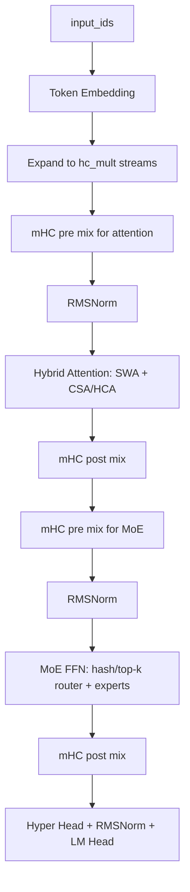

# DeepSeek V4: Towards Highly Efficient Million-Token Context Intelligence

**Link:**

- Technical Report: [DeepSeek_V4.pdf](https://huggingface.co/deepseek-ai/DeepSeek-V4-Pro/resolve/main/DeepSeek_V4.pdf)
- Hugging Face Model Card: [deepseek-ai/DeepSeek-V4-Pro](https://huggingface.co/deepseek-ai/DeepSeek-V4-Pro)
- Official Inference Code: [inference/model.py](https://huggingface.co/deepseek-ai/DeepSeek-V4-Pro/blob/main/inference/model.py)
- Transformers Code: [modeling_deepseek_v4.py](https://github.com/huggingface/transformers/blob/main/src/transformers/models/deepseek_v4/modeling_deepseek_v4.py)
- Transformers Docs: [DeepSeek-V4](https://huggingface.co/docs/transformers/main/model_doc/deepseek_v4)

[toc]

------

## **Main Contributions**

- **1M Context:** DeepSeek-V4 系列把上下文长度推到 1M tokens。重点不是单纯把 RoPE 拉长，而是围绕长上下文重新设计 attention、KV cache 和 sparse selection。
- **Hybrid Attention Architecture:** 使用 **Compressed Sparse Attention (CSA)** 和 **Heavily Compressed Attention (HCA)** 混合结构，把近邻 token 精确保留，把远程 token 压缩后选择性读取。
- **Manifold-Constrained Hyper-Connections (mHC):** 把传统 residual stream 扩成多条 hidden streams，并用受约束的 mixing 矩阵进行合并与传播。
- **MoE Routing Update:** MoE router 支持 `sqrt softplus` 分数函数和前若干层的 hash routing。
- **MTP:** 继续使用 Multi-Token Prediction 思路，为训练提供 next-n token 信号，也为后续推理辅助留下结构入口。
- **Training / Post-training:** 官方模型卡中提到 32T+ tokens 预训练、Muon optimizer，以及 SFT + GRPO + on-policy distillation 的后训练路线。

官方给出的模型规模如下：

| Model | Total Params | Activated Params | Context Length | Precision |
|---|---:|---:|---:|---|
| DeepSeek-V4-Flash | 284B | 13B | 1M | FP4 + FP8 mixed |
| DeepSeek-V4-Pro | 1.6T | 49B | 1M | FP4 + FP8 mixed |
| DeepSeek-V4-Flash-Base | 284B | 13B | 1M | FP8 mixed |
| DeepSeek-V4-Pro-Base | 1.6T | 49B | 1M | FP8 mixed |


------

## **1. 整体架构**

我先把 DeepSeek-V4 看成三条线：

1. **Attention 线：** 用 sliding window 处理最近 token，用 CSA / HCA 处理远程 token。
2. **Residual 线：** 用 mHC 替代简单 residual，让 hidden state 在多条 stream 之间混合。
3. **MoE 线：** 继续走 sparse MoE，但 router 分数和部分层路由方式有变化。

一个比较接近源码的 block 级流程如下：



在官方 inference 代码里，这个结构大概对应：

- `Transformer`: embedding、主干 blocks、lm head、MTP blocks。
- `Block`: attention + MoE，两处都包了一层 hyper-connection。
- `Attention`: sliding window cache + optional compressor + optional indexer。
- `MoE`: router、routed experts、shared expert。

需要注意：Transformers 版本为了兼容 `generate`、cache 和 HF API，类名更细；官方 inference 版本更像“论文结构的最小可读实现”。这篇笔记会同时参考两者，但讲概念时优先贴近官方 inference 写法。

------

## **2. 和 DeepSeek-V3 / V3.2 的关系**

DeepSeek-V3 的两个核心词是 **MLA** 和 **DeepSeekMoE**。V4 没有丢掉 MoE 路线，但长上下文这件事变成了中心问题。

可以先这样理解：

| 模型 | 主要 attention / cache 思路 | MoE | 长上下文处理重点 |
|---|---|---|---|
| DeepSeek-V2 | MLA 降低 KV cache | DeepSeekMoE | 经济型推理 |
| DeepSeek-V3 | MLA + MTP + MoE 训练优化 | DeepSeekMoE | 训练效率和推理能力 |
| DeepSeek-V4 | CSA + HCA hybrid attention | MoE + hash/top-k router | 1M context 下压缩和稀疏选择 |

V4 的关键不是“把所有历史 token 都完整记下来”。如果 1M tokens 全量 KV cache 直接进 attention，显存和算力都不现实。V4 的路线是：

- 最近窗口：保留完整 KV，保证局部上下文精度。
- 更远上下文：压缩成少量 compressed entries。
- 需要读远程信息时：用 indexer 从 compressed entries 里选 top-k。

所以 V4 的 attention 更像一个分层记忆系统：近处看原文，远处看摘要，必要时再从摘要索引里挑重点。

------

## **3. MTP: Multi-Token Prediction**

### 3.1 MTP 是什么

MTP = **Multi-Token Prediction**。

普通 causal LM 的训练目标是：

$$
p(x_{t+1}\mid x_{\le t})
$$

也就是每个位置只预测下一个 token。MTP 的思路是：在主 next-token loss 之外，再让模型预测更远的 token，例如：

$$
p(x_{t+2}\mid x_{\le t}),\quad p(x_{t+3}\mid x_{\le t}),\quad \ldots
$$

可以写成一个简化目标：

$$
\mathcal{L}_{\mathrm{MTP}}
= \frac{1}{D}\sum_{k=1}^{D}
\mathrm{CE}\big(p_k(x_{t+k}\mid x_{\le t}), x_{t+k}\big)
$$

其中 $D$ 是额外预测的步数。

直觉上，next-token prediction 只要求模型把眼前一步做好；MTP 会逼模型在 hidden state 里保留更多“接下来几步可能怎么走”的信息。DeepSeek-V3 技术报告里已经使用过 MTP，V4 继续保留了这个方向。

### 3.2 DeepSeek-V4 里的 MTPBlock

官方 inference 代码里有 `n_mtp_layers` 和 `MTPBlock`。从结构上看，MTPBlock 会拿两类信息：

- 当前主干模型的 hidden state。
- shifted input token 的 embedding。

先对齐源码接口。官方 inference 里的 `MTPBlock.forward` 是：

```python
def forward(self, x, start_pos, input_ids):
    e = self.embed(input_ids)
    e = self.enorm(e)
    x = self.hnorm(x)
    x = self.e_proj(e).unsqueeze(2) + self.h_proj(x)
    x = super().forward(x, start_pos, input_ids)
    logits = self.head(x, self.hc_head_fn, self.hc_head_scale, self.hc_head_base, self.norm)
    return logits
```

也就是说，源码里的 `MTPBlock` **不会自己构造 shifted tokens**。它只要求调用方传入一段 `input_ids`，然后把这段 token 的 embedding 和上一层 hidden streams 融合。真正的 shift 逻辑属于训练数据/调用逻辑：第 1 个 MTPBlock 传入 `x[t+1]`，目标是 `x[t+2]`；第 2 个 MTPBlock 再传入 `x[t+2]`，目标是 `x[t+3]`。

这里的 **shifted input token** 指的是“向后错位后的真实 token”。假设原始序列是：

```text
x0, x1, x2, x3, x4, x5
```

普通 next-token prediction 在位置 `t=2` 使用 `x0, x1, x2` 的上下文预测 `x3`。

MTP 想继续预测更远的位置。为了预测 `x4`，MTPBlock 会额外看到一个 shifted token，也就是 `x3` 的 embedding。这里不是把 `x3` 当成模型生成结果，而是在训练时把真实序列右移后喂给 MTP 模块，帮助它构造“预测下一步的下一步”的中间状态。

可以把它想成：

| 位置 | 主模型看到的上下文 | 主 LM head 目标 | 第 1 个 MTPBlock 额外输入 | 第 1 个 MTPBlock 目标 |
|---|---|---|---|---|
| `t=0` | `x0` | `x1` | `x1` | `x2` |
| `t=1` | `x0, x1` | `x2` | `x2` | `x3` |
| `t=2` | `x0, x1, x2` | `x3` | `x3` | `x4` |

所以 `shifted_input_ids` 不是一个新 token，也不是预测 token，而是训练数据中已经存在的 token，只是相对当前位置向后平移了一格。如果有多个 MTP 层，第 2 个 MTPBlock 会继续用更后面的 shifted token，去预测更远的目标。

然后 MTPBlock 会把 shifted token embedding 和主 hidden state 分别投影、相加，再过一个 block，最后接同一个 head 输出 logits。

用等价伪代码表示：

```python
tokens = [x0, x1, x2, x3, x4, x5]
T = len(tokens)

# 主模型：位置 t 的 hidden 用来预测 x[t+1]
# 有效位置：t = 0, 1, 2, 3, 4
main_hidden = backbone(tokens[:-1])
main_logits = lm_head(main_hidden)
main_loss = 0
for t in range(T - 1):
    main_loss += CE(main_logits[t], tokens[t + 1])

# 第 1 个 MTPBlock：额外输入 tokens[t+1]，目标变成 tokens[t+2]
# 有效位置：t = 0, 1, 2, 3
shifted_1 = tokens[1:]               # x1, x2, x3, x4, x5
target_1 = tokens[2:]                # x2, x3, x4, x5
mtp_hidden_1 = mtp_block_1(main_hidden[:-1], shifted_1[:-1])
mtp_logits_1 = lm_head(mtp_hidden_1)
mtp_loss_1 = 0
for t in range(T - 2):
    mtp_loss_1 += CE(mtp_logits_1[t], target_1[t])

# 如果有第 2 个 MTPBlock：继续往后错一格，目标变成 tokens[t+3]
# 有效位置：t = 0, 1, 2
shifted_2 = tokens[2:]               # x2, x3, x4, x5
target_2 = tokens[3:]                # x3, x4, x5
mtp_hidden_2 = mtp_block_2(mtp_hidden_1[:-1], shifted_2[:-1])
mtp_logits_2 = lm_head(mtp_hidden_2)
mtp_loss_2 = 0
for t in range(T - 3):
    mtp_loss_2 += CE(mtp_logits_2[t], target_2[t])
```

再把一个 `MTPBlock` 本身展开看，它内部大概是：

```python
class MTPBlock:
    def forward(prev_hidden_streams, shifted_input_ids):
        shifted_emb = embed(shifted_input_ids)
        token_part = e_proj(norm_embed(shifted_emb))
        hidden_part = h_proj(norm_hidden(prev_hidden_streams))

        mtp_hidden = token_part[:, :, None, :] + hidden_part
        mtp_hidden = transformer_block(mtp_hidden, shifted_input_ids)

        logits = shared_lm_head(hyper_head(mtp_hidden))
        return logits
```

这里有一个容易混淆的点：MTP 不是把模型一次 forward 变成“直接吐多个 token”。在公开 inference 代码里，主 `Transformer.forward` 默认仍然返回 next-token logits；`MTPBlock` 更像是额外结构，让 hidden state 多承担几个未来 token 的预测任务。

------

## **4. MoE Router、Softplus 和 Hash Route**

### 4.1 Softplus 是什么

Softplus 的定义是：

$$
\mathrm{softplus}(x)=\log(1+e^x)
$$

它可以看成 ReLU 的平滑版本：

$$
\mathrm{ReLU}(x)=\max(0,x)
$$

区别是：

- ReLU 在 $x<0$ 时直接变成 0。
- Softplus 始终大于 0，并且在 0 附近是平滑的。

这对 router 分数有用，因为 MoE router 最后要得到非负权重。如果使用 softplus，负 logits 不会被硬切成 0，而是保留一个很小的正值。

### 4.2 sqrtsoftplus

DeepSeek-V4 官方 inference 代码里，router 支持三种 score function：

- `softmax`
- `sigmoid`
- `sqrtsoftplus`

`sqrtsoftplus` 的等价形式是：

$$
s_i = \sqrt{\mathrm{softplus}(z_i)}
$$

然后对被选中的 top-k experts 做归一化：

$$
w_i = \frac{s_i}{\sum_{j\in \mathrm{TopK}}s_j}
$$

用伪代码写就是：

```python
logits = hidden @ router_weight.T
scores = sqrt(softplus(logits))
indices = topk(scores + bias, k)
weights = gather(scores, indices)
weights = weights / weights.sum(dim=-1, keepdim=True)
```

这里有个细节：bias 可以影响 top-k 选择，但真正的 routing weights 来自未加 bias 的原始 scores。这和很多 MoE router 的写法一致：selection 和 weighting 可以使用略不同的信号。

### 4.3 Hash Route 是什么

普通 top-k router 是：

```python
indices = topk(scores, k)
```

Hash route 则是：

```python
indices = tid2eid[input_ids]
```

也就是说，某些层的 expert 选择不再由当前 hidden state 动态决定，而是由 token id 查表得到。

这像是把“这个 token 去哪些专家”提前写进一个表里。对应到源码，hash layer 会有一个 `tid2eid` 参数，它的形状大致是：

$$
[\mathrm{vocab\_size},\ \mathrm{num\_experts\_per\_tok}]
$$

### 4.4 为什么要 Hash Route

这部分论文和源码能确认的是：DeepSeek-V4 确实支持前若干层使用 hash routing。至于动机，我的理解要稍微保守一点：

- 早期层的 token 表示还比较接近 token identity，用 token id 路由有一定合理性。
- hash routing 可以减少动态 top-k 路由带来的计算和通信波动。
- 固定路由可能让早期 expert 分配更稳定，降低某些 batch 下的 routing collapse 风险。
- 但它也会牺牲一部分上下文自适应能力，所以不适合所有层都这么做。

因此我会把 Hash Route 理解成：**早期层用更便宜、更稳定的 token-id 路由，后续层再交给 hidden-state-based top-k router。**

------

## **5. mHC: Manifold-Constrained Hyper-Connections**

### 5.1 先统一符号和维度

论文第 2.2 节讲的是 **Manifold-Constrained Hyper-Connections**。这一节如果只说“多条 residual stream”还是不够，因为真正难点在于：`pre`、`post`、`comb` 到底分别对应论文里的哪个量，以及它们的维度是什么。

为了避免 batch size 和论文里的矩阵 $B_l$ 撞名，下面我用：

- $b$ 表示 batch size。
- $s$ 表示 sequence length。
- $d$ 表示 hidden size。
- $h$ 表示 hyper-connection multiplier，也就是源码里的 `hc_mult`。DeepSeek-V4 里常见配置是 $h=4$。

普通 Transformer 的 hidden states 是：

$$
X_l \in \mathbb{R}^{b\times s\times d}
$$

mHC 会把它扩成 $h$ 条 residual streams：

$$
\mathbf{X}_l \in \mathbb{R}^{b\times s\times h\times d}
$$

对单个 token 来看，就是：

$$
\mathbf{X}_{l,t}\in\mathbb{R}^{h\times d}
$$

这一步非常重要：**不是把一个 token 的 $d$ 维 hidden state 切成 $h$ 份，而是为同一个 token 维护 $h$ 条 $d$ 维 stream。**

源码里对应：

```python
h = embed(input_ids)                         # [b, s, d]
h = h.unsqueeze(2).repeat(1, 1, hc_mult, 1)  # [b, s, h, d]
```

### 5.2 mHC 的核心流程

对于 attention 或 FFN 这样的子层，普通 residual 是：

$$
x_{l+1}=x_l + F(x_l)
$$

而 mHC 变成三步：

1. 用 `pre` 权重把 $h$ 条 stream collapse 成一条，喂给子层。
2. 子层输出一条新的 $d$ 维向量。
3. 用 `post` 和 `comb` 把子层输出写回 $h$ 条 stream，并混合旧 stream。

写成公式：

$$
\bar{x}_l = \sum_{i=1}^{h} A_{l,i}\mathbf{X}_{l,i}
$$

$$
u_l = F_l(\bar{x}_l)
$$

$$
\mathbf{X}_{l+1,j}
= C_{l,j}u_l+\sum_{i=1}^{h}B_{l,j,i}\mathbf{X}_{l,i}
$$

其中：

- $A_l\in\mathbb{R}^{h}$：collapse weights，对应源码里的 `pre`。
- $C_l\in\mathbb{R}^{h}$：write-back weights，对应源码里的 `post`。
- $B_l\in\mathbb{R}^{h\times h}$：stream mixing matrix，对应源码里的 `comb`。
- $\bar{x}_l\in\mathbb{R}^{d}$：collapse 后喂给 attention / FFN 的单条 hidden state。
- $u_l\in\mathbb{R}^{d}$：attention / FFN 的输出。
- $\mathbf{X}_{l+1}\in\mathbb{R}^{h\times d}$：更新后的多条 residual streams。

如果把 batch 和 sequence 维度补回来，就是：

$$
A_l,C_l\in\mathbb{R}^{b\times s\times h}
$$

$$
B_l\in\mathbb{R}^{b\times s\times h\times h}
$$

$$
\bar{X}_l,U_l\in\mathbb{R}^{b\times s\times d}
$$

$$
\mathbf{X}_{l+1}\in\mathbb{R}^{b\times s\times h\times d}
$$

### 5.3 `pre`、`post`、`comb` 分别是什么

源码里的 `DeepseekV4HyperConnection.forward(hidden_streams)` 会返回三个东西：

```python
post, comb, collapsed = self.attn_hc(hidden_streams)
```

如果对照论文符号，它们其实是：

| 源码变量 | 论文符号 | 维度 | 作用 |
|---|---|---|---|
| `pre` | $A_l$ | $[b,s,h]$ | 把 $h$ 条 stream 加权合成 1 条 |
| `collapsed` | $\bar{X}_l$ | $[b,s,d]$ | 子层 attention / FFN 的输入 |
| `post` | $C_l$ | $[b,s,h]$ | 把子层输出写回每条 stream 的权重 |
| `comb` | $B_l$ | $[b,s,h,h]$ | 旧 streams 之间的混合矩阵 |

这里有一个命名小坑：`pre` 没有作为返回值直接传回 decoder layer，而是在 `DeepseekV4HyperConnection.forward` 内部已经被用掉了：

$$
\bar{X}_l
= \sum_{i=1}^{h}A_{l,i}\mathbf{X}_{l,i}
$$

所以 decoder layer 只拿到 `collapsed`、`post`、`comb`。

源码更新 hidden streams 的逻辑是：

```python
post, comb, collapsed = attn_hc(hidden_streams)
attn_output = self_attn(norm(collapsed))
hidden_streams = post.unsqueeze(-1) * attn_output.unsqueeze(-2) + torch.matmul(comb, hidden_streams)
```

对应论文公式就是：

$$
\mathbf{X}_{l+1}
= C_l\odot U_l+B_l\mathbf{X}_l
$$

其中 $\odot$ 表示把 $C_l\in\mathbb{R}^{b\times s\times h}$ broadcast 到 hidden dim 上：

$$
C_l\odot U_l
\in
\mathbb{R}^{b\times s\times h\times d}
$$

而矩阵乘法：

$$
B_l\mathbf{X}_l
$$

是在 stream 维度上做的。也就是说，对每个 batch、每个 token，都有一个 $h\times h$ 的 $B_l$ 去混合 $h$ 条 $d$ 维 streams。

### 5.4 A_l、C_l、B_l 是怎么生成的

mHC 不是固定用一组全局 $A_l$、$C_l$、$B_l$。它们是根据当前 token 的多条 streams 动态生成的。

先把每个 token 的 $h\times d$ 展平：

$$
\mathrm{vec}(\mathbf{X}_{l,t})\in\mathbb{R}^{hd}
$$

然后经过一个线性映射，得到长度为 $(2+h)h$ 的 logits：

$$
\begin{aligned}
M_l &= \phi_l(\mathrm{RMSNorm}(\mathrm{vec}(\mathbf{X}_l))) \\
&\in \mathbb{R}^{(2+h)h}
\end{aligned}
$$

这段 logits 被切成三部分：

$$
\begin{aligned}
M_l &=
\left[
\tilde{A}_l,\tilde{C}_l,\tilde{B}_l
\right]
\end{aligned}
$$

其中：

$$
\tilde{A}_l\in\mathbb{R}^{h}
$$

$$
\tilde{C}_l\in\mathbb{R}^{h}
$$

$$
\tilde{B}_l\in\mathbb{R}^{h\times h}
$$

在官方 inference kernel 里，大致是：

```text
pre  = sigmoid(A_logits * scale[0] + base_A) + eps
post = 2 * sigmoid(C_logits * scale[1] + base_C)
comb = Sinkhorn(row_softmax(B_logits * scale[2] + base_B) + eps)
```

也就是：

$$
A_l = \sigma(\tilde{A}_l)+\epsilon
$$

$$
C_l = 2\sigma(\tilde{C}_l)
$$

$$
B_l = \mathrm{Sinkhorn}(\mathrm{softmax}(\tilde{B}_l)+\epsilon)
$$

严格说，源码里还有 `scale` 和 `base` 参数，上面公式为了可读性把它们吸收到 $\tilde{A}_l,\tilde{C}_l,\tilde{B}_l$ 里了。

### 5.5 为什么 `comb` 要做双随机约束

论文里强调的是 $B_l$ 位于 doubly-stochastic manifold。双随机矩阵近似满足：

$$
B_l\mathbf{1}=\mathbf{1}
$$

$$
B_l^{\mathsf{T}}\mathbf{1}=\mathbf{1}
$$

直观解释是：

- 行和为 1：每条新 stream 从旧 streams 接收的信息总量受控。
- 列和为 1：每条旧 stream 被分发出去的信息总量受控。

如果没有这个约束，$B_l$ 可能把某些 stream 不断放大，或者让某些 stream 在多层之后消失。双随机约束不是为了让信息“平均”，而是为了让 stream mixing 更稳定。

源码里用 Sinkhorn-Knopp 做近似投影：

```python
for _ in range(hc_sinkhorn_iters):
    comb = comb / (comb.sum(dim=-1, keepdim=True) + eps)  # row normalize
    comb = comb / (comb.sum(dim=-2, keepdim=True) + eps)  # col normalize
```

### 5.6 Sinkhorn 20 次会不会慢

DeepSeek-V4 配置里能看到类似：

```text
hc_mult = 4
hc_sinkhorn_iters = 20
```

这个疑问是合理的，但要看矩阵大小。`comb` 的矩阵尺寸是：

$$
h\times h = 4\times 4
$$

不是：

$$
d\times d
$$

也不是：

$$
(hd)\times (hd)
$$

所以每个 token 做 20 次 Sinkhorn，确实有额外开销，但每次处理的是很小的 $4\times4$ 矩阵。相比 attention、MoE expert GEMM、长上下文 cache 读写，它通常不应该是最大瓶颈。

不过，这不代表它完全免费。Hugging Face 上有一篇相关论文叫 **mHC-lite: You Don't Need 20 Sinkhorn-Knopp Iterations**，标题已经很直接：社区确实在讨论 20 次迭代是否必要。写笔记时可以把它放在“相关讨论”，不要把它当成 DeepSeek-V4 官方实现。

### 5.7 和源码变量的完整对应

| 论文 / 本文符号 | 官方 inference 变量 | Transformers 变量 | 维度 |
|---|---|---|---|
| $\mathbf{X}_l$ | `x` / `residual` | `hidden_states` | $[b,s,h,d]$ |
| $M_l$ | `mixes` | `mix` | $[b,s,(2+h)h]$ |
| $A_l$ | `pre` | `pre` | $[b,s,h]$ |
| $\bar{X}_l$ | `y` in `hc_pre` | `collapsed` | $[b,s,d]$ |
| $C_l$ | `post` | `post` | $[b,s,h]$ |
| $B_l$ | `comb` | `comb` | $[b,s,h,h]$ |
| $U_l=F_l(\bar{X}_l)$ | attention / MoE output | `attn_output` / `mlp_output` | $[b,s,d]$ |
| $\mathbf{X}_{l+1}$ | output of `hc_post` | updated `hidden_states` | $[b,s,h,d]$ |

所以一句话总结：

**`pre` 负责把多条 stream 收成一条；`post` 负责把新子层输出写回多条 stream；`comb` 负责让旧 streams 以双随机矩阵的形式继续流动。**

------

## **6. CSA: Compressed Sparse Attention**

CSA 是这篇最难的一块。我先用一句话压住它：

**CSA = 最近 token 用 sliding window 精确看，远程 token 先压缩，再用 indexer 选一小部分看。**

### 6.1 符号统一

论文 9-10 页里会出现几组很像的符号。先把它们对应到源码直觉：

| 符号 | 直觉含义 | 源码中大概对应 |
|---|---|---|
| $H$ | 当前层输入 hidden states | attention 输入 hidden |
| $W^{KV}$ | 把 hidden state 投影成待压缩 KV 的权重 | `kv_proj` / `wkv` |
| $C=H W^{KV}$ | original KV entries，压缩前的每 token KV 表示 | `kv` 或 `C` |
| $W^Z$ | 生成 compression weights 的权重 | `gate_proj` / `wgate` |
| $Z=H W^Z$ | 每个 token 在压缩窗口里的打分 | `gate` / `score` |
| $B$ | position bias，不是 mHC 的 mixing matrix | `position_bias` / `ape` |
| $C^{\mathrm{Comp}}$ | 压缩后的 KV entry | `compressed_kv` |

最基础的压缩公式可以写成：

$$
C = H W^{KV}
$$

$$
Z = H W^Z
$$

对一个长度为 $m$ 的窗口，压缩结果是：

$$
\begin{aligned}
C^{\mathrm{Comp}}_i
&= \sum_{j=0}^{m-1}
\mathrm{softmax}(Z_{i,j}+B_j)\, C_{i,j}
\end{aligned}
$$

这里 $B_j$ 是窗口内位置 bias。它让模型知道“窗口里第几个 token”在压缩时可能有不同重要性。

### 6.2 Hidden State of Query Token 和 Queries 的区别

这个地方我一开始也会绕。

- **Hidden State of Query Token:** 还没变成 attention query 的 token 表示，记作 $H_q$。
- **Queries:** 经过 query projection 之后的向量，记作 $Q$。

也就是：

$$
Q = H_q W^Q
$$

在 DeepSeek-V4 这种实现里，query 还会经过低秩投影、RMSNorm、RoPE 等处理。所以不要把论文里的 `hidden state of query token` 直接等同于最后参与 attention dot-product 的 $Q$。

### 6.3 CSA 的两个 KV 来源

CSA 的 attention KV 大致由两部分拼起来：

1. **Window KV:** 最近 $w$ 个 token 的原始 KV。
2. **Compressed KV:** 更早历史 token 的压缩 entries。

可以画成：

```text
query token
    |
    |-- attend to recent exact KV: [t-w, ..., t]
    |
    |-- indexer selects remote compressed KV:
        [comp_3, comp_19, comp_41, ...]
```

所以 CSA 不是把所有 KV 都压缩掉。它保留了局部精确性，同时给远程上下文一个便宜入口。

### 6.4 overlap 为什么还能压缩到约 1/m

这个问题很关键。

如果不 overlap，长度 $L$、窗口大小 $m$，输出 compressed entries 数量约为：

$$
\frac{L}{m}
$$

CSA 的 overlap 会让一个 compressed entry 聚合时看到相邻窗口的信息。Transformers 实现注释里把它解释成两组 series：`Ca` 和 `Cb`。可以粗略理解为：

- 当前窗口提供一部分信息。
- 上一个窗口保留一部分边界信息。
- 聚合时把两边拼起来看。

但输出 stride 仍然是 $m$。也就是说，每走 $m$ 个源 token，仍然只产生约 1 个 compressed entry。

所以 overlap 改的是“每个 compressed entry 看到了哪些 token”，不是“每个窗口都额外输出一个 entry”。因此压缩率仍然接近：

$$
\frac{1}{m}
$$

### 6.5 CSA 的等价伪代码

```python
def csa_compress(hidden, m):
    C = kv_proj(hidden)
    Z = gate_proj(hidden)

    # overlap makes each compressed entry see boundary information
    chunks = make_overlapped_chunks(C, size=m, stride=m)
    gates = make_overlapped_chunks(Z, size=m, stride=m)

    weights = softmax(gates + position_bias, dim="window")
    compressed = sum(weights * chunks, dim="window")
    return compressed

def csa_attention(query, recent_kv, compressed_kv):
    selected = indexer(query, compressed_kv)
    kv = concat(recent_kv, compressed_kv[selected])
    return sparse_attention(query, kv)
```

这里的 `indexer` 只负责选 compressed entries，不负责最终 attention 输出。

------

## **7. HCA: Heavily Compressed Attention**

HCA = **Heavily Compressed Attention**。

相比 CSA，HCA 更直接：

- 不做 overlap。
- 不做 indexer。
- 用更大的压缩窗口，例如 $m'=128$。
- 每 $m'$ 个 token 压成一个 compressed entry。

对应公式更接近：

$$
\begin{aligned}
C^{\mathrm{HCA}}_i
&= \sum_{j=0}^{m'-1}
\mathrm{softmax}(Z_{i,j}+B_j)\, C_{i,j}
\end{aligned}
$$

HCA 的定位不是“精确找远程细节”，而是“用很小代价保存远程上下文的粗粒度记忆”。

| Layer type | Compress rate | Overlap | Indexer | KV 形态 |
|---|---:|---|---|---|
| Sliding window attention | 0 | No | No | 最近窗口原始 KV |
| CSA | 4 | Yes | Yes | 原始窗口 KV + selected compressed KV |
| HCA | 128 | No | No | 原始窗口 KV + 全部 heavily compressed KV |

官方 inference 默认 `compress_ratios` 类似：

```text
(0, 0, 4, 128, 4, 128, 4, 0)
```

这说明不同层混合使用无压缩、CSA 和 HCA。这个设计挺合理：不是所有层都需要同一种长程记忆，一些层负责精确，一些层负责便宜地扫远处。

------

## **8. Lightning Indexer for Sparse Selection**

压缩之后还有一个问题：如果上下文有 1M tokens，即使每 4 个 token 压成 1 个 entry，也仍然有很多 compressed entries。

不能全看，所以需要 indexer。

我把这个模块理解成一个轻量检索器：

1. 从 query token hidden state 得到 index query。
2. 把历史 hidden states 压成 index KV。
3. 用便宜的 scoring 算出每个 compressed entry 的相关性。
4. 选 top-k。
5. 真正的 sparse attention 只读取这些 top-k entries。

等价伪代码：

```python
def lightning_indexer(hidden, query_low_rank, compressed_index_kv):
    q_idx = index_query_proj(query_low_rank)
    q_idx = apply_rope(q_idx)
    q_idx = rotate_and_quantize(q_idx)

    scores = q_idx @ compressed_index_kv.T
    scores = relu(scores) * learned_head_weights
    scores = reduce_heads(scores)

    selected = topk(scores, k=index_topk)
    return selected

def sparse_selection_attention(q, recent_kv, compressed_kv):
    selected = lightning_indexer(...)
    kv = concat(recent_kv, compressed_kv[selected])
    return sparse_attention(q, kv)
```

它和 attention 的区别很重要：

- Indexer 输出的是位置，也就是 `selected indices`。
- Attention 输出的是新的 hidden representation。

所以 indexer 不需要像主 attention 那么精细。它只要大致选对远程 compressed entries，就能把大部分计算省掉。

------

## **9. 关键源码阅读**

下面不是官方源码逐字摘录，而是根据官方 inference / Transformers 实现改写的最小逻辑。这样更适合看懂结构，也避免被工程细节淹没。

### 9.1 Transformer 主体

```python
class Transformer:
    def forward(input_ids):
        h = embed(input_ids)
        h = repeat_as_hc_streams(h, hc_mult)

        for block in layers:
            h = block(h, input_ids)

        logits = lm_head(norm(hyper_head(h)))
        return logits
```

关键 shape：

$$
[B,S,D] \rightarrow [B,S,n_{\mathrm{hc}},D]
$$

### 9.2 mHC pre/post

```python
def hyper_connection(streams):
    mix_logits = linear(rmsnorm(flatten_hc(streams)))
    pre, post, comb = split_to_A_C_B_and_sinkhorn(mix_logits)
    collapsed = sum(pre[..., i, None] * streams[..., i, :] for i in range(hc_mult))
    return post, comb, collapsed

post, comb, collapsed = hyper_connection(old_streams)
module_output = sublayer(norm(collapsed))
new_streams = post[..., None] * module_output[..., None, :] + comb @ old_streams
```

这里 `pre/post/comb` 分别对应 $A_l/C_l/B_l$。`pre` 已经在 `collapsed` 内部用掉；decoder layer 继续使用的是 `post`、`comb` 和 `collapsed`。

### 9.3 Router

```python
def router(hidden, input_ids=None):
    logits = hidden @ router_weight.T
    scores = sqrt(softplus(logits))

    if is_hash_layer:
        indices = tid2eid[input_ids]
    else:
        indices = topk(scores + bias, k)

    weights = gather(scores, indices)
    weights = weights / weights.sum()
    return weights, indices
```

这里最容易漏掉的是：hash route 仍然会计算 scores 和 weights，只是 expert indices 来自 token-id table。

### 9.4 CSA / HCA Compressor

```python
def compressor(hidden, compress_rate, overlap=False):
    C = kv_proj(hidden)
    Z = gate_proj(hidden)

    if overlap:
        C = build_overlap_windows(C)
        Z = build_overlap_windows(Z)
    else:
        C = split_into_windows(C, compress_rate)
        Z = split_into_windows(Z, compress_rate)

    weights = softmax(Z + position_bias, dim="window")
    compressed = sum(weights * C, dim="window")
    return norm(compressed)
```

CSA 和 HCA 都有这类 compressor。差异主要是：

- CSA 的 `compress_rate` 小，且 overlap。
- HCA 的 `compress_rate` 大，且不 overlap。
- CSA 还有 indexer，HCA 没有。

### 9.5 Sparse Attention

```python
def hybrid_attention(hidden, cache):
    q = make_query(hidden)
    recent_kv = cache.recent_window()

    if layer_type == "csa":
        compressed = csa_compressor(hidden)
        selected = indexer(q, compressed)
        kv = concat(recent_kv, compressed[selected])
    elif layer_type == "hca":
        compressed = hca_compressor(hidden)
        kv = concat(recent_kv, compressed)
    else:
        kv = recent_kv

    return sparse_attention(q, kv)
```

这段伪代码基本就是 V4 attention 的精神：近处原样看，远处压缩看，CSA 再加一步选择。

------

## **10. 逐个回答我自己的疑问**

### 10.1 MTP 是什么？

MTP 是 Multi-Token Prediction。它让模型不只学习预测下一个 token，还学习预测未来多个 token。DeepSeek-V4 的 inference 代码中有 `MTPBlock`，它把 shifted token embedding 和主 hidden state 融合，再接 block 和 head 输出 logits；但主 `forward` 路径默认仍然是 next-token logits。

### 10.2 softplus 是什么？

Softplus 是：

$$
\mathrm{softplus}(x)=\log(1+e^x)
$$

它是 ReLU 的平滑非负版本。DeepSeek-V4 router 里的 `sqrtsoftplus` 则是：

$$
\sqrt{\log(1+e^x)}
$$

这样能得到非负、平滑的 routing scores。

### 10.3 为什么 hash route？

hash route 是用 token id 查表得到 expert indices。它可能带来更稳定和更便宜的早期层路由。我的理解是：早期层 token 表示还没有充分上下文化，用 token identity 参与路由并不奇怪；到了后面层，再用 top-k router 让 hidden state 决定 experts。

### 10.4 mHC 里的 token 是被切成 n_hc 份吗？

不是。它是把每个 token 的 hidden state 扩成 $n_{\mathrm{hc}}$ 条 stream，每条仍然是 $d$ 维：

$$
[B,S,D]\rightarrow [B,S,n_{\mathrm{hc}},D]
$$

所以不是 $D$ 被切成 $D/n_{\mathrm{hc}}$。

### 10.5 Sinkhorn 20 次会不会耽误时间？

会有开销，但矩阵通常是 $4\times 4$ 这种小矩阵，不是对 hidden dim 做 20 次大矩阵归一化。主要成本仍然在 attention、MoE 和 cache 操作。这个问题不是杞人忧天，因为已经有 mHC-lite 论文专门讨论是否需要 20 次 Sinkhorn-Knopp 迭代。

### 10.6 CSA 里的 W、Z、C 分别是什么？

最简对应是：

$$
C=H W^{KV}
$$

$$
Z=H W^Z
$$

- $W^{KV}$：生成待压缩 KV entries 的投影权重。
- $C$：original KV entries，也就是压缩前每个 token 的 KV 表示。
- $W^Z$：生成 compression weights 的投影权重。
- $Z$：压缩窗口里的 gate / score。

### 10.7 为什么 overlap 还能压缩到 1/m？

因为 overlap 改的是每个 compressed entry 聚合时能看到的窗口范围，不改输出 stride。stride 仍然是 $m$，所以输出 compressed entries 数量仍接近 $L/m$。

### 10.8 Hidden State of Query Token 和 Queries 的区别？

Hidden state 是 query token 当前的表示，Queries 是它经过 query projection、norm、RoPE 等操作后的 attention query：

$$
Q=H_q W^Q
$$

不要把二者直接等同。

### 10.9 HCA 为什么更简单？

HCA 没有 CSA 的 overlap 和 indexer。它只是用更大的窗口把远程 token heavily compress，再把这些 compressed entries 拼到 attention KV 里。

### 10.10 Lightning Indexer 没看懂的核心点是什么？

它不是 attention，而是 attention 前的候选选择器。它用便宜的打分方式从 compressed entries 中选 top-k，然后主 sparse attention 再读取这些 entries。

------

## **11. 总结表**

| 模块 | 解决的问题 | 核心机制 | 代价 | 源码入口 |
|---|---|---|---|---|
| MTP | next-token 信号太局部 | 预测未来多个 token | 额外 MTP block/head 计算 | `MTPBlock` |
| sqrtsoftplus router | MoE routing scores 需要平滑非负 | $\sqrt{\mathrm{softplus}(x)}$ + top-k | 比 softmax 逻辑略复杂 | `Gate` / `DeepseekV4TopKRouter` |
| Hash Route | 早期层动态路由成本和波动 | token id 查表得到 experts | 上下文自适应弱一些 | `tid2eid` / `DeepseekV4HashRouter` |
| mHC | 深层 residual 信号传播 | 多 stream + Sinkhorn mixing | 小矩阵归一化开销 | `DeepseekV4HyperConnection` |
| CSA | 远程上下文太长 | 近邻原始 KV + 远程压缩 KV + indexer | 需要 compressor 和 indexer | `DeepseekV4CSACompressor` |
| HCA | 更便宜的远程记忆 | 大窗口压缩，无 indexer | 细节损失更大 | `DeepseekV4HCACompressor` |
| Lightning Indexer | compressed entries 仍然太多 | 轻量打分选 top-k | 可能漏选远程关键信息 | `Indexer` / `DeepseekV4Indexer` |

------

## **12. 源码与资料入口**

- DeepSeek-V4 Technical Report: [DeepSeek_V4.pdf](https://huggingface.co/deepseek-ai/DeepSeek-V4-Pro/resolve/main/DeepSeek_V4.pdf)
- DeepSeek-V4-Pro Model Card: [deepseek-ai/DeepSeek-V4-Pro](https://huggingface.co/deepseek-ai/DeepSeek-V4-Pro)
- Official inference code: [inference/model.py](https://huggingface.co/deepseek-ai/DeepSeek-V4-Pro/blob/main/inference/model.py)
- Official encoding code: [encoding/encoding_dsv4.py](https://huggingface.co/deepseek-ai/DeepSeek-V4-Pro/blob/main/encoding/encoding_dsv4.py)
- Transformers implementation: [modeling_deepseek_v4.py](https://github.com/huggingface/transformers/blob/main/src/transformers/models/deepseek_v4/modeling_deepseek_v4.py)
- Transformers config: [configuration_deepseek_v4.py](https://github.com/huggingface/transformers/blob/main/src/transformers/models/deepseek_v4/configuration_deepseek_v4.py)
- DeepSeek-V3 Technical Report, for MTP background: [hf.co/papers/2412.19437](https://hf.co/papers/2412.19437)
- mHC-lite discussion: [hf.co/papers/2601.05732](https://hf.co/papers/2601.05732)
- Sparse indexer related work: [IndexCache](https://hf.co/papers/2603.12201), [HISA](https://hf.co/papers/2603.28458)

------

## **13. 最后的一句话理解**

DeepSeek-V4 的主线不是“又把模型做大了”。它更像是在问一个工程问题：当上下文来到 1M tokens，模型到底应该怎样保存、压缩、索引和读取历史信息？

CSA、HCA、Lightning Indexer 解决的是 **长上下文的读写成本**；mHC 解决的是 **深层网络里的信息传播稳定性**；MTP 和 router 更新则继续服务于 **训练信号密度与 sparse computation**。把这些合起来，DeepSeek-V4 才有了 1M context 下还能工作的结构基础。
