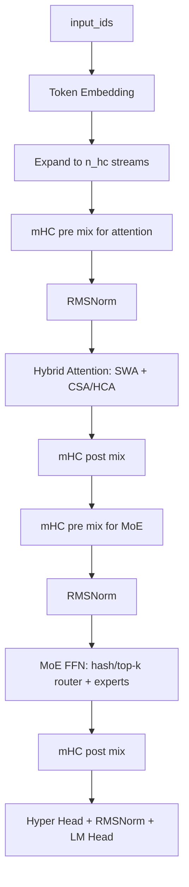

# DeepSeek V4: Towards Highly Efficient Million-Token Context Intelligence

**Link:**

- Technical Report: [DeepSeek_V4.pdf](https://huggingface.co/deepseek-ai/DeepSeek-V4-Pro/resolve/main/DeepSeek_V4.pdf)
- Hugging Face Model Card: [deepseek-ai/DeepSeek-V4-Pro](https://huggingface.co/deepseek-ai/DeepSeek-V4-Pro)
- Official Inference Code: [inference/model.py](https://huggingface.co/deepseek-ai/DeepSeek-V4-Pro/blob/main/inference/model.py)
- Transformers Code: [modeling_deepseek_v4.py](https://github.com/huggingface/transformers/blob/main/src/transformers/models/deepseek_v4/modeling_deepseek_v4.py)
- Transformers Docs: [DeepSeek-V4](https://huggingface.co/docs/transformers/main/model_doc/deepseek_v4)

[toc]

------

## **Main Contributions**

- **1M Context:** DeepSeek-V4 系列把上下文长度推到 1M tokens。重点不是单纯把 RoPE 拉长，而是围绕长上下文重新设计 attention、KV cache 和 sparse selection。
- **Hybrid Attention Architecture:** 使用 **Compressed Sparse Attention (CSA)** 和 **Heavily Compressed Attention (HCA)** 混合结构，把近邻 token 精确保留，把远程 token 压缩后选择性读取。
- **Manifold-Constrained Hyper-Connections (mHC):** 把传统 residual stream 扩成多条 hidden streams，并用受约束的 mixing 矩阵进行合并与传播。
- **MoE Routing Update:** MoE router 支持 `sqrt softplus` 分数函数和前若干层的 hash routing。
- **MTP:** 继续使用 Multi-Token Prediction 思路，为训练提供 next-n token 信号，也为后续推理辅助留下结构入口。
- **Training / Post-training:** 官方模型卡中提到 32T+ tokens 预训练、Muon optimizer，以及 SFT + GRPO + on-policy distillation 的后训练路线。

官方给出的模型规模如下：

| Model | Total Params | Activated Params | Context Length | Precision |
|---|---:|---:|---:|---|
| DeepSeek-V4-Flash | 284B | 13B | 1M | FP4 + FP8 mixed |
| DeepSeek-V4-Pro | 1.6T | 49B | 1M | FP4 + FP8 mixed |
| DeepSeek-V4-Flash-Base | 284B | 13B | 1M | FP8 mixed |
| DeepSeek-V4-Pro-Base | 1.6T | 49B | 1M | FP8 mixed |


------

## **1. 整体架构**

我先把 DeepSeek-V4 看成三条线：

1. **Attention 线：** 用 sliding window 处理最近 token，用 CSA / HCA 处理远程 token。
2. **Residual 线：** 用 mHC 替代简单 residual，让 hidden state 在多条 stream 之间混合。
3. **MoE 线：** 继续走 sparse MoE，但 router 分数和部分层路由方式有变化。

一个比较接近源码的 block 级流程如下：



在官方 inference 代码里，这个结构大概对应：

- `Transformer`: embedding、主干 blocks、lm head、MTP blocks。
- `Block`: attention + MoE，两处都包了一层 hyper-connection。
- `Attention`: sliding window cache + optional compressor + optional indexer。
- `MoE`: router、routed experts、shared expert。

需要注意：Transformers 版本为了兼容 `generate`、cache 和 HF API，类名更细；官方 inference 版本更像“论文结构的最小可读实现”。这篇笔记会同时参考两者，但讲概念时优先贴近官方 inference 写法。

------

## **2. 和 DeepSeek-V3 / V3.2 的关系**

DeepSeek-V3 的两个核心词是 **MLA** 和 **DeepSeekMoE**。V4 没有丢掉 MoE 路线，但长上下文这件事变成了中心问题。

可以先这样理解：

| 模型 | 主要 attention / cache 思路 | MoE | 长上下文处理重点 |
|---|---|---|---|
| DeepSeek-V2 | MLA 降低 KV cache | DeepSeekMoE | 经济型推理 |
| DeepSeek-V3 | MLA + MTP + MoE 训练优化 | DeepSeekMoE | 训练效率和推理能力 |
| DeepSeek-V4 | CSA + HCA hybrid attention | MoE + hash/top-k router | 1M context 下压缩和稀疏选择 |

V4 的关键不是“把所有历史 token 都完整记下来”。如果 1M tokens 全量 KV cache 直接进 attention，显存和算力都不现实。V4 的路线是：

- 最近窗口：保留完整 KV，保证局部上下文精度。
- 更远上下文：压缩成少量 compressed entries。
- 需要读远程信息时：用 indexer 从 compressed entries 里选 top-k。

所以 V4 的 attention 更像一个分层记忆系统：近处看原文，远处看摘要，必要时再从摘要索引里挑重点。

------

## **3. MTP: Multi-Token Prediction**

### 3.1 MTP 是什么

MTP = **Multi-Token Prediction**。

普通 causal LM 的训练目标是：

$$
p(x_{t+1}\mid x_{\le t})
$$

也就是每个位置只预测下一个 token。MTP 的思路是：在主 next-token loss 之外，再让模型预测更远的 token，例如：

$$
p(x_{t+2}\mid x_{\le t}),\quad p(x_{t+3}\mid x_{\le t}),\quad \ldots
$$

可以写成一个简化目标：

$$
\mathcal{L}_{\mathrm{MTP}}
= \frac{1}{D}\sum_{k=1}^{D}
\mathrm{CE}\big(p_k(x_{t+k}\mid x_{\le t}), x_{t+k}\big)
$$

其中 $D$ 是额外预测的步数。

直觉上，next-token prediction 只要求模型把眼前一步做好；MTP 会逼模型在 hidden state 里保留更多“接下来几步可能怎么走”的信息。DeepSeek-V3 技术报告里已经使用过 MTP，V4 继续保留了这个方向。

### 3.2 DeepSeek-V4 里的 MTPBlock

官方 inference 代码里有 `n_mtp_layers` 和 `MTPBlock`。从结构上看，MTPBlock 会拿两类信息：

- 当前主干模型的 hidden state。
- shifted input token 的 embedding。

先对齐源码接口。官方 inference 里的 `MTPBlock.forward` 是：

```python
def forward(self, x, start_pos, input_ids):
    e = self.embed(input_ids)
    e = self.enorm(e)
    x = self.hnorm(x)
    x = self.e_proj(e).unsqueeze(2) + self.h_proj(x)
    x = super().forward(x, start_pos, input_ids)
    logits = self.head(x, self.hc_head_fn, self.hc_head_scale, self.hc_head_base, self.norm)
    return logits
```

也就是说，源码里的 `MTPBlock` **不会自己构造 shifted tokens**。它只要求调用方传入一段 `input_ids`，然后把这段 token 的 embedding 和上一层 hidden streams 融合。真正的 shift 逻辑属于训练数据/调用逻辑：第 1 个 MTPBlock 传入 `x[t+1]`，目标是 `x[t+2]`；第 2 个 MTPBlock 再传入 `x[t+2]`，目标是 `x[t+3]`。

这里的 **shifted input token** 指的是“向后错位后的真实 token”。假设原始序列是：

```text
x0, x1, x2, x3, x4, x5
```

普通 next-token prediction 在位置 `t=2` 使用 `x0, x1, x2` 的上下文预测 `x3`。

MTP 想继续预测更远的位置。为了预测 `x4`，MTPBlock 会额外看到一个 shifted token，也就是 `x3` 的 embedding。这里不是把 `x3` 当成模型生成结果，而是在训练时把真实序列右移后喂给 MTP 模块，帮助它构造“预测下一步的下一步”的中间状态。

可以把它想成：

| 位置 | 主模型看到的上下文 | 主 LM head 目标 | 第 1 个 MTPBlock 额外输入 | 第 1 个 MTPBlock 目标 |
|---|---|---|---|---|
| `t=0` | `x0` | `x1` | `x1` | `x2` |
| `t=1` | `x0, x1` | `x2` | `x2` | `x3` |
| `t=2` | `x0, x1, x2` | `x3` | `x3` | `x4` |

所以 `shifted_input_ids` 不是一个新 token，也不是预测 token，而是训练数据中已经存在的 token，只是相对当前位置向后平移了一格。如果有多个 MTP 层，第 2 个 MTPBlock 会继续用更后面的 shifted token，去预测更远的目标。

然后 MTPBlock 会把 shifted token embedding 和主 hidden state 分别投影、相加，再过一个 block，最后接同一个 head 输出 logits。

用等价伪代码表示：

```python
tokens = [x0, x1, x2, x3, x4, x5]
T = len(tokens)

# 主模型：位置 t 的 hidden 用来预测 x[t+1]
# 有效位置：t = 0, 1, 2, 3, 4
main_hidden = backbone(tokens[:-1])
main_logits = lm_head(main_hidden)
main_loss = 0
for t in range(T - 1):
    main_loss += CE(main_logits[t], tokens[t + 1])

# 第 1 个 MTPBlock：额外输入 tokens[t+1]，目标变成 tokens[t+2]
# 有效位置：t = 0, 1, 2, 3
shifted_1 = tokens[1:]               # x1, x2, x3, x4, x5
target_1 = tokens[2:]                # x2, x3, x4, x5
mtp_hidden_1 = mtp_block_1(main_hidden[:-1], shifted_1[:-1])
mtp_logits_1 = lm_head(mtp_hidden_1)
mtp_loss_1 = 0
for t in range(T - 2):
    mtp_loss_1 += CE(mtp_logits_1[t], target_1[t])

# 如果有第 2 个 MTPBlock：继续往后错一格，目标变成 tokens[t+3]
# 有效位置：t = 0, 1, 2
shifted_2 = tokens[2:]               # x2, x3, x4, x5
target_2 = tokens[3:]                # x3, x4, x5
mtp_hidden_2 = mtp_block_2(mtp_hidden_1[:-1], shifted_2[:-1])
mtp_logits_2 = lm_head(mtp_hidden_2)
mtp_loss_2 = 0
for t in range(T - 3):
    mtp_loss_2 += CE(mtp_logits_2[t], target_2[t])
```

再把一个 `MTPBlock` 本身展开看，它内部大概是：

```python
class MTPBlock:
    def forward(prev_hidden_streams, shifted_input_ids):
        shifted_emb = embed(shifted_input_ids)
        token_part = e_proj(norm_embed(shifted_emb))
        hidden_part = h_proj(norm_hidden(prev_hidden_streams))

        mtp_hidden = token_part[:, :, None, :] + hidden_part
        mtp_hidden = transformer_block(mtp_hidden, shifted_input_ids)

        logits = shared_lm_head(hyper_head(mtp_hidden))
        return logits
```

这里有一个容易混淆的点：MTP 不是把模型一次 forward 变成“直接吐多个 token”。在公开 inference 代码里，主 `Transformer.forward` 默认仍然返回 next-token logits；`MTPBlock` 更像是额外结构，让 hidden state 多承担几个未来 token 的预测任务。

------

## **4. MoE Router、Softplus 和 Hash Route**

### 4.1 Softplus 是什么

Softplus 的定义是：

$$
\mathrm{softplus}(x)=\log(1+e^x)
$$

它可以看成 ReLU 的平滑版本：

$$
\mathrm{ReLU}(x)=\max(0,x)
$$

区别是：

- ReLU 在 $x<0$ 时直接变成 0。
- Softplus 始终大于 0，并且在 0 附近是平滑的。

这对 router 分数有用，因为 MoE router 最后要得到非负权重。如果使用 softplus，负 logits 不会被硬切成 0，而是保留一个很小的正值。

### 4.2 sqrtsoftplus

DeepSeek-V4 官方 inference 代码里，router 支持三种 score function：

- `softmax`
- `sigmoid`
- `sqrtsoftplus`

`sqrtsoftplus` 的等价形式是：

$$
s_i = \sqrt{\mathrm{softplus}(z_i)}
$$

然后对被选中的 top-k experts 做归一化：

$$
w_i = \frac{s_i}{\sum_{j\in \mathrm{TopK}}s_j}
$$

用伪代码写就是：

```python
logits = hidden @ router_weight.T
scores = sqrt(softplus(logits))
indices = topk(scores + bias, k)
weights = gather(scores, indices)
weights = weights / weights.sum(dim=-1, keepdim=True)
```

这里有个细节：bias 可以影响 top-k 选择，但真正的 routing weights 来自未加 bias 的原始 scores。这和很多 MoE router 的写法一致：selection 和 weighting 可以使用略不同的信号。

### 4.3 Hash Route 是什么

普通 top-k router 是：

```python
indices = topk(scores, k)
```

Hash route 则是：

```python
indices = tid2eid[input_ids]
```

也就是说，某些层的 expert 选择不再由当前 hidden state 动态决定，而是由 token id 查表得到。

这像是把“这个 token 去哪些专家”提前写进一个表里。对应到源码，hash layer 会有一个 `tid2eid` 参数，它的形状大致是：

$$
[\mathrm{vocab\_size},\ \mathrm{num\_experts\_per\_tok}]
$$

### 4.4 为什么要 Hash Route

这部分论文和源码能确认的是：DeepSeek-V4 确实支持前若干层使用 hash routing。至于动机，我的理解要稍微保守一点：

- 早期层的 token 表示还比较接近 token identity，用 token id 路由有一定合理性。
- hash routing 可以减少动态 top-k 路由带来的计算和通信波动。
- 固定路由可能让早期 expert 分配更稳定，降低某些 batch 下的 routing collapse 风险。
- 但它也会牺牲一部分上下文自适应能力，所以不适合所有层都这么做。

因此我会把 Hash Route 理解成：**早期层用更便宜、更稳定的 token-id 路由，后续层再交给 hidden-state-based top-k router。**

------

## **5. mHC: Manifold-Constrained Hyper-Connections**

### 5.1 先按论文符号统一维度

论文第 2.2 节的核心符号是 $n_{\mathrm{hc}}$，也就是 Hyper-Connection 的 stream 数量。Hugging Face 配置里对应的字段叫 `hc_mult`，默认值是 4。下面统一写 $n_{\mathrm{hc}}$，只在讲源码时标注 `hc_mult`。

为了避免 batch size 和论文里的 mixing matrix $B_l$ 撞名，下面用 $B_{\mathrm{sz}}$ 表示 batch size，用 $S$ 表示 sequence length，用 $D$ 表示 hidden size。

普通 Transformer 每层只有一条 residual stream：

$$
X_l \in \mathbb{R}^{B_{\mathrm{sz}}\times S\times D}
$$

mHC 把它扩成 $n_{\mathrm{hc}}$ 条并行 residual streams：

$$
\mathbf{X}_l \in \mathbb{R}^{B_{\mathrm{sz}}\times S\times n_{\mathrm{hc}}\times D}
$$

对单个 token 来看：

$$
\mathbf{X}_{l,t}\in\mathbb{R}^{n_{\mathrm{hc}}\times D}
$$

这不是把一个 token 的 $D$ 维 hidden state 切成 $n_{\mathrm{hc}}$ 份。更准确地说，是同一个 token 在第 $l$ 层同时维护 $n_{\mathrm{hc}}$ 条 $D$ 维 residual streams。HF 文档也把这一点写成 `[B, S, hc_mult, D]`。

源码对应的形状变化可以读成：

```python
hidden_states = embed(input_ids)                         # [B, S, D]
hidden_states = repeat_as_hc_streams(hidden_states)      # [B, S, n_hc, D]
```

### 5.2 mHC 的 read-compute-write 过程

对于 attention 或 FFN 这样的子层，普通 residual 是：

$$
x_{l+1}=x_l+F_l(x_l)
$$

mHC 则拆成三步：

1. **read:** 用 $A_l$ 从 $n_{\mathrm{hc}}$ 条 stream 读出一条 $\bar{X}_l$。
2. **compute:** 子层 $F_l$ 只处理这一条 $\bar{X}_l$。
3. **write:** 用 $C_l$ 写入新子层输出，同时用 $B_l$ 混合旧 streams。

对单个 token $t$，公式可以写成：

$$
\bar{X}_{l,t}
= \sum_{r=1}^{n_{\mathrm{hc}}} A_{l,t,r}\mathbf{X}_{l,t,r}
$$

$$
U_{l,t}=F_l(\bar{X}_{l,t})
$$

$$
\mathbf{X}_{l+1,t,r}
= C_{l,t,r}U_{l,t}
+ \sum_{q=1}^{n_{\mathrm{hc}}}B_{l,t,r,q}\mathbf{X}_{l,t,q}
$$

其中：

- $A_l\in\mathbb{R}^{B_{\mathrm{sz}}\times S\times n_{\mathrm{hc}}}$：read / collapse weights，对应 HF 里的 `pre`。
- $C_l\in\mathbb{R}^{B_{\mathrm{sz}}\times S\times n_{\mathrm{hc}}}$：write-back weights，对应 HF 里的 `post`。
- $B_l\in\mathbb{R}^{B_{\mathrm{sz}}\times S\times n_{\mathrm{hc}}\times n_{\mathrm{hc}}}$：stream mixing matrix，对应 HF 里的 `comb`。
- $\bar{X}_l\in\mathbb{R}^{B_{\mathrm{sz}}\times S\times D}$：collapse 后喂给 attention / FFN 的 hidden state。
- $U_l\in\mathbb{R}^{B_{\mathrm{sz}}\times S\times D}$：attention / FFN 的输出。

这里的下标 $r,q$ 都是在 stream 维度上索引，不是在 hidden dimension 上索引。

### 5.3 `pre`、`post`、`comb` 和论文符号的对应

HF Transformers 里的 `DeepseekV4DecoderLayer` 有两个 hyper-connection 模块：

- `attn_hc`：包住 self-attention。
- `ffn_hc`：包住 MoE / FFN。

它们都会返回：

```python
post, comb, collapsed = self.attn_hc(hidden_states)
```

对应关系是：

| HF 变量 | 论文符号 | 维度 | 作用 |
|---|---|---|---|
| `pre` | $A_l$ | $[B_{\mathrm{sz}},S,n_{\mathrm{hc}}]$ | 把 $n_{\mathrm{hc}}$ 条 stream collapse 成 1 条 |
| `collapsed` | $\bar{X}_l$ | $[B_{\mathrm{sz}},S,D]$ | 子层 attention / FFN 的输入 |
| `post` | $C_l$ | $[B_{\mathrm{sz}},S,n_{\mathrm{hc}}]$ | 把子层输出写回每条 stream |
| `comb` | $B_l$ | $[B_{\mathrm{sz}},S,n_{\mathrm{hc}},n_{\mathrm{hc}}]$ | 旧 streams 之间的双随机混合 |

`pre` 没有返回给 decoder layer，是因为它已经在 `DeepseekV4HyperConnection.forward` 里被用来生成 `collapsed`：

$$
\bar{X}_l
= \sum_{r=1}^{n_{\mathrm{hc}}}A_{l,r}\mathbf{X}_{l,r}
$$

decoder layer 后续只需要 `collapsed`、`post` 和 `comb`。

HF 中更新 hidden streams 的核心逻辑可以按这个读：

```python
post, comb, collapsed = attn_hc(hidden_states)
attn_output = self_attn(norm(collapsed))
hidden_states = post[..., None] * attn_output[..., None, :] + comb @ hidden_states
```

对应论文符号：

$$
\mathbf{X}_{l+1}
= C_l\odot U_l+B_l\mathbf{X}_l
$$

其中：

$$
C_l\odot U_l
\in
\mathbb{R}^{B_{\mathrm{sz}}\times S\times n_{\mathrm{hc}}\times D}
$$

而 $B_l\mathbf{X}_l$ 是对每个 token 的 $n_{\mathrm{hc}}\times n_{\mathrm{hc}}$ 矩阵乘上 $n_{\mathrm{hc}}\times D$ streams：

$$
\left[n_{\mathrm{hc}}\times n_{\mathrm{hc}}\right]
\times
\left[n_{\mathrm{hc}}\times D\right]
\rightarrow
\left[n_{\mathrm{hc}}\times D\right]
$$

所以你的理解“token 被切成 $n_{\mathrm{hc}}$ 份变成 $n_{\mathrm{hc}}\times D$”需要微调：形状确实是 $n_{\mathrm{hc}}\times D$，但不是切分，而是复制/展开成多条完整维度的 residual streams。

### 5.4 A_l、C_l、B_l 是怎么生成的

$A_l$、$C_l$、$B_l$ 不是全局固定参数，而是由当前 token 的多条 streams 动态生成。

先展平当前 token 的 $n_{\mathrm{hc}}\times D$ 表示：

$$
\mathrm{vec}(\mathbf{X}_{l,t})
\in
\mathbb{R}^{n_{\mathrm{hc}}D}
$$

再经过一个线性映射，生成长度为 $(2+n_{\mathrm{hc}})n_{\mathrm{hc}}$ 的 logits：

$$
\begin{aligned}
M_{l,t}
&= \phi_l\!\left(\mathrm{RMSNorm}(\mathrm{vec}(\mathbf{X}_{l,t}))\right) \\
&\in \mathbb{R}^{(2+n_{\mathrm{hc}})n_{\mathrm{hc}}}
\end{aligned}
$$

然后切成三部分：

$$
\begin{aligned}
M_{l,t}
&=
\left[
\tilde{A}_{l,t},
\tilde{C}_{l,t},
\tilde{B}_{l,t}
\right]
\end{aligned}
$$

维度分别是：

$$
\tilde{A}_{l,t}\in\mathbb{R}^{n_{\mathrm{hc}}}
$$

$$
\tilde{C}_{l,t}\in\mathbb{R}^{n_{\mathrm{hc}}}
$$

$$
\tilde{B}_{l,t}\in\mathbb{R}^{n_{\mathrm{hc}}\times n_{\mathrm{hc}}}
$$

HF 源码里的参数名是 `hc_fn`、`hc_scale`、`hc_base`。删去工程细节后，可以对应成：

$$
A_l=\sigma(\tilde{A}_l\cdot s_A+b_A)+\epsilon
$$

$$
C_l=2\sigma(\tilde{C}_l\cdot s_C+b_C)
$$

$$
B_l=\mathrm{Sinkhorn}\left(\mathrm{softmax}(\tilde{B}_l\cdot s_B+b_B)+\epsilon\right)
$$

这里 $s_A,s_C,s_B$ 对应源码里的 scale，$b_A,b_C,b_B$ 对应 base。写成这一步的目的不是引入新符号，而是提醒自己：论文里的 $A_l,C_l,B_l$ 是从当前 hidden streams 生成出来的动态量。

### 5.5 为什么 B_l 要做双随机约束

论文里强调 $B_l$ 位于 doubly-stochastic manifold。双随机矩阵满足：

$$
B_l\mathbf{1}=\mathbf{1}
$$

$$
B_l^{\mathsf{T}}\mathbf{1}=\mathbf{1}
$$

更展开一点：

- 行和为 1：每条新 stream 从旧 streams 接收的信息总量受控。
- 列和为 1：每条旧 stream 被分发出去的信息总量受控。

如果没有这个约束，$B_l$ 可能把某些 stream 不断放大，或者让某些 stream 在多层之后消失。双随机约束不是为了让信息“平均”，而是为了让 stream mixing 在深层网络里保持非扩张。

HF 的实现用 `hc_sinkhorn_iters` 次 Sinkhorn-Knopp 归一化把 `comb` 投影到双随机矩阵附近：

```python
for _ in range(hc_sinkhorn_iters):
    comb = comb / (comb.sum(dim=-1, keepdim=True) + eps)
    comb = comb / (comb.sum(dim=-2, keepdim=True) + eps)
```

### 5.6 Sinkhorn 20 次会不会慢

HF 配置里对应的是：

```text
hc_mult = 4
hc_sinkhorn_iters = 20
```

按论文符号就是：

$$
n_{\mathrm{hc}}=4,\qquad t_{\max}=20
$$

每个 token 上需要投影的矩阵是：

$$
n_{\mathrm{hc}}\times n_{\mathrm{hc}}=4\times 4
$$

不是：

$$
D\times D
$$

也不是：

$$
(n_{\mathrm{hc}}D)\times(n_{\mathrm{hc}}D)
$$

所以它有额外开销，但主要复杂度更像：

$$
O(B_{\mathrm{sz}}S\,t_{\max}n_{\mathrm{hc}}^2)
$$

当 $n_{\mathrm{hc}}=4$ 时，矩阵本身很小。真正重的部分仍然是 attention、MoE expert GEMM 和长上下文 cache 读写。不过它不是完全免费的，所以 mHC-lite 这类后续工作才会讨论是否真的需要 20 次 Sinkhorn-Knopp 迭代。

### 5.7 和 HF 变量的完整对应

| 论文符号 | HF Transformers 变量 | 维度 |
|---|---|---|
| $\mathbf{X}_l$ | `hidden_states` | $[B_{\mathrm{sz}},S,n_{\mathrm{hc}},D]$ |
| $M_l$ | `mixes` | $[B_{\mathrm{sz}},S,(2+n_{\mathrm{hc}})n_{\mathrm{hc}}]$ |
| $A_l$ | `pre` | $[B_{\mathrm{sz}},S,n_{\mathrm{hc}}]$ |
| $\bar{X}_l$ | `collapsed` | $[B_{\mathrm{sz}},S,D]$ |
| $C_l$ | `post` | $[B_{\mathrm{sz}},S,n_{\mathrm{hc}}]$ |
| $B_l$ | `comb` | $[B_{\mathrm{sz}},S,n_{\mathrm{hc}},n_{\mathrm{hc}}]$ |
| $U_l=F_l(\bar{X}_l)$ | `attn_output` / `mlp_output` | $[B_{\mathrm{sz}},S,D]$ |
| $\mathbf{X}_{l+1}$ | updated `hidden_states` | $[B_{\mathrm{sz}},S,n_{\mathrm{hc}},D]$ |

一句话总结：

**`pre` 是 $A_l$，负责 read；`post` 是 $C_l$，负责写入新输出；`comb` 是 $B_l$，负责让旧 streams 在双随机约束下继续传播。**

------

## **6. CSA: Compressed Sparse Attention**

CSA 是这篇最难的一块。我先用一句话压住它：

**CSA = 最近 token 用 sliding window 精确看，远程 token 先压缩，再用 indexer 选一小部分看。**

### 6.1 符号统一

论文 9-10 页里会出现几组很像的符号。先把它们对应到源码直觉：

| 符号 | 直觉含义 | 源码中大概对应 |
|---|---|---|
| $H$ | 当前层输入 hidden states | attention 输入 hidden |
| $W^{KV}$ | 把 hidden state 投影成待压缩 KV 的权重 | `kv_proj` / `wkv` |
| $C=H W^{KV}$ | original KV entries，压缩前的每 token KV 表示 | `kv` 或 `C` |
| $W^Z$ | 生成 compression weights 的权重 | `gate_proj` / `wgate` |
| $Z=H W^Z$ | 每个 token 在压缩窗口里的打分 | `gate` / `score` |
| $B$ | position bias，不是 mHC 的 mixing matrix | `position_bias` / `ape` |
| $C^{\mathrm{Comp}}$ | 压缩后的 KV entry | `compressed_kv` |

最基础的压缩公式可以写成：

$$
C = H W^{KV}
$$

$$
Z = H W^Z
$$

对一个长度为 $m$ 的窗口，压缩结果是：

$$
\begin{aligned}
C^{\mathrm{Comp}}_i
&= \sum_{j=0}^{m-1}
\mathrm{softmax}(Z_{i,j}+B_j)\, C_{i,j}
\end{aligned}
$$

这里 $B_j$ 是窗口内位置 bias。它让模型知道“窗口里第几个 token”在压缩时可能有不同重要性。

### 6.2 Hidden State of Query Token 和 Queries 的区别

这个地方我一开始也会绕。

- **Hidden State of Query Token:** 还没变成 attention query 的 token 表示，记作 $H_q$。
- **Queries:** 经过 query projection 之后的向量，记作 $Q$。

也就是：

$$
Q = H_q W^Q
$$

在 DeepSeek-V4 这种实现里，query 还会经过低秩投影、RMSNorm、RoPE 等处理。所以不要把论文里的 `hidden state of query token` 直接等同于最后参与 attention dot-product 的 $Q$。

### 6.3 CSA 的两个 KV 来源

CSA 的 attention KV 大致由两部分拼起来：

1. **Window KV:** 最近 $w$ 个 token 的原始 KV。
2. **Compressed KV:** 更早历史 token 的压缩 entries。

可以画成：

```text
query token
    |
    |-- attend to recent exact KV: [t-w, ..., t]
    |
    |-- indexer selects remote compressed KV:
        [comp_3, comp_19, comp_41, ...]
```

所以 CSA 不是把所有 KV 都压缩掉。它保留了局部精确性，同时给远程上下文一个便宜入口。

### 6.4 overlap 为什么还能压缩到约 1/m

这个问题很关键。

如果不 overlap，长度 $L$、窗口大小 $m$，输出 compressed entries 数量约为：

$$
\frac{L}{m}
$$

CSA 的 overlap 会让一个 compressed entry 聚合时看到相邻窗口的信息。Transformers 实现注释里把它解释成两组 series：`Ca` 和 `Cb`。可以粗略理解为：

- 当前窗口提供一部分信息。
- 上一个窗口保留一部分边界信息。
- 聚合时把两边拼起来看。

但输出 stride 仍然是 $m$。也就是说，每走 $m$ 个源 token，仍然只产生约 1 个 compressed entry。

所以 overlap 改的是“每个 compressed entry 看到了哪些 token”，不是“每个窗口都额外输出一个 entry”。因此压缩率仍然接近：

$$
\frac{1}{m}
$$

### 6.5 CSA 的等价伪代码

```python
def csa_compress(hidden, m):
    C = kv_proj(hidden)
    Z = gate_proj(hidden)

    # overlap makes each compressed entry see boundary information
    chunks = make_overlapped_chunks(C, size=m, stride=m)
    gates = make_overlapped_chunks(Z, size=m, stride=m)

    weights = softmax(gates + position_bias, dim="window")
    compressed = sum(weights * chunks, dim="window")
    return compressed

def csa_attention(query, recent_kv, compressed_kv):
    selected = indexer(query, compressed_kv)
    kv = concat(recent_kv, compressed_kv[selected])
    return sparse_attention(query, kv)
```

这里的 `indexer` 只负责选 compressed entries，不负责最终 attention 输出。

### 6.6 Attention Sink 是什么

论文在 CSA / HCA 的 core attention 里还用了 **Attention Sink**。这一节的 $h$ 是 attention head 的编号，不是 mHC 里的 $n_{\mathrm{hc}}$。

普通 attention 会把一个 head 的全部权重都分给真实 token / compressed block：

$$
\sum_j s_{h,i,j}=1
$$

但在长上下文压缩场景里，有些 compressed block 对当前 query 可能没用。如果没有 sink，这个 head 还是必须把 100% 概率质量硬分给它们，可能引入噪声。

论文的做法是给每个 attention head 加一个可学习的 sink logit $z'_h$，并把 $\exp(z'_h)$ 加进 softmax 分母：

$$
\begin{aligned}
s_{h,i,j}
&=
\frac{\exp(z_{h,i,j})}
{\sum_k\exp(z_{h,i,k})+\exp(z'_h)}
\end{aligned}
$$

其中：

- $z_{h,i,j}$：第 $h$ 个 attention head 中，第 $i$ 个 query token 对第 $j$ 个 preceding token / compressed block 的 attention logit。
- $s_{h,i,j}$：对应的 attention score。
- $z'_h$：第 $h$ 个 attention head 的 learnable sink logit。

这样真实 KV 上的总 attention mass 变成：

$$
\begin{aligned}
\sum_j s_{h,i,j}
&=
\frac{\sum_j\exp(z_{h,i,j})}
{\sum_k\exp(z_{h,i,k})+\exp(z'_h)}
\le 1
\end{aligned}
$$

剩下的概率质量被 sink 吃掉，不参与 value 聚合。直觉上，这允许某个 head 表达“这次这条 attention branch 没什么可看的”，而不是强迫它在一堆低相关 compressed entries 里硬选。

------

## **7. HCA: Heavily Compressed Attention**

HCA = **Heavily Compressed Attention**。

相比 CSA，HCA 更直接：

- 不做 overlap。
- 不做 indexer。
- 用更大的压缩窗口，例如 $m'=128$。
- 每 $m'$ 个 token 压成一个 compressed entry。

对应公式更接近：

$$
\begin{aligned}
C^{\mathrm{HCA}}_i
&= \sum_{j=0}^{m'-1}
\mathrm{softmax}(Z_{i,j}+B_j)\, C_{i,j}
\end{aligned}
$$

HCA 的定位不是“精确找远程细节”，而是“用很小代价保存远程上下文的粗粒度记忆”。

| Layer type | Compress rate | Overlap | Indexer | KV 形态 |
|---|---:|---|---|---|
| Sliding window attention | 0 | No | No | 最近窗口原始 KV |
| CSA | 4 | Yes | Yes | 原始窗口 KV + selected compressed KV |
| HCA | 128 | No | No | 原始窗口 KV + 全部 heavily compressed KV |

官方 inference 默认 `compress_ratios` 类似：

```text
(0, 0, 4, 128, 4, 128, 4, 0)
```

这说明不同层混合使用无压缩、CSA 和 HCA。这个设计挺合理：不是所有层都需要同一种长程记忆，一些层负责精确，一些层负责便宜地扫远处。

------

## **8. Lightning Indexer for Sparse Selection**

压缩之后还有一个问题：如果上下文有 1M tokens，即使每 4 个 token 压成 1 个 entry，也仍然有很多 compressed entries。

不能全看，所以需要 indexer。

我把这个模块理解成一个轻量检索器：

1. 从 query token hidden state 得到 index query。
2. 把历史 hidden states 压成 index KV。
3. 用便宜的 scoring 算出每个 compressed entry 的相关性。
4. 选 top-k。
5. 真正的 sparse attention 只读取这些 top-k entries。

等价伪代码：

```python
def lightning_indexer(hidden, query_low_rank, compressed_index_kv):
    q_idx = index_query_proj(query_low_rank)
    q_idx = apply_rope(q_idx)
    q_idx = rotate_and_quantize(q_idx)

    scores = q_idx @ compressed_index_kv.T
    scores = relu(scores) * learned_head_weights
    scores = reduce_heads(scores)

    selected = topk(scores, k=index_topk)
    return selected

def sparse_selection_attention(q, recent_kv, compressed_kv):
    selected = lightning_indexer(...)
    kv = concat(recent_kv, compressed_kv[selected])
    return sparse_attention(q, kv)
```

它和 attention 的区别很重要：

- Indexer 输出的是位置，也就是 `selected indices`。
- Attention 输出的是新的 hidden representation。

所以 indexer 不需要像主 attention 那么精细。它只要大致选对远程 compressed entries，就能把大部分计算省掉。

------

## **9. Hugging Face 源码阅读**

这一节不再写完全自造的伪代码，而是尽量贴近 Hugging Face Transformers 里的类名、变量名和张量形状。代码块是删减版关键路径，目的是看结构，不复刻所有 cache、mask、quantization 和 device 细节。

### 9.1 DecoderLayer: attention 和 FFN 都包一层 mHC

HF 的 `DeepseekV4DecoderLayer` 可以按下面这条路径读：

```python
post, comb, collapsed = self.attn_hc(hidden_states)
attn_output = self.self_attn(self.input_layernorm(collapsed), ...)
hidden_states = post[..., None] * attn_output[..., None, :] + comb @ hidden_states

post, comb, collapsed = self.ffn_hc(hidden_states)
mlp_output = self.mlp(self.post_attention_layernorm(collapsed), input_ids=input_ids)
hidden_states = post[..., None] * mlp_output[..., None, :] + comb @ hidden_states
```

这里的关键是：attention 和 FFN 都不是直接吃 `[B,S,n_{\mathrm{hc}},D]`，而是先通过 `attn_hc` / `ffn_hc` collapse 成：

$$
\bar{X}_l\in\mathbb{R}^{B_{\mathrm{sz}}\times S\times D}
$$

子层输出后，再通过 $C_l\odot U_l+B_l\mathbf{X}_l$ 写回多 stream。

### 9.2 DeepseekV4HyperConnection

`DeepseekV4HyperConnection` 做的事情就是生成 $A_l,C_l,B_l$，并返回 `collapsed`：

```python
flat = hidden_states.flatten(2)
mixes = linear(input_norm(flat), hc_fn)
pre, post, comb = split(mixes, [n_hc, n_hc, n_hc * n_hc])

pre = sigmoid(pre * scale_A + base_A) + eps
post = 2 * sigmoid(post * scale_C + base_C)
comb = sinkhorn(row_softmax(comb * scale_B + base_B) + eps)

collapsed = (pre[..., None] * hidden_states).sum(dim=2)
return post, comb, collapsed
```

这段和论文符号逐项对应：

| HF 变量 | 论文符号 | 说明 |
|---|---|---|
| `hidden_states` | $\mathbf{X}_l$ | 多条 residual streams |
| `mixes` | $M_l$ | 生成 $A_l,C_l,B_l$ 的 logits |
| `pre` | $A_l$ | collapse weights |
| `post` | $C_l$ | write-back weights |
| `comb` | $B_l$ | doubly-stochastic mixing matrix |
| `collapsed` | $\bar{X}_l$ | 子层输入 |

### 9.3 Router: hash route 和 top-k route 的区别

HF 的 router 逻辑可以按这两步拆：

```python
logits = linear(hidden_states, router_weight)
scores = sqrt(softplus(logits))

if hash_routing:
    selected_experts = tid2eid[input_ids]
else:
    selected_experts = topk(scores + correction_bias, k)

router_weights = gather(scores, selected_experts)
router_weights = router_weights / router_weights.sum(dim=-1, keepdim=True)
```

这里要注意：hash route 改的是 `selected_experts` 的来源。它不是让 expert weights 全部变成常数；选中哪些 expert 来自 `tid2eid[input_ids]`，而对应的 weights 仍然可以由当前 hidden state 算出的 `scores` 决定。

### 9.4 CSA / HCA Compressor

HF 里 CSA 和 HCA 都可以看成先生成两类东西：

$$
C=HW^{KV},\qquad Z=HW^Z
$$

代码结构可以读成：

```python
C = kv_proj(hidden_states)
Z = weight_proj(hidden_states)

C_window = reshape_into_compression_windows(C, compress_rate)
Z_window = reshape_into_compression_windows(Z, compress_rate)
weights = softmax(Z_window + position_bias, dim=window_dim)
C_comp = (weights[..., None] * C_window).sum(dim=window_dim)
C_comp = output_norm(C_comp)
```

区别是：

- `DeepseekV4CSACompressor` 会处理 overlap，论文里对应相邻压缩窗口共享边界信息。
- `DeepseekV4HCACompressor` 不做 sparse indexer，压缩率更大，结构更直接。
- 两者都不是最终 attention，本质上只是更新 long-context cache 中的 compressed KV entries。

### 9.5 DeepseekV4Indexer

CSA 还需要 `DeepseekV4Indexer` 从很多 compressed entries 里选 top-k。可以按下面理解：

```python
q_idx = index_query_proj(hidden_or_query_residual)
k_idx = compressed_index_key_cache

scores = relu(q_idx @ k_idx.transpose(-1, -2))
scores = scores * learned_head_weights
selected_indices = topk(scores, k=index_topk)
```

Indexer 的输出不是 hidden state，而是 compressed cache 的位置索引。真正的 attention 仍然发生在后面的 sparse attention kernel 里。

### 9.6 Attention Sink 在代码里的位置

Attention Sink 对应的是每个 head 一个 learnable sink logit。它不会产生新的 value 向量，而是改变 attention softmax 的归一化分母：

```python
denom = exp(attn_logits).sum(dim=-1, keepdim=True) + exp(sink_logits)
attn_scores = exp(attn_logits) / denom
```

所以它的作用不是“多 attend 一个 token”，而是让真实 KV 的 attention mass 可以小于 1。

------

## **10. 逐个回答我自己的疑问**

### 10.1 MTP 是什么？

MTP 是 Multi-Token Prediction。它让模型不只学习预测下一个 token，还学习预测未来多个 token。DeepSeek-V4 的 inference 代码中有 `MTPBlock`，它把 shifted token embedding 和主 hidden state 融合，再接 block 和 head 输出 logits；但主 `forward` 路径默认仍然是 next-token logits。

### 10.2 softplus 是什么？

Softplus 是：

$$
\mathrm{softplus}(x)=\log(1+e^x)
$$

它是 ReLU 的平滑非负版本。DeepSeek-V4 router 里的 `sqrtsoftplus` 则是：

$$
\sqrt{\log(1+e^x)}
$$

这样能得到非负、平滑的 routing scores。

### 10.3 为什么 hash route？

hash route 是用 token id 查表得到 expert indices。它可能带来更稳定和更便宜的早期层路由。我的理解是：早期层 token 表示还没有充分上下文化，用 token identity 参与路由并不奇怪；到了后面层，再用 top-k router 让 hidden state 决定 experts。

### 10.4 mHC 里的 token 是被切成 n_hc 份吗？

不是。它是把每个 token 的 hidden state 扩成 $n_{\mathrm{hc}}$ 条 stream，每条仍然是 $d$ 维：

$$
[B,S,D]\rightarrow [B,S,n_{\mathrm{hc}},D]
$$

所以不是 $D$ 被切成 $D/n_{\mathrm{hc}}$。

### 10.5 Sinkhorn 20 次会不会耽误时间？

会有开销，但矩阵通常是 $4\times 4$ 这种小矩阵，不是对 hidden dim 做 20 次大矩阵归一化。主要成本仍然在 attention、MoE 和 cache 操作。这个问题不是杞人忧天，因为已经有 mHC-lite 论文专门讨论是否需要 20 次 Sinkhorn-Knopp 迭代。

### 10.6 CSA 里的 W、Z、C 分别是什么？

最简对应是：

$$
C=H W^{KV}
$$

$$
Z=H W^Z
$$

- $W^{KV}$：生成待压缩 KV entries 的投影权重。
- $C$：original KV entries，也就是压缩前每个 token 的 KV 表示。
- $W^Z$：生成 compression weights 的投影权重。
- $Z$：压缩窗口里的 gate / score。

### 10.7 为什么 overlap 还能压缩到 1/m？

因为 overlap 改的是每个 compressed entry 聚合时能看到的窗口范围，不改输出 stride。stride 仍然是 $m$，所以输出 compressed entries 数量仍接近 $L/m$。

### 10.8 Hidden State of Query Token 和 Queries 的区别？

Hidden state 是 query token 当前的表示，Queries 是它经过 query projection、norm、RoPE 等操作后的 attention query：

$$
Q=H_q W^Q
$$

不要把二者直接等同。

### 10.9 HCA 为什么更简单？

HCA 没有 CSA 的 overlap 和 indexer。它只是用更大的窗口把远程 token heavily compress，再把这些 compressed entries 拼到 attention KV 里。

### 10.10 Lightning Indexer 没看懂的核心点是什么？

它不是 attention，而是 attention 前的候选选择器。它用便宜的打分方式从 compressed entries 中选 top-k，然后主 sparse attention 再读取这些 entries。

------

## **11. 总结表**

| 模块 | 解决的问题 | 核心机制 | 代价 | 源码入口 |
|---|---|---|---|---|
| MTP | next-token 信号太局部 | 预测未来多个 token | 额外 MTP block/head 计算 | `MTPBlock` |
| sqrtsoftplus router | MoE routing scores 需要平滑非负 | $\sqrt{\mathrm{softplus}(x)}$ + top-k | 比 softmax 逻辑略复杂 | `Gate` / `DeepseekV4TopKRouter` |
| Hash Route | 早期层动态路由成本和波动 | token id 查表得到 experts | 上下文自适应弱一些 | `tid2eid` / `DeepseekV4HashRouter` |
| mHC | 深层 residual 信号传播 | 多 stream + Sinkhorn mixing | 小矩阵归一化开销 | `DeepseekV4HyperConnection` |
| CSA | 远程上下文太长 | 近邻原始 KV + 远程压缩 KV + indexer | 需要 compressor 和 indexer | `DeepseekV4CSACompressor` |
| HCA | 更便宜的远程记忆 | 大窗口压缩，无 indexer | 细节损失更大 | `DeepseekV4HCACompressor` |
| Attention Sink | compressed KV 无关时不应强制分配满权重 | 分母加入 learnable sink logit | 每个 head 多一个 sink 参数 | attention score computation |
| Lightning Indexer | compressed entries 仍然太多 | 轻量打分选 top-k | 可能漏选远程关键信息 | `Indexer` / `DeepseekV4Indexer` |

------

## **12. 源码与资料入口**

- DeepSeek-V4 Technical Report: [DeepSeek_V4.pdf](https://huggingface.co/deepseek-ai/DeepSeek-V4-Pro/resolve/main/DeepSeek_V4.pdf)
- DeepSeek-V4-Pro Model Card: [deepseek-ai/DeepSeek-V4-Pro](https://huggingface.co/deepseek-ai/DeepSeek-V4-Pro)
- Official inference code: [inference/model.py](https://huggingface.co/deepseek-ai/DeepSeek-V4-Pro/blob/main/inference/model.py)
- Official encoding code: [encoding/encoding_dsv4.py](https://huggingface.co/deepseek-ai/DeepSeek-V4-Pro/blob/main/encoding/encoding_dsv4.py)
- Transformers implementation: [modeling_deepseek_v4.py](https://github.com/huggingface/transformers/blob/main/src/transformers/models/deepseek_v4/modeling_deepseek_v4.py)
- Transformers config: [configuration_deepseek_v4.py](https://github.com/huggingface/transformers/blob/main/src/transformers/models/deepseek_v4/configuration_deepseek_v4.py)
- DeepSeek-V3 Technical Report, for MTP background: [hf.co/papers/2412.19437](https://hf.co/papers/2412.19437)
- mHC-lite discussion: [hf.co/papers/2601.05732](https://hf.co/papers/2601.05732)
- Sparse indexer related work: [IndexCache](https://hf.co/papers/2603.12201), [HISA](https://hf.co/papers/2603.28458)

------

## **13. 最后的一句话理解**

DeepSeek-V4 的主线不是“又把模型做大了”。它更像是在问一个工程问题：当上下文来到 1M tokens，模型到底应该怎样保存、压缩、索引和读取历史信息？

CSA、HCA、Lightning Indexer 解决的是 **长上下文的读写成本**；mHC 解决的是 **深层网络里的信息传播稳定性**；MTP 和 router 更新则继续服务于 **训练信号密度与 sparse computation**。把这些合起来，DeepSeek-V4 才有了 1M context 下还能工作的结构基础。
