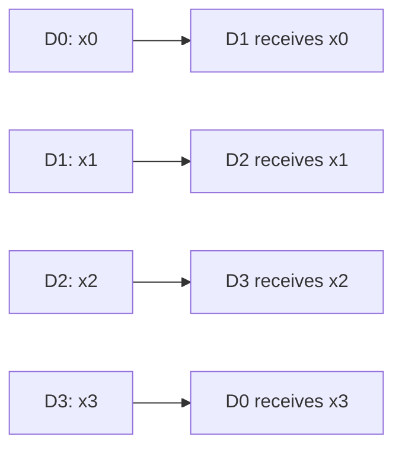
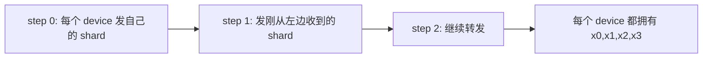
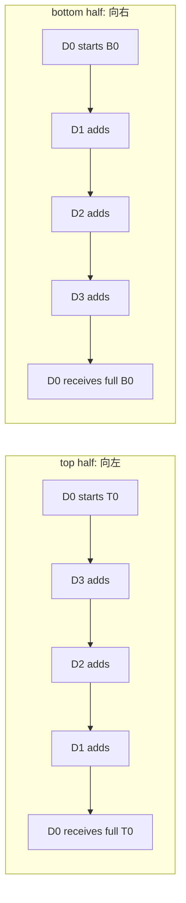

# Pallas TPU Distributed Collectives 复习文档

本文根据 JAX 官方文档 [Distributed Computing in Pallas for TPUs](https://docs.jax.dev/en/latest/pallas/tpu/distributed.html) 整理，重点复习四个 collective 示例：

- `lax.ppermute`
- `lax.all_gather`
- `lax.psum`
- `lax.psum_scatter`

说明：代码是“教学整理版”，保留官方示例的核心结构、API 和数据流，但注释与组织方式做了重写，方便复习。真实运行仍需要 TPU 环境。

---

## 0. 共同背景

### 0.1 Ring 设备模型

假设有 4 个 device：

```text
D0 -> D1 -> D2 -> D3 -> D0
```

右邻居：

```python
right = (my_id + 1) % num_devices
```

左邻居：

```python
left = (my_id - 1 + num_devices) % num_devices
```

在本文模拟中：

```text
D0 的本地数据记作 x0
D1 的本地数据记作 x1
D2 的本地数据记作 x2
D3 的本地数据记作 x3
```

### 0.2 `mesh`、`PartitionSpec`、`NamedSharding`

```python
P = jax.sharding.PartitionSpec

mesh = jax.make_mesh((num_devices,), ("x",))
partition = P(None, "x")
sharding = jax.sharding.NamedSharding(mesh, partition)
```

三者区别：

| 名称 | 含义 |
|---|---|
| `mesh` | 设备组成的逻辑网格，例如一维 `x` 轴有 4 个 TPU device |
| `PartitionSpec` | 说明数组维度如何映射到 mesh 轴 |
| `NamedSharding` | 把设备网格和切分规则合成一个真正可用于 `device_put` 的 sharding |

例子：

```python
partition = P(None, "x")
input_arr.shape == (8, 128 * num_devices)
```

表示：

```text
第 0 维不切分
第 1 维沿 x 轴切分
```

如果 `num_devices=4`，全局 shape 是 `(8, 512)`，每个 device 本地拿到 `(8, 128)`。

### 0.3 TPU Pallas 通信：RDMA 是 push-only

TPU Pallas 的 remote DMA 是 **push-only**：

```text
当前 device 可以把本地 src_ref 推送到远端 device 的 dst_ref。
当前 device 不能直接读取远端 device 的内存。
```

核心 API：

```python
copy = pltpu.make_async_remote_copy(
    src_ref=local_ref,
    dst_ref=remote_ref,
    send_sem=send_sem,
    recv_sem=recv_sem,
    device_id=(target_device,),
    device_id_type=pl.DeviceIdType.MESH,
)
copy.start()
copy.wait()
```

关键点：

| 参数 | 含义 |
|---|---|
| `src_ref` | 本 device 上要发送的数据 |
| `dst_ref` | 目标 device 上接收的位置 |
| `send_sem` | 发送端 DMA semaphore |
| `recv_sem` | 接收端 DMA semaphore |
| `.start()` | 发起异步 DMA |
| `.wait()` | 等发送和接收都完成 |

### 0.4 HBM、VMEM、VREG 的直觉

在这些示例里，常见内存角色是：

| 名称 | 直觉 |
|---|---|
| HBM | 每个 device 自己的大内存，适合放通信 buffer |
| VMEM | TPU 上更靠近计算的内存，适合做局部计算 |
| VREG | vector register，真正执行向量操作的位置 |

一个常见流程：

```text
远端 DMA 写入本 device 的 HBM scratch
        ↓
local DMA 把 HBM scratch 拷到 VMEM scratch
        ↓
在 VMEM/VREG 中计算
        ↓
写回 HBM scratch 或最终 o_ref
```

---

## 1. `lax.ppermute`：右移一格

### 1.1 直观解释

`ppermute` 是最简单的跨设备通信：每个 device 把自己的 shard 发给右邻居。

对 4 个 device：

```text
输入:
  D0: x0
  D1: x1
  D2: x2
  D3: x3

每个 device 发送到右邻居:
  D0 -> D1
  D1 -> D2
  D2 -> D3
  D3 -> D0

输出:
  D0: x3
  D1: x0
  D2: x1
  D3: x2
```

### 1.2 配图



### 1.3 教学版完整代码

```python
import jax
from jax import lax
from jax import numpy as jnp
from jax.experimental import pallas as pl
from jax.experimental.pallas import tpu as pltpu

P = jax.sharding.PartitionSpec
num_devices = jax.local_device_count()

partition = P(None, "x")
mesh = jax.make_mesh((num_devices,), ("x",))
sharding = jax.sharding.NamedSharding(mesh, partition)

input_arr = jax.random.uniform(
    jax.random.key(0),
    shape=(8, 128 * num_devices),
)
input_arr = jax.device_put(input_arr, sharding)


def right_shift_kernel(x_ref, y_ref, send_sem, recv_sem):
    my_id = lax.axis_index("x")
    target = lax.rem(my_id + 1, num_devices)

    dma = pltpu.make_async_remote_copy(
        src_ref=x_ref,
        dst_ref=y_ref,
        send_sem=send_sem,
        recv_sem=recv_sem,
        device_id=(target,),
        device_id_type=pl.DeviceIdType.MESH,
    )
    dma.start()
    dma.wait()


out_shape = jax.ShapeDtypeStruct((8, 128), jnp.float32)

grid_spec = pltpu.PrefetchScalarGridSpec(
    num_scalar_prefetch=0,
    in_specs=[pl.BlockSpec(memory_space=pl.ANY)],
    out_specs=pl.BlockSpec(memory_space=pl.ANY),
    scratch_shapes=([pltpu.SemaphoreType.DMA] * 2),
)

right_shift = pl.pallas_call(
    right_shift_kernel,
    out_shape=out_shape,
    grid_spec=grid_spec,
)

pallas_result = jax.jit(
    jax.shard_map(
        right_shift,
        mesh=mesh,
        in_specs=partition,
        out_specs=partition,
        check_vma=False,
    )
)(input_arr)

perm = tuple((src, (src + 1) % num_devices) for src in range(num_devices))
xla_result = jax.jit(
    jax.shard_map(
        lambda x: lax.ppermute(x, "x", perm),
        mesh=mesh,
        in_specs=partition,
        out_specs=partition,
    )
)(input_arr)
```

### 1.4 逐步模拟

| Device | 初始本地输入 | 发送到 | 最终本地输出 |
|---|---|---|---|
| D0 | `x0` | D1 | `x3` |
| D1 | `x1` | D2 | `x0` |
| D2 | `x2` | D3 | `x1` |
| D3 | `x3` | D0 | `x2` |

完成这个操作的代码是：

```python
target = (my_id + 1) % num_devices
make_async_remote_copy(src_ref=x_ref, dst_ref=y_ref, device_id=(target,))
```

这里 `dst_ref=y_ref` 表示目标 device 上同一个 Pallas output buffer 的本地位置。

---

## 2. `lax.all_gather`：每个 device 收集所有 shard

### 2.1 直观解释

`all_gather` 的目标是：

```text
每个 device 一开始只有自己的 shard。
最后每个 device 都有所有 shard。
```

4 个 device：

```text
初始:
  D0: x0
  D1: x1
  D2: x2
  D3: x3

最终每个 device:
  [x0, x1, x2, x3]
```

官方图：


### 2.2 配图



### 2.3 教学版完整代码

```python
partition = P("x", None)
mesh = jax.make_mesh((num_devices,), ("x",))
sharding = jax.sharding.NamedSharding(mesh, partition)

input_arr = jax.random.uniform(
    jax.random.key(0),
    shape=(8 * num_devices, 128),
)
input_arr = jax.device_put(input_arr, sharding)


def all_gather_kernel(x_ref, out_ref, local_sem, send_sem, recv_sems):
    step = pl.program_id(0)
    my_id = lax.axis_index("x")
    right = lax.rem(my_id + 1, num_devices)

    slot = lax.rem(my_id - step + num_devices, num_devices)

    @pl.when(step == 0)
    def _():
        local = pltpu.make_async_copy(
            src_ref=x_ref,
            dst_ref=out_ref.at[my_id],
            sem=local_sem,
        )
        local.start()
        local.wait()

    remote = pltpu.make_async_remote_copy(
        src_ref=out_ref.at[slot],
        dst_ref=out_ref.at[slot],
        send_sem=send_sem,
        recv_sem=recv_sems.at[step],
        device_id=(right,),
        device_id_type=pl.DeviceIdType.MESH,
    )
    remote.start()
    remote.wait()


out_shape = jax.ShapeDtypeStruct((num_devices, 8, 128), jnp.float32)

grid_spec = pltpu.PrefetchScalarGridSpec(
    num_scalar_prefetch=0,
    in_specs=[pl.BlockSpec(memory_space=pl.ANY)],
    out_specs=pl.BlockSpec(memory_space=pl.ANY),
    scratch_shapes=(
        [pltpu.SemaphoreType.DMA] * 2
        + [pltpu.SemaphoreType.DMA((num_devices - 1,))]
    ),
    grid=(num_devices - 1,),
)

all_gather = pl.pallas_call(
    all_gather_kernel,
    out_shape=out_shape,
    grid_spec=grid_spec,
)

pallas_result = jax.jit(
    jax.shard_map(
        all_gather,
        mesh=mesh,
        in_specs=partition,
        out_specs=partition,
        check_vma=False,
    )
)(input_arr)

xla_result = jax.jit(
    jax.shard_map(
        lambda x: lax.all_gather(x, "x"),
        mesh=mesh,
        in_specs=partition,
        out_specs=partition,
    )
)(input_arr)
```

### 2.4 关键代码解释

```python
grid=(num_devices - 1,)
```

每个 device 自己已经有自己的 shard，只需要再收到其他 `num_devices - 1` 个 shard。

```python
slot = (my_id - step) % num_devices
```

当前这一轮要把哪个 slot 转发给右邻居。

例如 D0：

```text
step 0: 发送 slot 0
step 1: 发送 slot 3
step 2: 发送 slot 2
```

同时 D0 会从 D3 收到：

```text
step 0: slot 3
step 1: slot 2
step 2: slot 1
```

### 2.5 遍历模拟

表格展示每轮结束后，每个 device 的 output slots。

| loop 后 | D0 slots | D1 slots | D2 slots | D3 slots |
|---|---|---|---|---|
| 初始 | `[-,-,-,-]` | `[-,-,-,-]` | `[-,-,-,-]` | `[-,-,-,-]` |
| step 0 | `[x0,-,-,x3]` | `[x0,x1,-,-]` | `[-,x1,x2,-]` | `[-,-,x2,x3]` |
| step 1 | `[x0,-,x2,x3]` | `[x0,x1,-,x3]` | `[x0,x1,x2,-]` | `[-,x1,x2,x3]` |
| step 2 | `[x0,x1,x2,x3]` | `[x0,x1,x2,x3]` | `[x0,x1,x2,x3]` | `[x0,x1,x2,x3]` |

操作来源：

| 动作 | 代码 |
|---|---|
| step 0 本地写自己的 slot | `out_ref.at[my_id] = x_ref` via `make_async_copy` |
| 每轮转发已有 slot | `src_ref=out_ref.at[slot]` |
| 写到右邻居同编号 slot | `dst_ref=out_ref.at[slot]` with `device_id=(right,)` |

为什么 `recv_sems` 有多个？

```python
recv_sems.at[step]
```

每一轮一个 receive semaphore，避免多个 in-flight DMA 复用同一个接收计数器。官方文档也提醒，大 kernel 中 device 更容易不同步，复用 receive semaphore 可能导致静默错误。

---

## 3. `lax.psum`：单向 ring all-reduce sum

### 3.1 直观解释

`psum` 是 all-reduce sum：

```text
每个 device 一开始有自己的 x。
最后每个 device 都得到 x0 + x1 + x2 + x3。
```

这个 Pallas 示例不是先 all-gather 再求和，而是：

```text
数据沿 ring 传递。
每个 device 收到一份数据就加进自己的 accumulator。
```

官方图：


### 3.2 配图


每个 device 都在做同样的事情，所以一圈后每个 device 都累加了所有输入。

### 3.3 教学版完整代码

```python
partition = P(None, "x")
mesh = jax.make_mesh((num_devices,), ("x",))
sharding = jax.sharding.NamedSharding(mesh, partition)

input_arr = jax.random.uniform(
    jax.random.key(0),
    shape=(8, 128 * num_devices),
)
input_arr = jax.device_put(input_arr, sharding)


def neighbor_barrier(left, right, double_barrier=True):
    barrier = pltpu.get_barrier_semaphore()
    for nbr in [left, right]:
        pl.semaphore_signal(
            barrier,
            inc=1,
            device_id=(nbr,),
            device_id_type=pl.DeviceIdType.MESH,
        )
    pl.semaphore_wait(barrier, 2)

    if double_barrier:
        @functools.partial(pl.run_scoped, second=pltpu.SemaphoreType.REGULAR)
        def _(second):
            for nbr in [left, right]:
                pl.semaphore_signal(
                    second,
                    inc=1,
                    device_id=(nbr,),
                    device_id_type=pl.DeviceIdType.MESH,
                )
            pl.semaphore_wait(second, 2)


def psum_kernel(
    x_ref,
    o_ref,
    hbm_buf,
    local_copy_sem,
    remote_recv_sem,
    remote_send_sem,
    capacity_sem,
    vmem_recv,
):
    step = pl.program_id(0)
    working = lax.rem(step, 2)
    receiving = 1 - working

    my_id = lax.axis_index("x")
    right = lax.rem(my_id + 1, num_devices)
    left = lax.rem(my_id - 1 + num_devices, num_devices)

    @pl.when(step == 0)
    def _():
        neighbor_barrier(left, right)
        o_ref[...] = jnp.zeros_like(o_ref)
        vmem_recv[...] = jnp.zeros_like(vmem_recv)

        first = pltpu.make_async_remote_copy(
            src_ref=x_ref,
            dst_ref=hbm_buf.at[working],
            send_sem=remote_send_sem,
            recv_sem=remote_recv_sem,
            device_id=(right,),
            device_id_type=pl.DeviceIdType.MESH,
        )
        first.start()
        first.wait()

    # 告诉左邻居：我已经准备好接收它下一次写入。
    pl.semaphore_signal(
        capacity_sem,
        inc=1,
        device_id=(left,),
        device_id_type=pl.DeviceIdType.MESH,
    )

    # 本地 HBM -> VMEM，用于累加。
    local = pltpu.make_async_copy(
        src_ref=hbm_buf.at[working],
        dst_ref=vmem_recv,
        sem=local_copy_sem,
    )
    local.start()

    # 写右邻居前，先等右邻居说它准备好了。
    pl.semaphore_wait(capacity_sem, 1)

    remote = pltpu.make_async_remote_copy(
        src_ref=hbm_buf.at[working],
        dst_ref=hbm_buf.at[receiving],
        send_sem=remote_send_sem,
        recv_sem=remote_recv_sem,
        device_id=(right,),
        device_id_type=pl.DeviceIdType.MESH,
    )
    remote.start()

    local.wait()
    o_ref[...] += vmem_recv[...]
    remote.wait()


out_shape = (
    jax.ShapeDtypeStruct((8, 128), jnp.float32),
    jax.ShapeDtypeStruct((2, 8, 128), jnp.float32),
)

grid_spec = pltpu.PrefetchScalarGridSpec(
    num_scalar_prefetch=0,
    in_specs=[pl.BlockSpec(memory_space=pltpu.VMEM)],
    out_specs=[
        pl.BlockSpec(memory_space=pltpu.VMEM),
        pl.BlockSpec(memory_space=pl.ANY),
    ],
    grid=(num_devices,),
    scratch_shapes=(
        [pltpu.SemaphoreType.DMA] * 3
        + [pltpu.SemaphoreType.REGULAR]
        + [pltpu.VMEM((8, 128), jnp.float32)]
    ),
)

psum_pallas = pl.pallas_call(
    psum_kernel,
    out_shape=out_shape,
    grid_spec=grid_spec,
    compiler_params=pltpu.CompilerParams(collective_id=0),
)

pallas_result = jax.jit(
    jax.shard_map(
        psum_pallas,
        mesh=mesh,
        in_specs=partition,
        out_specs=partition,
        check_vma=False,
    )
)(input_arr)[0]

xla_result = jax.jit(
    jax.shard_map(
        lambda x: lax.psum(x, "x"),
        mesh=mesh,
        in_specs=partition,
        out_specs=partition,
    )
)(input_arr)
```

### 3.4 关键区域

| 区域 | memory space | 用途 |
|---|---|---|
| `x_ref` | VMEM | 本 device 的原始输入 |
| `o_ref` | VMEM | 本 device 的累加结果 |
| `hbm_buf[0]` | HBM | 通信双缓冲 slot 0 |
| `hbm_buf[1]` | HBM | 通信双缓冲 slot 1 |
| `vmem_recv` | VMEM | 从 HBM 拷出来后用于累加的临时 buffer |

### 3.5 遍历模拟

`H0 = hbm_buf[0]`，`H1 = hbm_buf[1]`。

| loop 后 | D0 `(H0,H1,o)` | D1 `(H0,H1,o)` | D2 `(H0,H1,o)` | D3 `(H0,H1,o)` |
|---|---|---|---|---|
| prologue 后 | `(x3,-,0)` | `(x0,-,0)` | `(x1,-,0)` | `(x2,-,0)` |
| step 0 | `(x3,x2,x3)` | `(x0,x3,x0)` | `(x1,x0,x1)` | `(x2,x1,x2)` |
| step 1 | `(x1,x2,x3+x2)` | `(x2,x3,x0+x3)` | `(x3,x0,x1+x0)` | `(x0,x1,x2+x1)` |
| step 2 | `(x1,x0,x3+x2+x1)` | `(x2,x1,x0+x3+x2)` | `(x3,x2,x1+x0+x3)` | `(x0,x3,x2+x1+x0)` |
| step 3 | `(x3,x0,all)` | `(x0,x1,all)` | `(x1,x2,all)` | `(x2,x3,all)` |

其中：

```text
all = x0 + x1 + x2 + x3
```

每轮核心操作来源：

| 动作 | 代码 |
|---|---|
| 第 0 轮先发自己的输入给右邻居 | `first = make_async_remote_copy(src_ref=x_ref, dst_ref=hbm_buf.at[working])` |
| 读当前 working slot 到 VMEM | `make_async_copy(src_ref=hbm_buf.at[working], dst_ref=vmem_recv)` |
| 把当前 working slot 继续发给右邻居 | `make_async_remote_copy(src_ref=hbm_buf.at[working], dst_ref=hbm_buf.at[receiving])` |
| 累加 | `o_ref[...] += vmem_recv[...]` |
| 防止跑快一轮覆盖邻居 working slot | `capacity_sem` signal/wait |

`capacity_sem` 的作用：

```text
如果所有 device 严格同步，双缓冲不会冲突。
但不同 device 可以跑快或跑慢。
快的 device 下一轮 receiving_slot 可能正好是慢邻居还在读的 working_slot。
capacity_sem 让发送者必须等接收者确认“我已经进入对应轮次，可以写我的 receiving slot”。
```

---

## 4. `lax.psum_scatter`：双向 reduce-scatter

### 4.1 直观解释

`psum_scatter` 的语义可以看成：

```text
先对所有 device 的输入按 block 求和；
然后每个 device 只保留属于自己的那个 block。
```

但高效实现不是：

```text
all-reduce 完整结果 -> 再 scatter
```

而是：

```text
每个 output block 的 partial sum 在 ring 上移动；
经过一个 device，就加上该 device 对这个 block 的贡献；
最后回到目标 device 时，这个 block 已经完整。
```

官方语义图：


官方通信图：


### 4.2 配图

一个 block 被切成上下两半：

```text
T = top half    -> 向左传
B = bottom half -> 向右传
```



注意：这段教学代码的数据流是双向的，但 phase 调度是交替的：

```text
phase LEFT:
  发送上一阶段的 right-half
  计算当前 left-half

phase RIGHT:
  发送刚算好的 left-half
  计算当前 right-half
```

### 4.3 教学版完整代码

```python
partition = P(None, "x")
mesh = jax.make_mesh((num_devices,), ("x",))
sharding = jax.sharding.NamedSharding(mesh, partition)

block_size = (16, 128)
input_arr = jax.random.uniform(
    jax.random.key(0),
    shape=(block_size[0] * num_devices, block_size[1] * num_devices),
)
input_arr = jax.device_put(input_arr, sharding)

LEFT = 0
RIGHT = 1


def mod(x, n):
    return lax.rem(x + n, n)


def signal(direction, sem):
    my_id = lax.axis_index("x")
    if direction == LEFT:
        target = mod(my_id - 1, num_devices)
    else:
        target = mod(my_id + 1, num_devices)
    pl.semaphore_signal(
        sem,
        inc=1,
        device_id=(target,),
        device_id_type=pl.DeviceIdType.MESH,
    )


def reduce_scatter_kernel(
    x_ref,
    o_ref,
    hbm_buf,
    local_copy_sem,
    left_recv_sem,
    left_send_sem,
    right_recv_sem,
    right_send_sem,
    left_capacity_sem,
    right_capacity_sem,
    accum,
):
    step = pl.program_id(0)
    phase = pl.program_id(1)

    is_first = jnp.logical_and(step == 0, phase == LEFT)
    is_last_step = step == pl.num_programs(0) - 1

    working = lax.rem(step, 2)
    receiving = 1 - working

    my_id = lax.axis_index("x")
    right = mod(my_id + 1, num_devices)
    left = mod(my_id - 1, num_devices)

    left_block = mod(my_id + step + 1, num_devices)
    right_block = mod(my_id - step - 1, num_devices)

    half_rows = block_size[0] // 2
    top = pl.ds(0, half_rows)
    bottom = pl.ds(half_rows, half_rows)
    current_half = pl.ds(phase * half_rows, half_rows)

    init_left = pltpu.make_async_remote_copy(
        src_ref=x_ref.at[my_id, top],
        dst_ref=hbm_buf.at[working, top],
        send_sem=left_send_sem,
        recv_sem=left_recv_sem,
        device_id=(left,),
        device_id_type=pl.DeviceIdType.MESH,
    )

    init_right = pltpu.make_async_remote_copy(
        src_ref=x_ref.at[my_id, bottom],
        dst_ref=hbm_buf.at[working, bottom],
        send_sem=right_send_sem,
        recv_sem=right_recv_sem,
        device_id=(right,),
        device_id_type=pl.DeviceIdType.MESH,
    )

    send_left = pltpu.make_async_remote_copy(
        src_ref=hbm_buf.at[working, top],
        dst_ref=hbm_buf.at[receiving, top],
        send_sem=left_send_sem,
        recv_sem=left_recv_sem,
        device_id=(left,),
        device_id_type=pl.DeviceIdType.MESH,
    )

    send_right = pltpu.make_async_remote_copy(
        src_ref=hbm_buf.at[receiving, bottom],
        dst_ref=hbm_buf.at[working, bottom],
        send_sem=right_send_sem,
        recv_sem=right_recv_sem,
        device_id=(right,),
        device_id_type=pl.DeviceIdType.MESH,
    )

    @pl.when(is_first)
    def _():
        neighbor_barrier(left, right)
        o_ref[...] = jnp.zeros_like(o_ref)
        accum[...] = jnp.zeros_like(accum)

        init_left.start()
        init_left.wait()
        init_right.start()

        signal(LEFT, right_capacity_sem)
        signal(RIGHT, left_capacity_sem)

    @pl.when(~is_first)
    def _():
        @pl.when(phase == LEFT)
        def _():
            pl.semaphore_wait(right_capacity_sem, 1)
            send_right.start()

        @pl.when(phase == RIGHT)
        def _():
            pl.semaphore_wait(left_capacity_sem, 1)
            send_left.start()

    local = pltpu.make_async_copy(
        src_ref=hbm_buf.at[working, current_half],
        dst_ref=accum,
        sem=local_copy_sem,
    )
    local.start()
    local.wait()

    @pl.when(~is_last_step)
    def _():
        @pl.when(phase == LEFT)
        def _():
            accum[...] += x_ref[left_block, top]

        @pl.when(phase == RIGHT)
        def _():
            accum[...] += x_ref[right_block, bottom]

    local = pltpu.make_async_copy(
        src_ref=accum,
        dst_ref=hbm_buf.at[working, current_half],
        sem=local_copy_sem,
    )
    local.start()
    local.wait()

    @pl.when(is_first)
    def _():
        init_right.wait()

    @pl.when(~is_first)
    def _():
        @pl.when(phase == LEFT)
        def _():
            send_right.wait()
            signal(LEFT, right_capacity_sem)

        @pl.when(phase == RIGHT)
        def _():
            send_left.wait()
            signal(RIGHT, left_capacity_sem)

    @pl.when(is_last_step)
    def _():
        @pl.when(phase == LEFT)
        def _():
            o_ref[top, ...] = accum[...]
            pl.semaphore_wait(right_capacity_sem, 1)

        @pl.when(phase == RIGHT)
        def _():
            o_ref[bottom, ...] = accum[...]
            pl.semaphore_wait(left_capacity_sem, 1)


out_shape = (
    jax.ShapeDtypeStruct((block_size[0], block_size[1]), jnp.float32),
    jax.ShapeDtypeStruct((2, block_size[0], block_size[1]), jnp.float32),
)

grid_spec = pltpu.PrefetchScalarGridSpec(
    num_scalar_prefetch=0,
    in_specs=[pl.BlockSpec(memory_space=pltpu.VMEM)],
    out_specs=[
        pl.BlockSpec(memory_space=pltpu.VMEM),
        pl.BlockSpec(memory_space=pl.ANY),
    ],
    grid=(num_devices, 2),
    scratch_shapes=(
        [pltpu.SemaphoreType.DMA] * 5
        + [pltpu.SemaphoreType.REGULAR] * 2
        + [pltpu.VMEM((block_size[0] // 2, block_size[1]), jnp.float32)]
    ),
)


def pallas_reduce_scatter(x):
    x = x.reshape(num_devices, block_size[0], block_size[1])
    return pl.pallas_call(
        reduce_scatter_kernel,
        out_shape=out_shape,
        grid_spec=grid_spec,
        compiler_params=pltpu.CompilerParams(collective_id=0),
    )(x)[0]


pallas_result = jax.jit(
    jax.shard_map(
        pallas_reduce_scatter,
        mesh=mesh,
        in_specs=P(None, "x"),
        out_specs=P("x", None),
        check_vma=False,
    )
)(input_arr)


def xla_reduce_scatter(x):
    x = x.reshape(num_devices, block_size[0], block_size[1])
    return lax.psum_scatter(x, "x")


xla_result = jax.jit(
    jax.shard_map(
        xla_reduce_scatter,
        mesh=mesh,
        in_specs=P(None, "x"),
        out_specs=P("x", None),
    )
)(input_arr)
```

### 4.4 输入为什么是设备倍数

```python
input_arr.shape = (
    block_size[0] * num_devices,
    block_size[1] * num_devices,
)
partition = P(None, "x")
```

第 1 维被切到所有 device，所以每个 device 本地宽度是 `block_size[1]`。

每个 device 本地 shape 是：

```text
(block_size[0] * num_devices, block_size[1])
```

然后 reshape：

```python
x = x.reshape(num_devices, block_size[0], block_size[1])
```

本地变成：

```text
x_d[0], x_d[1], x_d[2], x_d[3]
```

其中：

```text
x_d[b] = device d 对最终 block b 的贡献
```

最终：

```text
D0 得到 sum_d x_d[0]
D1 得到 sum_d x_d[1]
D2 得到 sum_d x_d[2]
D3 得到 sum_d x_d[3]
```

### 4.5 关键区域

| 区域 | memory space | 用途 |
|---|---|---|
| `x_ref` | VMEM | 当前 device 的所有 block 贡献 |
| `o_ref` | VMEM | 当前 device 最终保留的 reduced block |
| `hbm_buf[0]` | HBM | 通信 slot 0 |
| `hbm_buf[1]` | HBM | 通信 slot 1 |
| `accum` | VMEM | 当前 half-block 的临时累加器 |

### 4.6 遍历模拟

假设：

```text
num_devices = 4
D0, D1, D2, D3
T = top half
B = bottom half
```

记号：

```text
T2(2+1+0) = block 2 的 top half，已经累加 device 2、1、0 的贡献
B0(0+1+2+3) = block 0 的 bottom half 完整结果
```

#### Loop `(0, LEFT)`

执行：

```python
init_left.start()
init_left.wait()
init_right.start()

local_copy: H0.T -> accum
accum += x_ref[left_block, T]
accum -> H0.T
```

| Device | H0.T | H0.B | H1.T | H1.B | accum | o_ref |
|---|---|---|---|---|---|---|
| D0 | `T1(1+0)` | `B3(3)` | `-` | `-` | `T1(1+0)` | `-` |
| D1 | `T2(2+1)` | `B0(0)` | `-` | `-` | `T2(2+1)` | `-` |
| D2 | `T3(3+2)` | `B1(1)` | `-` | `-` | `T3(3+2)` | `-` |
| D3 | `T0(0+3)` | `B2(2)` | `-` | `-` | `T0(0+3)` | `-` |

#### Loop `(0, RIGHT)`

执行：

```python
send_left.start()
local_copy: H0.B -> accum
accum += x_ref[right_block, B]
accum -> H0.B
```

| Device | H0.T | H0.B | H1.T | H1.B | accum | o_ref |
|---|---|---|---|---|---|---|
| D0 | `T1(1+0)` | `B3(3+0)` | `T2(2+1)` | `-` | `B3(3+0)` | `-` |
| D1 | `T2(2+1)` | `B0(0+1)` | `T3(3+2)` | `-` | `B0(0+1)` | `-` |
| D2 | `T3(3+2)` | `B1(1+2)` | `T0(0+3)` | `-` | `B1(1+2)` | `-` |
| D3 | `T0(0+3)` | `B2(2+3)` | `T1(1+0)` | `-` | `B2(2+3)` | `-` |

#### Loop `(1, LEFT)`

执行：

```python
send_right.start()
local_copy: H1.T -> accum
accum += x_ref[left_block, T]
accum -> H1.T
```

| Device | H0.T | H0.B | H1.T | H1.B | accum | o_ref |
|---|---|---|---|---|---|---|
| D0 | `T1(1+0)` | `B3(3+0)` | `T2(2+1+0)` | `B2(2+3)` | `T2(2+1+0)` | `-` |
| D1 | `T2(2+1)` | `B0(0+1)` | `T3(3+2+1)` | `B3(3+0)` | `T3(3+2+1)` | `-` |
| D2 | `T3(3+2)` | `B1(1+2)` | `T0(0+3+2)` | `B0(0+1)` | `T0(0+3+2)` | `-` |
| D3 | `T0(0+3)` | `B2(2+3)` | `T1(1+0+3)` | `B1(1+2)` | `T1(1+0+3)` | `-` |

#### Loop `(1, RIGHT)`

执行：

```python
send_left.start()
local_copy: H1.B -> accum
accum += x_ref[right_block, B]
accum -> H1.B
```

| Device | H0.T | H0.B | H1.T | H1.B | accum | o_ref |
|---|---|---|---|---|---|---|
| D0 | `T3(3+2+1)` | `B3(3+0)` | `T2(2+1+0)` | `B2(2+3+0)` | `B2(2+3+0)` | `-` |
| D1 | `T0(0+3+2)` | `B0(0+1)` | `T3(3+2+1)` | `B3(3+0+1)` | `B3(3+0+1)` | `-` |
| D2 | `T1(1+0+3)` | `B1(1+2)` | `T0(0+3+2)` | `B0(0+1+2)` | `B0(0+1+2)` | `-` |
| D3 | `T2(2+1+0)` | `B2(2+3)` | `T1(1+0+3)` | `B1(1+2+3)` | `B1(1+2+3)` | `-` |

#### Loop `(2, LEFT)`

| Device | H0.T | H0.B | H1.T | H1.B | accum | o_ref |
|---|---|---|---|---|---|---|
| D0 | `T3(3+2+1+0)` | `B1(1+2+3)` | `T2(2+1+0)` | `B2(2+3+0)` | `T3(3+2+1+0)` | `-` |
| D1 | `T0(0+3+2+1)` | `B2(2+3+0)` | `T3(3+2+1)` | `B3(3+0+1)` | `T0(0+3+2+1)` | `-` |
| D2 | `T1(1+0+3+2)` | `B3(3+0+1)` | `T0(0+3+2)` | `B0(0+1+2)` | `T1(1+0+3+2)` | `-` |
| D3 | `T2(2+1+0+3)` | `B0(0+1+2)` | `T1(1+0+3)` | `B1(1+2+3)` | `T2(2+1+0+3)` | `-` |

#### Loop `(2, RIGHT)`

| Device | H0.T | H0.B | H1.T | H1.B | accum | o_ref |
|---|---|---|---|---|---|---|
| D0 | `T3(3+2+1+0)` | `B1(1+2+3+0)` | `T0(0+3+2+1)` | `B2(2+3+0)` | `B1(1+2+3+0)` | `-` |
| D1 | `T0(0+3+2+1)` | `B2(2+3+0+1)` | `T1(1+0+3+2)` | `B3(3+0+1)` | `B2(2+3+0+1)` | `-` |
| D2 | `T1(1+0+3+2)` | `B3(3+0+1+2)` | `T2(2+1+0+3)` | `B0(0+1+2)` | `B3(3+0+1+2)` | `-` |
| D3 | `T2(2+1+0+3)` | `B0(0+1+2+3)` | `T3(3+2+1+0)` | `B1(1+2+3)` | `B0(0+1+2+3)` | `-` |

#### Loop `(3, LEFT)`

最后一轮不再加本地贡献，只把完整 top half 写入输出。

| Device | H0.T | H0.B | H1.T | H1.B | accum | o_ref |
|---|---|---|---|---|---|---|
| D0 | `T3(3+2+1+0)` | `B1(1+2+3+0)` | `T0(0+3+2+1)` | `B0(0+1+2+3)` | `T0(0+3+2+1)` | `T0(all)` |
| D1 | `T0(0+3+2+1)` | `B2(2+3+0+1)` | `T1(1+0+3+2)` | `B1(1+2+3+0)` | `T1(1+0+3+2)` | `T1(all)` |
| D2 | `T1(1+0+3+2)` | `B3(3+0+1+2)` | `T2(2+1+0+3)` | `B2(2+3+0+1)` | `T2(2+1+0+3)` | `T2(all)` |
| D3 | `T2(2+1+0+3)` | `B0(0+1+2+3)` | `T3(3+2+1+0)` | `B3(3+0+1+2)` | `T3(3+2+1+0)` | `T3(all)` |

#### Loop `(3, RIGHT)`

最后一轮不再加本地贡献，只把完整 bottom half 写入输出。

| Device | H0.T | H0.B | H1.T | H1.B | accum | o_ref |
|---|---|---|---|---|---|---|
| D0 | `T1(1+0+3+2)` | `B1(1+2+3+0)` | `T0(0+3+2+1)` | `B0(0+1+2+3)` | `B0(0+1+2+3)` | `T0(all)+B0(all)` |
| D1 | `T2(2+1+0+3)` | `B2(2+3+0+1)` | `T1(1+0+3+2)` | `B1(1+2+3+0)` | `B1(1+2+3+0)` | `T1(all)+B1(all)` |
| D2 | `T3(3+2+1+0)` | `B3(3+0+1+2)` | `T2(2+1+0+3)` | `B2(2+3+0+1)` | `B2(2+3+0+1)` | `T2(all)+B2(all)` |
| D3 | `T0(0+3+2+1)` | `B0(0+1+2+3)` | `T3(3+2+1+0)` | `B3(3+0+1+2)` | `B3(3+0+1+2)` | `T3(all)+B3(all)` |

### 4.7 最后复习口诀

```text
ppermute:
  一跳。每个 device 把自己的 shard 发给右邻居。

all_gather:
  多跳收集。每轮转发一个已有 slot，最终每个 device 收齐所有 slots。

psum:
  单向 all-reduce。数据沿 ring 转，每个 device 收到就加到自己的 o_ref。

psum_scatter:
  直接 reduce-scatter，不是真的先 all-reduce 再 scatter。
  partial sum 在路上传，经过 device 就加本地贡献。
  top half 向左，bottom half 向右。
```

---

## 5. 复习时最容易错的点

### 5.1 `x_ref[i]` 不是读 device i 的内存

在 `shard_map` 内，`x_ref` 永远是当前 device 的本地 shard。

所以：

```python
x_ref[left_block, top]
```

意思是：

```text
当前 device 本地保存的 block left_block 的 top half
```

不是远端 device `left_block` 的内存。

### 5.2 grid 循环不是天然全局同步

Pallas TPU grid 可以理解成本 device 上按顺序执行：

```python
for step in range(...):
    kernel(...)
```

但不同 device 之间不保证每一轮严格同步。同步需要：

```text
DMA semaphores
regular semaphores
barrier semaphores
```

### 5.3 双缓冲只解决同轮读写冲突

如果所有设备同轮执行：

```text
working_slot 和 receiving_slot 不冲突
```

但如果一个 device 跑快一轮：

```text
快 device 以为它在写邻居 receiving_slot
慢邻居可能还在读同一个 slot 作为 working_slot
```

所以 `capacity_sem` 用来做接收方确认。

### 5.4 `psum_scatter` 传的是 accumulator，不是输入本身

在 `psum` 中：

```text
传输入 shard，accumulator 留在本地。
```

在 `psum_scatter` 中：

```text
传 partial sum，输入贡献留在本地。
```

这是理解 reduce-scatter 的关键。

---

## 6. 官方参考

- 主页面：[Distributed Computing in Pallas for TPUs](https://docs.jax.dev/en/latest/pallas/tpu/distributed.html)
- `make_async_remote_copy` API：[jax.experimental.pallas.tpu.make_async_remote_copy](https://docs.jax.dev/en/latest/_autosummary/jax.experimental.pallas.tpu.make_async_remote_copy.html)
- `ppermute` 小节：[Example: Right Permute](https://docs.jax.dev/en/latest/pallas/tpu/distributed.html#example-right-permute-lax-ppermute)
- `all_gather` 小节：[Example: All-gather](https://docs.jax.dev/en/latest/pallas/tpu/distributed.html#example-all-gather-lax-all-gather)
- `psum` 小节：[Example: All-Reduce Sum](https://docs.jax.dev/en/latest/pallas/tpu/distributed.html#example-all-reduce-sum-lax-psum)
- `psum_scatter` 小节：[Example: Bi-directional Reduce-Scatter](https://docs.jax.dev/en/latest/pallas/tpu/distributed.html#example-bi-directional-reduce-scatter-lax-psum-scatter)
